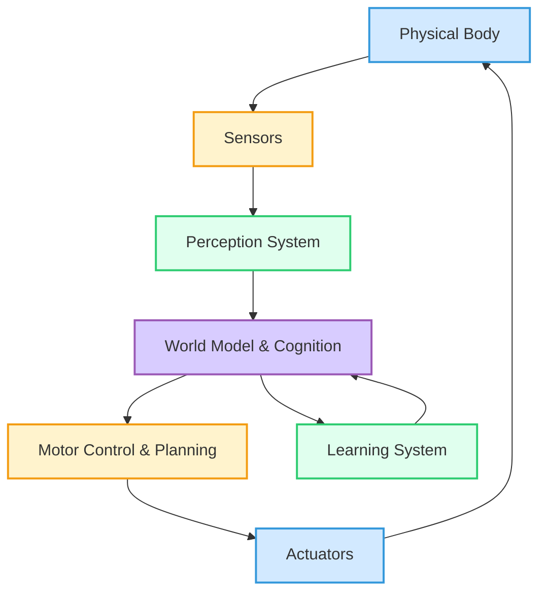

# Embodied Intelligence: When AI Gets a Body

## Learning Objectives
- Understand the concept of embodied cognition
- Learn how physical form shapes intelligence
- Explore the importance of sensorimotor learning
- Compare disembodied vs embodied AI approaches

## Introduction

In the quest to create truly intelligent machines, we often default to thinking about powerful algorithms and complex neural networks – the "brain" of the AI. However, a growing body of research, particularly within the field of **embodied cognition**, suggests that intelligence is not merely a product of computation occurring within a detached processor. Instead, it emerges dynamically from the intricate, continuous interaction between an agent's **body**, its **brain (or control system)**, and the **environment** it inhabits. This perspective challenges the traditional view of intelligence as a purely abstract, disembodied process. Think of a human infant learning to grasp a toy; the subtle movements of its fingers, the tactile feedback, the visual perception of the object's shape – all these physical interactions contribute profoundly to the development of its cognitive abilities. Similarly, for AI, when intelligence gets a body, it gains new ways to learn, perceive, and reason. Embodied intelligence posits that physical existence and interaction are not just conduits for intelligence but are fundamental to its very nature and development.

## What is Embodied Intelligence?

Embodied intelligence refers to the idea that an agent's cognitive capabilities are deeply rooted in, and shaped by, its physical body and its interactions with the real world. It challenges the "brain in a vat" perspective of AI, suggesting that intelligence is not just about abstract symbol manipulation or complex computations happening internally, but rather an emergent property of the agent's full sensori-motor loop within its environment.

Historically, this perspective gained significant traction with the work of robotics pioneer **Rodney Brooks** in the late 1980s. His **subsumption architecture** demonstrated that complex, intelligent behaviors could arise from simple, reactive modules interacting directly with the environment, rather than from a central, monolithic planner. Brooks famously argued, "The world is its own best model," implying that maintaining an exhaustive internal representation of the world is often less effective than using sensory information directly to guide action. This marked a departure from traditional AI that emphasized abstract reasoning and symbolic representations.

The key principle of embodied intelligence is that **"intelligence is in the interaction, not just in the brain."** This means that the physical constraints and capabilities of a robot's body can simplify its control and learning problems. For example, a robot with legs might naturally develop certain walking gaits due to its physical structure, rather than needing to explicitly compute every joint angle. The very form factor of the body acts as a computational resource.

Examples from biology offer compelling evidence. Consider the **octopus**, an invertebrate with remarkable intelligence. Its eight flexible arms contain a significant portion of its neurons and can operate semi-autonomously, demonstrating a distributed form of intelligence where the "brain" extends into the periphery. The octopus's unique body shape and highly flexible limbs are integral to its ability to manipulate objects, camouflage, and navigate complex marine environments. Similarly, the way humans perceive and interact with tools often incorporates the tool into our body schema, blurring the lines between our biological body and an external object. Embodied intelligence, therefore, moves beyond just computation, emphasizing the crucial role of physical presence and interaction in the genesis and expression of intelligence.

## The Body Shapes the Mind

The physical form of an intelligent agent is not merely a vessel for its brain; it actively shapes the way that intelligence develops, learns, and operates. This concept, often called **morphological computation**, highlights how the body's structure and material properties can simplify the computational demands on the control system.

For instance, the prevalent interest in **humanoid forms** for robots stems from more than just aesthetic appeal. Our world, from doorknobs and tools to stairs and cars, is fundamentally designed for human bodies. A humanoid robot, with a torso, two arms, and two legs, inherently possesses the physical configuration to interact with such environments and use human-designed tools effectively. Its morphology provides a natural interface to the human-centric world, simplifying tasks that would be incredibly complex for a purely wheeled or tracked robot.

**Morphological computation** demonstrates how physical structures can intrinsically perform computations or constrain possible actions, thereby offloading complexity from the central controller. A classic case study is **passive dynamic walkers**. These simple, unpowered mechanisms, often with human-like legs and joints, can walk stably down a gentle slope purely by harnessing gravity and their own physical design, without the need for complex motors or sensors. Their "intelligence" of walking is largely embedded in their physical form, not in an explicit control program. This illustrates how the mechanical design itself can embody behavioral intelligence, reducing the need for elaborate sensorimotor computations.

The **importance of physical constraints** in learning is another key aspect. A robot's physical limits (e.g., joint ranges, strength, balance) guide its learning process. Instead of needing to explore an infinite space of possible actions, its body naturally restricts its options to physically plausible ones. This bio-inspiration, learning from nature's solutions, is fundamental. Animals have evolved specific body plans to thrive in their ecological niches, and these morphologies are perfectly adapted to their intelligence and behaviors. By understanding and mimicking these principles, we can design robots whose bodies intrinsically support the desired intelligent behaviors, making the overall system more efficient and robust.

## Disembodied vs Embodied AI

The distinction between disembodied and embodied AI represents a fundamental divergence in how artificial intelligence systems are conceived and developed. Understanding this contrast is key to appreciating the unique challenges and opportunities presented by Physical AI.

### Disembodied AI (Traditional):

Disembodied AI refers to intelligent systems that operate purely within the digital realm, detached from any physical body or direct interaction with the physical world. Their intelligence is manifested through software, data processing, and virtual outputs.

*   **Examples**:
    *   **ChatGPT and other Large Language Models (LLMs)**: These systems excel at generating human-like text, answering questions, and performing various language tasks, but they have no physical presence.
    *   **Image classifiers**: AI models that can identify objects or scenes within digital images, but do not physically "see" the world.
    *   **Recommendation systems**: Algorithms that suggest products, movies, or content based on user data and preferences.
*   **Learns from static datasets**: Typically trained on vast, pre-collected datasets (text, images, audio) that are static and do not change as a direct consequence of the AI's actions.
*   **No physical consequences**: Actions taken by disembodied AI (e.g., generating text, making a recommendation) have no direct physical impact on the real world.
*   **Doesn't need real-time performance (often)**: While some applications might have soft real-time requirements, many can operate with latency or process data in batches. A chatbot doesn't need to respond in milliseconds to avoid a physical collision.
*   **Can be retrained offline**: New versions of the model can be developed, tested, and deployed without requiring interaction with the physical environment during the training phase.

### Embodied AI:

Embodied AI systems, in contrast, are inherently linked to a physical body (their "embodiment") and interact directly with the physical world through sensors and actuators. Their intelligence is shaped by and expressed through these physical interactions.

*   **Examples**:
    *   **Humanoid robots**: Like Boston Dynamics' Atlas or Figure 01, which navigate and manipulate objects in human-centric environments.
    *   **Autonomous vehicles**: Self-driving cars and trucks that perceive roads, traffic, and pedestrians to navigate safely.
    *   **Drones**: Unmanned aerial vehicles that perform tasks like inspection, delivery, or surveillance in 3D physical space.
*   **Learns through physical interaction**: Often learn from continuous feedback loops derived from their actions in the real world (or high-fidelity simulations that mimic it).
*   **Actions have real consequences**: A robot's movements can cause physical changes, from successfully grasping an object to accidentally breaking one.
*   **Must process in real-time**: Delays in perception, decision-making, or action can lead to failures, collisions, or unsafe situations.
*   **Continuous learning while operating**: Often designed to adapt and learn on the fly to handle novel situations, unforeseen obstacles, or changes in their own physical state (e.g., battery levels, wear and tear).

Here's a comparison table:

| Feature                   | Disembodied AI                                | Embodied AI                                                |
| :------------------------ | :-------------------------------------------- | :--------------------------------------------------------- |
| **Physical Presence**     | None (purely software)                        | Yes (robot, vehicle, drone body)                           |
| **Interaction with World** | Indirect (via data, APIs)                     | Direct (sensors, actuators, physical contact)              |
| **Consequences of Actions** | Digital, informational (e.g., wrong answer) | Physical (e.g., move object, collision, damage)            |
| **Learning Data**         | Static, pre-collected datasets                | Dynamic, real-time sensory feedback from physical action   |
| **Processing Speed**      | Can be offline, batch; real-time optional     | Must be real-time for physical safety and interaction      |
| **Primary Domain**        | Information processing, virtual tasks         | Physical manipulation, navigation, interaction with reality|

## Sensorimotor Learning

Sensorimotor learning is a cornerstone of embodied intelligence, describing the process by which an agent learns to control its body and interact with its environment through continuous feedback between its sensory inputs and motor outputs. It's essentially "learning by doing" – a fundamental mechanism for both biological organisms and advanced robots.

At its core, sensorimotor learning involves:
*   **Sensing**: Gathering information from the environment through various sensors (vision, touch, hearing, proprioception).
*   **Motor Command**: Generating and executing actions through actuators.
*   **Feedback**: Observing the consequences of those actions through changes in sensory input.
*   **Adjustment**: Modifying future motor commands based on the observed feedback to achieve desired outcomes more effectively.

### Key Aspects of Sensorimotor Learning:

1.  **Proprioception**: This is the sense of the relative position of one's own body parts and strength of effort being used in movement. For a robot, this means knowing the precise angles of its joints, the forces applied by its motors, and its overall orientation in space. Without accurate proprioception, a robot cannot effectively coordinate its movements or maintain balance. Learning to map motor commands to changes in joint angles and body configuration is a critical sensorimotor skill.

2.  **Tactile Feedback**: Learning from touch and force. Robots equipped with tactile sensors can perceive properties like texture, pressure, and slippage. This is vital for manipulation tasks, allowing a robot to grasp objects firmly without crushing them, or to adjust its grip when an object begins to slip. Sensorimotor learning uses this feedback to refine grasping strategies and delicate physical interactions.

3.  **Visual-Motor Coordination**: Often referred to as "hand-eye coordination" in humans, this involves learning to coordinate visual perception with motor actions. For robots, this means using camera input to accurately guide a robotic arm to a target, track moving objects, or navigate through cluttered spaces. Learning to map visual features to appropriate motor commands is a complex sensorimotor challenge, often tackled with deep reinforcement learning.

### Python Example: Sensorimotor Loop

This Python example simulates a basic sensorimotor loop where an agent learns to position its "arm" (represented by an angle) to point towards a target in a 2D space.

```python
import numpy as np

class EmbodiedAgent:
    """Simulate an agent learning through sensorimotor interaction"""
    
    def __init__(self):
        self.arm_angle = 0.0  # Current arm position in degrees
        self.target_position = np.array([5.0, 5.0])  # Goal in 2D space (x, y)
        self.learning_rate = 0.5 # Controls how quickly the agent adjusts
        self.arm_length = 3.0 # Length of the arm
        
    def forward_kinematics(self, angle):
        """Calculate end-effector position from joint angle"""
        # Convert angle to radians for trigonometric functions
        x = self.arm_length * np.cos(np.radians(angle))
        y = self.arm_length * np.sin(np.radians(angle))
        return np.array([x, y])
    
    def sense_error(self):
        """Sense distance to target and angular error (proprioception + 'vision')"""
        current_pos = self.forward_kinematics(self.arm_angle)
        
        # Vector from current position to target
        vector_to_target = self.target_position - current_pos
        
        # Calculate the angle of this vector relative to the origin
        # This simulates "seeing" where the target is relative to the arm's tip
        target_angle = np.degrees(np.arctan2(vector_to_target[1], vector_to_target[0]))
        
        # Calculate the difference between current arm angle and target angle
        angular_error = target_angle - self.arm_angle
        
        # Normalize angular error to be within -180 to 180 degrees
        angular_error = (angular_error + 180) % 360 - 180
        
        return angular_error, np.linalg.norm(vector_to_target)
    
    def motor_command(self, angular_error):
        """Generate motor command based on sensed angular error"""
        # Simple proportional controller: adjust angle by a fraction of the error
        angle_adjustment = self.learning_rate * angular_error
        return angle_adjustment
    
    def act(self, command):
        """Execute motor command by adjusting the arm's angle"""
        self.arm_angle += command
        # Keep angle within a reasonable range
        self.arm_angle = np.clip(self.arm_angle, -90, 90) # Limit arm to front quadrant for simplicity
    
    def learn_reach(self, iterations=50):
        """Learn to reach target through sensorimotor loop"""
        print(f"Agent starting with arm_angle={self.arm_angle}°")
        for i in range(iterations):
            angular_error, distance_to_target = self.sense_error() # Perception
            
            # If agent is very close to target, stop learning
            if distance_to_target < 0.1: # Threshold for success
                print(f"Target reached within tolerance after {i} iterations!")
                break
                
            command_to_act = self.motor_command(angular_error) # Cognition/Decision
            self.act(command_to_act) # Action
            
            current_pos = self.forward_kinematics(self.arm_angle)
            
            print(f"Iteration {i+1}: Angle={self.arm_angle:.1f}°, "
                  f"Pos=({current_pos[0]:.2f}, {current_pos[1]:.2f}), "
                  f"Angular Error={angular_error:.2f}°, Dist to Target={distance_to_target:.2f}")
            
        else: # If loop finishes without breaking
             print("Learning finished. Target not fully reached within given iterations.")

# Run the embodied learning simulation
agent = EmbodiedAgent()
agent.learn_reach(iterations=100)
```

### Explanation of the Sensorimotor Loop:

This example demonstrates a rudimentary sensorimotor loop:
*   **Sense (Perception)**: The `sense_error()` method calculates both the angular difference between where the arm is pointing and where the target lies, and the linear distance to the target. This simulates sensory input (like visual feedback and proprioception).
*   **Decide/Motor Command (Cognition)**: The `motor_command()` method uses a simple proportional controller. It takes the `angular_error` and calculates an adjustment needed for the arm's angle. This is the "thinking" part – deciding how to act based on sensory input.
*   **Act (Motor Output)**: The `act()` method updates the `arm_angle` based on the `command`. This is the physical action, changing the robot's state.
Through continuous iterations of this loop, the agent progressively adjusts its arm angle, reducing the error, and learning to point towards (and effectively "reach") the target. This highlights how intelligence emerges from the interplay of sensing and acting in a feedback loop.

## The Importance of Physical Form

The specific physical form, or morphology, of a robot plays a pivotal role in shaping its intelligence and capabilities. It's not just about what an AI can compute, but how its body enables it to leverage those computations in the real world.

The emphasis on **humanoids for human spaces** is a prime example. Our environments—homes, offices, factories, and even natural landscapes—are overwhelmingly designed for the human body. Staircases, doorknobs, tools, vehicles, and furniture are all scaled and shaped to suit our bipedal locomotion, grasping hands, and visual perspective. A humanoid robot, with its two arms, two legs, and articulated torso, inherently possesses the physical structure best suited to navigate and manipulate objects in these human-centric environments. This morphological compatibility significantly simplifies the AI's task; instead of needing to learn entirely new ways of interacting with the world, it can leverage physical affordances (e.g., a hand designed to grip a human-sized handle).

Beyond humanoids, other morphologies serve different purposes:
*   **Quadrupeds** (like Boston Dynamics' Spot): Mimicking animals such as dogs, these robots excel in navigating uneven terrain, climbing stairs, and traversing unstructured outdoor environments where bipedalism might be less stable or efficient.
*   **Wheeled robots**: Highly efficient on flat, structured surfaces (e.g., factory floors, warehouses) for tasks requiring speed and load carrying, but limited by obstacles.
*   **Flying drones**: Offer unparalleled access to aerial views, inspection of high structures, and rapid deployment over large areas, but have limited physical manipulation capabilities.

The concept of **bio-inspiration** is crucial here. Engineers and AI researchers often look to nature for elegant solutions to physical challenges. How a gecko climbs, how a fish swims, or how a bird flies provides blueprints for robot design that intrinsically solve complex control problems. This reduces the computational burden on the AI, as the body itself does much of the "work."

However, there are **trade-offs**: **complexity vs. capability vs. cost**. Humanoid robots are incredibly complex to design, build, and control, leading to high costs. A simpler morphology might be less capable of certain tasks but far more robust, cheaper, and easier to maintain. The choice of physical form is a fundamental design decision that directly impacts the type of intelligence that can be expressed and the tasks that can be performed. The body is not passive; it's an active participant in the intelligent behavior.

## Developmental Robotics

Developmental Robotics is an exciting subfield that draws inspiration from child development to build robots that learn and acquire skills in a cumulative, open-ended way. Rather than being pre-programmed for specific tasks, these robots are designed to learn much like human infants do: through exploration, interaction, and social guidance.

The core idea is **learning like infants**: Robots start with minimal innate knowledge and progressively build a repertoire of skills. This involves:
*   **Starting simple, progressive skill building**: A robot might first learn basic motor control, then how to reach for objects, then how to grasp, and finally how to use objects to achieve goals. Each learned skill provides a foundation for more complex behaviors.
*   **Curiosity-driven exploration**: Robots are endowed with intrinsic motivation to explore their environment and test their capabilities. This often involves algorithms that guide the robot to seek out novel situations or interactions that lead to learning.
*   **Learning affordances**: An affordance is an opportunity for action provided by an object or environment. Developmental robots learn "what can I do with this object?" through experimentation. They discover that a ball can be rolled, a block can be stacked, or a button can be pressed, understanding the potential actions implied by an object's properties.
*   **Social learning**: Humans, especially infants, learn significantly through imitation and interaction with caregivers. Developmental robots also incorporate social learning, enabling them to learn from human demonstration, mimic actions, and even understand verbal instructions. This drastically speeds up the learning process and allows robots to acquire socially relevant skills.

The goal is to create robots that are not just task-specific tools but versatile learning agents capable of acquiring new abilities throughout their operational lifetime, adapting to changing environments and interacting more naturally with humans.

## Case Studies

Real-world examples powerfully illustrate the principles of embodied intelligence and the progress being made in the field.

### Tesla Optimus

**Tesla Optimus** is an ambitious humanoid robot project aimed at building a general-purpose bipedal robot capable of performing a wide range of mundane, repetitive, or dangerous tasks in both factory and domestic settings.

*   **Humanoid form for factory and home tasks**: Optimus is explicitly designed in a humanoid form to navigate and operate in environments built for humans, leveraging existing infrastructure like tools, doors, and stairs.
*   **Learning from human teleoperation**: Early development involves extensive use of human teleoperation (human operators controlling the robot remotely) to collect data and teach the robot complex manipulation and navigation behaviors. This data is then used to train AI models.
*   **Vision-based control (no LIDAR)**: Similar to Tesla's approach for autonomous vehicles, Optimus relies heavily on camera-based vision for perception, eschewing LIDAR in its primary design. This challenges the robot to interpret 3D space and make decisions from 2D visual input, requiring highly advanced computer vision and spatial reasoning AI.

### Boston Dynamics Atlas

**Boston Dynamics Atlas** is a hydraulic-powered humanoid robot renowned for its incredible mobility, balance, and dynamic behaviors. Atlas pushes the boundaries of what bipedal robots can achieve.

*   **Hydraulic humanoid with incredible mobility**: Unlike many electrically actuated robots, Atlas uses hydraulic actuators, providing immense power and speed, enabling it to perform dynamic maneuvers like parkour, backflips, and intricate obstacle course navigation.
*   **Parkour, backflips demonstrate embodied control**: The astonishing feats of Atlas are a direct result of sophisticated control algorithms that tightly integrate perception with dynamic motor control. Its physical body is an integral part of its ability to absorb impacts, maintain balance, and generate powerful movements.
*   **How dynamic balance is achieved**: Atlas employs advanced control strategies that continuously estimate its state and adjust its center of mass and foot placement in real-time. This dynamic balance is a hallmark of embodied intelligence, where the body's physics are actively exploited for stability.

### Figure 01

**Figure 01** is a commercially focused humanoid robot developed by Figure AI, designed primarily for warehouse labor and other physically demanding tasks.

*   **Commercial humanoid for warehouse work**: Figure 01 is being developed to address labor shortages and automate physically strenuous tasks in logistics and manufacturing environments. Its humanoid form allows it to operate within existing human infrastructure.
*   **Learning manipulation through practice**: Figure 01 learns complex manipulation tasks through various methods, including imitation learning from human demonstration and reinforcement learning through repeated practice in simulation and real-world setups.
*   **Integration with ChatGPT for natural language**: A notable recent demonstration showed Figure 01 integrating with OpenAI's large language models (like ChatGPT) to process natural language commands, enabling more intuitive human-robot interaction and allowing the robot to perform multi-step tasks based on verbal instructions.

These case studies highlight the diverse approaches and incredible progress in bringing embodied AI to fruition, each pushing different aspects of physical intelligence.

## Mermaid Diagram: Embodied Intelligence Stack

Here's a conceptual diagram illustrating the stack of components in an embodied intelligence system:



## Challenges in Embodied AI

While the potential of embodied AI is immense, its development is hindered by several significant challenges that go beyond those faced by disembodied AI. The physical nature of these systems introduces complexities that are often difficult to overcome.

1.  **Hardware Reliability**: Physical components are subject to wear and tear. Motors can fail, gears can strip, and sensors can become dirty, damaged, or miscalibrated. Maintaining a fleet of complex robots in operational condition requires constant vigilance, predictive maintenance, and robust fault-tolerance mechanisms. Unlike software, physical hardware cannot simply be "rebooted" without consequences.

2.  **Energy Constraints**: Most embodied AI systems, especially mobile robots, operate on finite power sources like batteries. The energy required for locomotion, manipulation, and continuous computation (especially for powerful AI models) can quickly deplete battery life, limiting operational duration and range. This drives research into energy-efficient hardware, low-power AI algorithms, and optimized motion planning.

3.  **Real-Time Control**: Embodied agents must respond to their environment in real-time. There is no opportunity to "pause and think" when navigating a dynamic environment or interacting with a delicate object. Delays between sensing, decision-making, and action can lead to instability, collisions, or failure to complete tasks. Achieving millisecond-level latency for complex control loops is a major challenge, demanding highly optimized software and hardware.

4.  **Safety**: The physical nature of embodied AI means that errors or malfunctions can have direct and potentially harmful consequences for humans and property. Designing robots to operate safely around people, especially in unstructured environments, requires robust safety protocols, redundant systems, fail-safe behaviors, and sophisticated risk assessment. Ethical considerations regarding responsibility and accountability in case of accidents are also paramount.

5.  **Maintenance**: Beyond basic reliability, embodied systems require regular physical maintenance. This includes replacing worn parts, recalibrating sensors, cleaning components, and updating physical software. The logistical burden and cost of maintaining large numbers of complex robots can be substantial, particularly as they become more ubiquitous.

These challenges underscore the interdisciplinary nature of embodied AI, requiring expertise not only in AI and software but also in mechanical engineering, electronics, control theory, and materials science to build systems that can truly thrive in the physical world.

## The Future of Embodied Intelligence

The trajectory of embodied intelligence points towards a future where AI systems are not just tools we use, but intelligent agents that co-exist and collaborate with us in our physical spaces. The next 5-10 years promise revolutionary advancements.

**Predictions for next 5-10 years**:
*   **Widespread Deployment of Humanoids**: Expect to see humanoid robots transition from research labs and highly controlled factory floors to more diverse environments, potentially assisting in elder care, retail, and domestic tasks.
*   **Enhanced Dexterity and Manipulation**: Significant improvements in robotic hands and manipulation capabilities, allowing robots to handle novel objects and complex tools with human-like precision.
*   **Advanced Human-Robot Collaboration**: Robots will become more intuitive and safer to work alongside, understanding human intent and adapting their behaviors dynamically.
*   **Real-time Adaptive Learning**: Robots will be able to learn new skills and adapt to unforeseen circumstances much faster, reducing the need for extensive pre-programming.
*   **Ubiquitous Autonomous Systems**: Beyond cars, expect more widespread use of autonomous drones for delivery and inspection, and sophisticated mobile robots in logistics and agriculture.

**Potential breakthroughs needed**:
*   **General Purpose Grippers**: Universal grippers that can reliably pick up a vast range of objects.
*   **Robust Sim-to-Real Transfer**: More seamless transition of learned behaviors from simulation to the real world.
*   **Long-Duration Autonomy**: Robots capable of operating for extended periods without human intervention, including self-charging and self-maintenance.
*   **Common Sense Reasoning for Physical Interactions**: AI that deeply understands physics and causality in an intuitive way.

**Ethical considerations**: As embodied AI becomes more capable, ethical discussions surrounding job displacement, safety regulations, privacy (e.g., robot surveillance), and the potential for autonomous decision-making in critical situations will intensify. The development of robust ethical frameworks is crucial.

**Impact on society and work**: Embodied AI will undoubtedly transform industries, freeing humans from dangerous, dirty, or dull jobs, and potentially creating new opportunities for human creativity and oversight. It will reshape how we live, work, and interact with technology, leading to a profound redefinition of human capabilities and societal structures.

## Summary

Embodied Intelligence defines intelligence as an emergent property of an agent's physical body interacting with its environment, challenging the view of intelligence as purely cerebral. This perspective highlights how physical form and sensorimotor learning—the continuous feedback loop between sensing and acting—are fundamental to cognitive development. While disembodied AI excels in abstract, digital tasks, embodied AI grapples with real-world consequences, real-time demands, and physical challenges like hardware reliability and energy constraints. The future promises widespread deployment of versatile embodied agents, driven by advances in manipulation, human-robot collaboration, and adaptive learning, with profound implications for society. In the next chapter, we will transition to understanding the specific "senses" that drive this intelligence, delving into **sensor systems**.

## Review Questions
1. Define embodied intelligence and give an example.
2. How does physical form influence learning and behavior?
3. What is sensorimotor learning? Provide an example.
4. Compare disembodied and embodied AI systems.
5. Why are humanoid robots well-suited for human environments?
6. Explain the concept of morphological computation.

## Hands-On Exercise
Create a simple simulation where a virtual agent learns to balance a pole through trial and error, demonstrating embodied learning principles. (Hint: Use a physics engine library if available, or simulate basic forces and torques).

## Further Resources
- **Rodney Brooks**: "Intelligence without Representation" (1991) and "Elephants Don't Play Chess" (1990) are foundational papers on behavior-based and embodied robotics.
- Videos of developmental robotics research (e.g., projects from the Cognitive Robotics Lab or iCub).
- **OpenAI Robotics Research Blog**: Features articles and videos on their work in robot manipulation and learning.
- **Embodied AI Workshop Papers**: Explore proceedings from major AI/Robotics conferences like NeurIPS, ICRA, and IROS.
- **Book**: "Robot-Human Collaboration" by Julie A. Adams.

---
[Previous Chapter: Physical AI: Bridging Digital Intelligence with Physical Reality](./01-physical-ai-basics.md)
[Next Chapter: ROS 2 Architecture and Core Concepts](../module-2/01-ros2-architecture.md)
