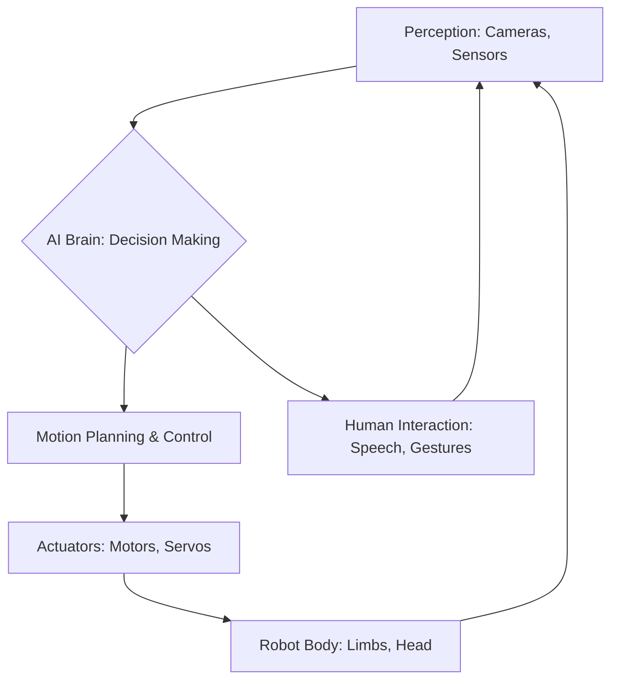

# Week 1 - Introduction to Humanoid Robotics

Welcome to the first chapter of Module 1! In this week, we'll set the stage for our journey into the fascinating world of physical AI and humanoid robotics. We'll start by defining what humanoid robots are, tracing their history, and exploring the diverse range of applications they are being developed for.

Humanoid robots are machines designed to resemble the human body. This anthropomorphic design often facilitates interaction with human-centric environments and tools.

## Historical Context

The idea of creating human-like machines dates back centuries, from ancient automata to the Golem legends. Modern robotics began to take shape in the 20th century with the advent of computers and advanced mechanics. Early pioneers like **Wabot-1** (Japan, 1973) and **ASIMO** (Honda, 2000) pushed the boundaries of what was thought possible.

## Key Applications

Humanoid robots are finding roles in various sectors:

*   **Hazardous Environments**: Exploring disaster zones, defusing bombs, space exploration.
*   **Healthcare**: Assisting the elderly, rehabilitation, surgical assistance.
*   **Education & Research**: Teaching STEM subjects, serving as research platforms for AI and control systems.
*   **Logistics & Service**: Performing tasks in warehouses, providing customer service.

## Code Example: Hello World in Robotics (Conceptual)

While true robot control involves complex APIs, a simple conceptual "Hello World" in a robotics context might look like this Python snippet, which would typically interface with a robot's motor control system.

```python
# Conceptual Python code for a robot's "Hello World"
import time

class RobotArm:
    def __init__(self, name="Generic Arm"):
        self.name = name
        print(f"{self.name} initialized.")

    def move_joint(self, joint_id, angle):
        """Simulates moving a single joint to a target angle."""
        print(f"Moving joint {joint_id} to {angle} degrees.")
        time.sleep(0.5) # Simulate movement time

    def wave(self):
        print(f"{self.name} is waving!")
        self.move_joint(1, 45) # Example: move shoulder
        self.move_joint(2, -30) # Example: move elbow
        time.sleep(1)
        self.move_joint(1, 0)
        self.move_joint(2, 0)
        print(f"{self.name} finished waving.")

if __name__ == "__main__":
    my_robot_arm = RobotArm("AlphaArm")
    my_robot_arm.wave()
```

## System Overview (Mermaid Diagram)

Here's a simplified overview of how a humanoid robot's systems might interact:



## Conclusion

This week has provided a broad introduction to humanoid robotics. In the following weeks, we will dive deeper into the technologies and principles that make these incredible machines possible.
