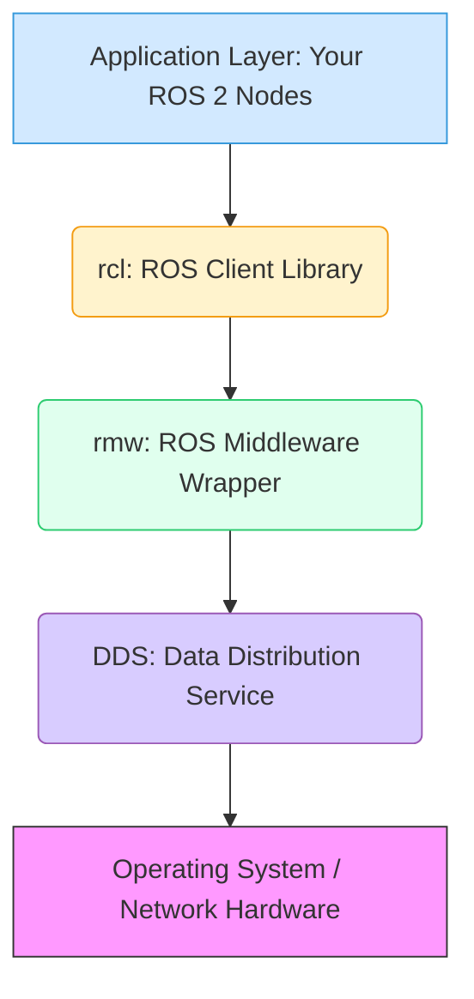
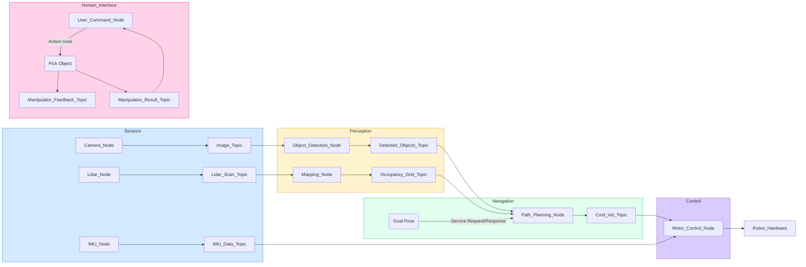

# ROS 2 Architecture and Core Concepts

## Introduction

Welcome to Module 2! Having explored the foundational concepts of Physical AI and Embodied Intelligence, it's time to dive into the practical framework that empowers modern robotics: the **Robot Operating System 2 (ROS 2)**. More than just an "operating system," ROS 2 is a flexible framework for writing robot software, providing a collection of tools, libraries, and conventions that simplify the complex task of creating sophisticated and robust robot behaviors. For humanoid robots, ROS 2 is particularly vital, offering the modularity and communication infrastructure needed to coordinate numerous sensors, actuators, and AI algorithms that define these advanced machines. It acts as the nervous system for your robotic creations, enabling disparate components to communicate seamlessly and work together towards a common goal. This chapter will demystify ROS 2, starting from its architectural innovations and moving through its core communication patterns, preparing you to build the intelligent, physical systems of the future.

### Difference Between ROS 1 and ROS 2

ROS 2 emerged as a major overhaul of its predecessor, ROS 1, addressing critical limitations in modern robotics applications. ROS 1, while revolutionary, was originally designed for single-robot systems in research labs, primarily on Linux. It struggled with real-time performance, multi-robot communication, and non-ideal network conditions.

ROS 2 was re-architected from the ground up to tackle these issues. Key differences include:

*   **Middleware**: ROS 1 used its own custom TCP/IP-based communication layer. ROS 2 leverages **DDS (Data Distribution Service)**, a standardized, high-performance, and real-time middleware.
*   **Real-time Capabilities**: DDS grants ROS 2 much better real-time performance, crucial for applications where precise timing is essential.
*   **Multi-robot Support**: Designed with multi-robot deployments in mind, enabling seamless communication and coordination across fleets of robots.
*   **Platform Agnostic**: ROS 2 supports Linux, Windows, and macOS, expanding its usability beyond a single operating system.
*   **Security**: ROS 2 incorporates robust security features from DDS, offering authentication, encryption, and access control.
*   **Quality of Service (QoS)**: Fine-grained control over communication reliability, latency, and durability.

### Real-world Applications in Humanoid Robots

For humanoid robots, ROS 2 is indispensable. Imagine a robot like a Tesla Optimus or a Figure 01:

*   **Sensor Integration**: ROS 2 provides standardized interfaces for integrating diverse sensors (cameras, IMUs, force sensors, LIDAR) from different manufacturers. Each sensor might publish data on a ROS 2 topic.
*   **Modular Control**: Complex behaviors like walking, grasping, or facial expressions can be broken down into separate ROS 2 nodes, allowing for parallel development and easier debugging. A walking controller node might subscribe to IMU data and publish motor commands.
*   **Human-Robot Interaction**: Nodes can manage speech recognition, natural language processing, and gesture recognition, enabling intuitive interaction with humans.
*   **Simulation Integration**: ROS 2 seamlessly integrates with simulators like Gazebo and NVIDIA Isaac Sim, allowing developers to test complex humanoid behaviors in virtual environments before deploying to hardware.

## ROS 2 Architecture

At the heart of ROS 2's power and flexibility is its innovative architecture, fundamentally built upon the **Data Distribution Service (DDS)** middleware. This choice provides ROS 2 with industrial-grade reliability, real-time capabilities, and scalability.

### DDS (Data Distribution Service) Middleware

DDS is an ISO/IEC international standard for real-time, publish-subscribe data distribution. It handles the low-level networking, ensuring that data reliably and efficiently moves between different components of a robotic system. Key features of DDS in ROS 2 include:

*   **Discovery**: DDS automatically discovers participants (nodes) on the network, simplifying system setup.
*   **Quality of Service (QoS)**: Developers can configure communication policies (e.g., reliability, durability, latency budget) to meet specific application needs.
*   **Platform Independent**: DDS implementations are available across various operating systems and programming languages.
*   **Decentralized**: Unlike ROS 1's central "roscore," DDS enables a peer-to-peer communication model, making systems more robust and scalable.

### Client Libraries (rclcpp, rclpy)

While DDS manages the underlying communication, developers interact with ROS 2 through client libraries. The two primary client libraries are:

*   **`rclcpp`**: The C++ client library, offering high performance and fine-grained control, often used for computationally intensive tasks or hardware interfaces.
*   **`rclpy`**: The Python client library, providing ease of development and rapid prototyping, making it popular for high-level logic and AI integration.

These client libraries abstract away the complexities of DDS, allowing developers to focus on robot behavior rather than network protocols.

### Communication Layer Architecture

The ROS 2 communication stack can be visualized as layers built on top of each other:

1.  **Application Layer**: Your ROS 2 nodes, implementing specific robot functionalities.
2.  **`rcl` (ROS Client Library)**: The C-based API that provides the common interface for `rclcpp` and `rclpy`, ensuring consistency.
3.  **`rmw` (ROS Middleware Wrapper)**: An abstraction layer that allows ROS 2 to be agnostic to the underlying DDS implementation. This means you can swap out DDS providers (e.g., Fast RTPS, Cyclone DDS) without changing your application code.
4.  **DDS (Data Distribution Service)**: The actual middleware responsible for data transport, discovery, and QoS.
5.  **Operating System/Network**: The physical network infrastructure (Ethernet, Wi-Fi) and the underlying OS.

This layered approach provides flexibility and allows for future improvements without breaking existing applications.

:::info
**Key takeaway:** DDS is fundamental to ROS 2, providing the robust communication backbone, while `rclcpp` and `rclpy` offer convenient programming interfaces.
:::

Here's a Mermaid diagram illustrating the ROS 2 architectural layers:



## Core Concepts

ROS 2 organizes robot software into a modular, distributed system. Understanding these core concepts is essential for building any ROS 2 application.

### Nodes: The Building Blocks

A **Node** is an executable process that performs a specific task. In a robotics system, functionalities are typically broken down into many small, modular nodes.
*   **Example**: A single node might be responsible for reading sensor data from a camera, another for running a navigation algorithm, and yet another for controlling the robot's motors.
*   **Benefit**: Modularity allows developers to easily replace, upgrade, or debug individual components without affecting the entire system.

### Topics: Publish-Subscribe Pattern

**Topics** are the primary mechanism for asynchronous, one-way streaming communication in ROS 2. They implement a **publish-subscribe** pattern.
*   **Publisher**: A node that sends data to a topic.
*   **Subscriber**: A node that receives data from a topic.
*   **Message**: The data type transmitted over a topic (e.g., `sensor_msgs/msg/Image` for camera data, `geometry_msgs/msg/Twist` for velocity commands).
*   **Example**: A camera driver node publishes `Image` messages on `/camera/image_raw`. An object detection node subscribes to this topic, processes the images, and publishes `Detection` messages on `/object_detector/detections`.

### Services: Request-Response Pattern

**Services** provide a synchronous, request-response communication pattern, suitable for operations that expect an immediate result.
*   **Server**: A node that offers a service and responds to requests.
*   **Client**: A node that sends a request to a service and waits for a response.
*   **Service Definition**: Consists of a request message and a response message.
*   **Example**: A navigation node might offer a service `/navigate_to_pose`. A client node sends a request with a target pose, and the navigation node responds with `success` or `failure` once the operation is complete.

### Actions: Long-Running Tasks

**Actions** are designed for long-running, goal-oriented tasks that require continuous feedback. They combine aspects of topics and services.
*   **Action Server**: A node that provides an action, processes goals, and sends continuous feedback and a final result.
*   **Action Client**: A node that sends a goal to an action server, receives periodic feedback on its progress, and gets a final result.
*   **Action Definition**: Consists of a goal, feedback, and result message.
*   **Example**: A robot arm manipulation node might offer a `/pick_object` action. A client sends a goal with the object to pick. The server provides feedback on the arm's position during the pick, and then returns a success/failure result.

### Parameters: Configuration Management

**Parameters** allow nodes to expose configurable values at runtime. They enable dynamic configuration of node behavior without recompiling code.
*   **Example**: A camera node might expose a `frame_rate` parameter that can be changed on the fly, or a navigation node might have a `max_speed` parameter.
*   **Mechanism**: Parameters can be set and retrieved using command-line tools (`ros2 param`) or programmatically within other nodes.

:::tip
Think of nodes as individual apps, topics for broadcasting live data, services for direct queries, actions for complex missions, and parameters for tweaking settings.
:::

## ROS 2 Graph Concept

The **ROS 2 Graph** is a conceptual network that describes all the active ROS 2 nodes in a system and how they are communicating with each other via topics, services, and actions. It's a powerful way to visualize and understand the runtime state and data flow of your robotic application.

### Computational Graph Explanation

In ROS 2, your robot's capabilities are distributed across many independent nodes. The computational graph illustrates how these nodes are interconnected and how data flows between them. There is no central master in ROS 2 (unlike ROS 1's `roscore`); instead, DDS handles the decentralized discovery and connection.

### How Nodes Discover Each Other

Nodes in ROS 2 discover each other automatically through the DDS middleware. When a node starts, it announces its presence and the topics/services/actions it publishes/subscribes to/provides. Other nodes listen for these announcements and establish direct connections as needed, based on their declared communication interfaces. This plug-and-play capability makes ROS 2 highly flexible for integrating new hardware or software components.

Here's a Mermaid diagram representing a sample ROS 2 computational graph for a mobile robot:



:::warning
While the graph is conceptual, tools like `rqt_graph` allow you to visualize the live ROS 2 graph of a running system, which is invaluable for debugging and understanding data flow.
:::

## Quality of Service (QoS)

**Quality of Service (QoS)** policies are a critical feature in ROS 2 that allow developers to fine-tune the communication behavior of topics, services, and actions. Since DDS is designed for diverse real-time applications, it provides a rich set of QoS settings, which ROS 2 exposes to the user. This is particularly important in robotics, where different data streams have varying requirements for reliability, latency, and throughput.

### QoS Policies Explained

Each ROS 2 publisher and subscriber can specify a set of QoS policies. The DDS middleware will then attempt to match these policies between compatible publishers and subscribers. If policies are incompatible (e.g., a reliable publisher trying to connect to a best-effort subscriber), communication might not be established.

Key QoS policies include:

*   **History**: How much data is retained by the middleware.
    *   `KEEP_LAST`: Only the N most recent samples.
    *   `KEEP_ALL`: All samples (limited by resource limits).
*   **Depth**: Used with `KEEP_LAST` history to specify the number of samples to keep.
*   **Reliability**: Guarantees about message delivery.
    *   `RELIABLE`: Guarantees that every message sent will be received (with retries if necessary). This can introduce latency but is crucial for command messages.
    *   `BEST_EFFORT`: Attempts to deliver messages but may drop them if the network is congested or slow. This is faster but less guaranteed, often suitable for streaming sensor data where new data quickly supersedes old data.
*   **Durability**: Whether data is persistent for late-joining subscribers.
    *   `TRANSIENT_LOCAL`: New subscribers receive the latest published data (or historical data up to depth).
    *   `VOLATILE`: Only data published while the subscriber is active is received.
*   **Liveliness**: How the middleware detects whether a publisher is still active.
    *   `AUTOMATIC`: Liveliness based on publisher activity.
    *   `MANUAL_BY_TOPIC`: Application explicitly asserts liveliness.
*   **Latency Budget**: Maximum acceptable delay between publication and reception.
*   **Lease Duration**: How long a publisher will be considered active without liveliness assertion.

### When to Use Different QoS Profiles

Choosing the right QoS profile is crucial for optimizing your ROS 2 application:

*   **Sensor Data (e.g., camera images, LIDAR scans)**: Often use `BEST_EFFORT` reliability and `KEEP_LAST` history with a small depth. It's more important to get the latest data quickly than to re-transmit old, possibly outdated, information.
*   **Critical Commands (e.g., motor commands, emergency stops)**: Require `RELIABLE` reliability and `TRANSIENT_LOCAL` durability (for a small depth) to ensure delivery, even if it means slight latency.
*   **Static Configuration Data**: Might use `RELIABLE` and `TRANSIENT_LOCAL` with a larger depth, so new nodes can receive configuration immediately upon joining.

:::info
Always consider the trade-off between reliability, latency, and resource usage when configuring QoS policies.
:::

## Practical Example: Simple Publisher-Subscriber in Python

Let's create a basic ROS 2 Python example with a publisher and a subscriber. This will demonstrate how nodes communicate using topics.

### 1. Simple Publisher Node (talker.py)

This node will continuously publish "Hello ROS 2!" messages.

```python
# talker.py
import rclpy
from rclpy.node import Node
from std_msgs.msg import String # Standard ROS 2 message type for strings

class MinimalPublisher(Node):
    def __init__(self):
        super().__init__('minimal_publisher') # Create a node named 'minimal_publisher'
        self.publisher_ = self.create_publisher(String, 'topic', 10) # Create a publisher
        # Arguments: message type, topic name, QoS history depth
        timer_period = 0.5  # seconds
        self.timer = self.create_timer(timer_period, self.timer_callback) # Create a timer for publishing
        self.i = 0

    def timer_callback(self):
        msg = String()
        msg.data = f'Hello ROS 2! {self.i}' # Create the message
        self.publisher_.publish(msg) # Publish the message
        self.get_logger().info(f'Publishing: "{msg.data}"') # Log to console
        self.i += 1

def main(args=None):
    rclpy.init(args=args) # Initialize ROS 2 communication

    minimal_publisher = MinimalPublisher() # Create the publisher node

    rclpy.spin(minimal_publisher) # Keep the node alive until Ctrl+C is pressed

    # Destroy the node explicitly
    # (optional - otherwise it will be done automatically
    # when the garbage collector destroys the node object)
    minimal_publisher.destroy_node()
    rclpy.shutdown() # Shutdown ROS 2 communication

if __name__ == '__main__':
    main()
```

### 2. Simple Subscriber Node (listener.py)

This node will subscribe to the "topic" and print received messages.

```python
# listener.py
import rclpy
from rclpy.node import Node
from std_msgs.msg import String # Import the same message type as the publisher

class MinimalSubscriber(Node):
    def __init__(self):
        super().__init__('minimal_subscriber') # Create a node named 'minimal_subscriber'
        self.subscription = self.create_subscription(
            String, # Message type
            'topic', # Topic name to subscribe to
            self.listener_callback, # Callback function to execute when a message is received
            10 # QoS history depth
        )
        self.subscription  # prevent unused variable warning

    def listener_callback(self, msg):
        self.get_logger().info(f'I heard: "{msg.data}"') # Log the received message

def main(args=None):
    rclpy.init(args=args) # Initialize ROS 2 communication

    minimal_subscriber = MinimalSubscriber() # Create the subscriber node

    rclpy.spin(minimal_subscriber) # Keep the node alive

    # Destroy the node explicitly
    minimal_subscriber.destroy_node()
    rclpy.shutdown() # Shutdown ROS 2 communication

if __name__ == '__main__':
    main()
```

## Hands-on Exercise: Create a simple talker-listener system

**Goal**: Implement and run the `talker.py` and `listener.py` nodes you just learned about.

**Step-by-step instructions**:

1.  **Create a ROS 2 package**:
    Navigate to your ROS 2 workspace `src` directory (if you have one, otherwise create `~/ros2_ws/src`) and run:
    ```bash
    ros2 pkg create --build-type ament_python my_python_pkg
    ```
2.  **Create `talker.py`**:
    Inside `my_python_pkg/my_python_pkg/`, create a file named `talker.py` and paste the publisher code provided above.
3.  **Create `listener.py`**:
    Inside `my_python_pkg/my_python_pkg/`, create a file named `listener.py` and paste the subscriber code provided above.
4.  **Modify `setup.py`**:
    Open `my_python_pkg/setup.py` and add the entry points for your executables:
    ```python
    # ... other imports
    
    entry_points={
        'console_scripts': [
            'talker = my_python_pkg.talker:main',
            'listener = my_python_pkg.listener:main',
        ],
    },
    # ... rest of setup.py
    ```
5.  **Build your package**:
    Navigate to your ROS 2 workspace root (`~/ros2_ws/`) and build:
    ```bash
    colcon build --packages-select my_python_pkg
    ```
6.  **Source your workspace**:
    ```bash
    source install/setup.bash # or setup.zsh, etc.
    ```
7.  **Run the talker node**:
    ```bash
    ros2 run my_python_pkg talker
    ```
8.  **Run the listener node (in a new terminal)**:
    Open a new terminal, source your workspace again, and run:
    ```bash
    ros2 run my_python_pkg listener
    ```
9.  **Observe communication**: You should see the talker publishing messages and the listener receiving and printing them.
10. **Inspect the ROS 2 graph**: In another terminal (after sourcing), run `rqt_graph` to visually inspect the running nodes and their connections.

**Expected output**:
The `talker` terminal will show messages like `Publishing: "Hello ROS 2! 0"`, `Publishing: "Hello ROS 2! 1"`, etc.
The `listener` terminal will show messages like `I heard: "Hello ROS 2! 0"`, `I heard: "Hello ROS 2! 1"`, etc.
`rqt_graph` will display two nodes (`/minimal_publisher` and `/minimal_subscriber`) connected by a topic (`/topic`).

## Key Takeaways

*   **ROS 2 is a powerful, flexible framework** for building robotics applications, leveraging DDS for robust communication.
*   **Modular architecture** with Nodes as fundamental building blocks.
*   **Communication patterns**: Topics (publish-subscribe), Services (request-response), and Actions (long-running goals with feedback).
*   **QoS policies** allow fine-grained control over communication characteristics like reliability and durability.
*   **Computational graph** helps visualize data flow and interactions between nodes.
*   Python (`rclpy`) offers an easy way to **prototype and develop ROS 2 applications**.

### Further reading resources:
*   [ROS 2 Documentation - Concepts Guide](https://docs.ros.org/en/humble/Concepts.html)
*   [ROS 2 Documentation - Quality of Service Policies](https://docs.ros.org/en/humble/Tutorials/Beginner-CLI-Tools/Introducing-ROS2-Quality-of-Service-Settings.html)
*   [ROS 2 Python Tutorials](https://docs.ros.org/en/humble/Tutorials/Demos/Topic-Listener-Talker.html)

---
[Previous Chapter: Embodied Intelligence: When AI Gets a Body](../module-1/02-embodied-intelligence.md)
[Next Chapter: Nodes, Topics, and Services in ROS 2](./02-nodes-topics-services.md)

---
[Previous Chapter: Physical AI: Bridging Digital Intelligence with Physical Reality](./01-physical-ai-basics.md)
[Next Chapter: Gazebo Simulation Fundamentals](../module-3/overview.md)
