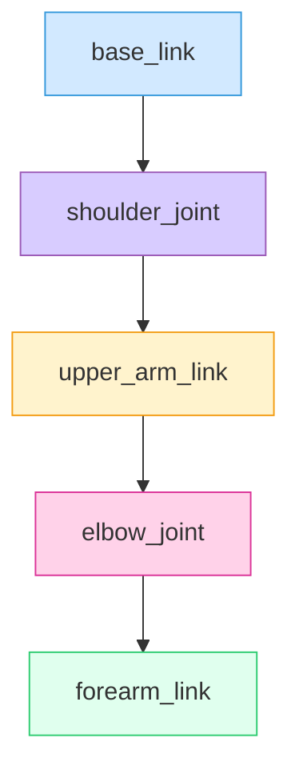

# Gazebo Simulation Environment and Robot Description Formats

## 1. Introduction to Gazebo

In the world of physical AI and humanoid robotics, moving from theory to practical implementation often involves a critical intermediate step: **simulation**. The real world is messy, unpredictable, and potentially dangerous for early-stage robot development. This is where **Gazebo** comes in.

Gazebo is a powerful 3D robotics simulator that allows you to accurately and efficiently simulate complex robotic systems in dynamic indoor and outdoor environments. It provides robust physics engines, high-quality graphics, and convenient interfaces for sensors and actuators.

### Why Use Simulation?

*   **Safety**: Test complex algorithms without risking damage to expensive hardware or harm to people.
*   **Cost-Effectiveness**: Develop and test concepts without needing physical prototypes, saving significant time and money.
*   **Reproducibility**: Simulations are entirely deterministic (given the same inputs), allowing for easy reproduction of experiments and debugging of difficult-to-replicate issues.
*   **Speed**: Run simulations faster than real-time, or in parallel, to accelerate learning and optimization (e.g., in reinforcement learning).
*   **Data Generation**: Create vast datasets (synthetic data) for training perception and control algorithms, especially useful for scenarios difficult to capture in the real world.

### Gazebo vs Real-World Testing

:::tip
Think of simulation as a virtual sandbox: you can play, experiment, and even break things without real-world consequences. Real-world testing is the final exam.
:::

While simulation offers immense benefits, it's crucial to remember the **sim-to-real gap** we discussed in Module 1. Simulations are models of reality, not reality itself. Discrepancies can arise from:
*   **Modeling errors**: Inaccurate physics parameters, sensor noise models, or contact properties.
*   **Environmental differences**: Unaccounted-for friction, lighting variations, or unexpected object properties.

Despite this, simulation is an indispensable tool, allowing us to validate algorithms and designs before extensive physical testing.

### Gazebo Versions (Gazebo Classic vs Gazebo Sim/Ignition)

Historically, there was **Gazebo Classic**. With the evolution of robotics and the need for more modern features, a new generation, **Gazebo Sim** (formerly Ignition Gazebo), was developed.
*   **Gazebo Classic**: The long-standing version, widely used with ROS 1.
*   **Gazebo Sim/Ignition**: The newer, actively developed version designed for ROS 2. It boasts a modular architecture, better performance, and advanced features for multi-robot and cloud simulation.

Throughout this textbook, we will primarily focus on **Gazebo Sim (Ignition Gazebo)** due to its tighter integration with ROS 2 and its future-proof capabilities.

### Use Cases in Humanoid Robotics

For humanoid robots, Gazebo simulation is invaluable:
*   **Gait Development**: Safely develop and test complex bipedal walking algorithms.
*   **Manipulation Tasks**: Practice grasping, object placement, and tool use in a controlled environment.
*   **Human-Robot Interaction**: Simulate human presence and test robot responses without risk.
*   **Sensor Fusion**: Evaluate algorithms combining data from various sensors (cameras, LIDAR, IMU).
*   **Reinforcement Learning**: Train humanoid policies for complex tasks through millions of simulated trials.

### Benefits of Simulation-First Development

Adopting a simulation-first approach means:
1.  **Rapid Iteration**: Quickly test design changes or algorithm modifications.
2.  **Early Bug Detection**: Identify and fix issues in a software-only environment.
3.  **Parallel Development**: Hardware and software teams can work concurrently.
4.  **Cost Reduction**: Minimize the need for expensive physical prototypes.

## 2. Gazebo Installation and Setup

This section guides you through installing Gazebo Sim (Ignition Gazebo) on Ubuntu 22.04 LTS, which is the recommended operating system for this textbook.

### System Requirements

*   **Operating System**: Ubuntu 22.04 LTS (Jammy Jellyfish).
*   **Graphics Card**: A dedicated GPU (NVIDIA, AMD) is highly recommended for smooth 3D rendering and complex simulations. Integrated graphics might work but will offer limited performance.
*   **Processor**: Modern multi-core CPU (Intel i5/i7 or AMD Ryzen 5/7 equivalent or better).
*   **RAM**: 8 GB (minimum), 16 GB+ (recommended) for complex simulations.
*   **Storage**: At least 10 GB free space for installation and models.

### Installation on Ubuntu 22.04

We will install the latest stable version of Gazebo Sim (often referred to as 'Fortress' or 'Garden' with ROS 2 Humble). The instructions below typically install the latest compatible version.

1.  **Add the Gazebo APT repository**:
    ```bash
    sudo sh -c 'echo "deb http://packages.osrfoundation.org/gazebo/ubuntu-stable $(lsb_release -cs) main" > /etc/apt/sources.list.d/gazebo-stable.list'
    wget https://packages.osrfoundation.org/gazebo.key -O - | sudo apt-key add -
    ```
    :::info
    The `lsb_release -cs` command automatically detects your Ubuntu version name (e.g., `jammy` for 22.04).
    :::

2.  **Update your package list**:
    ```bash
    sudo apt update
    ```

3.  **Install Gazebo Sim**:
    ```bash
    sudo apt install ignition-fortress # Or ignition-garden if using a newer ROS 2 distribution
    # For ROS 2 Humble, 'fortress' is typically used.
    ```
    This command installs the core Gazebo simulator, its command-line tools, and the GUI.

4.  **Install ROS 2 Integration Tools (optional but recommended for ROS 2 users)**:
    These packages provide the necessary bridges between ROS 2 and Gazebo.
    ```bash
    sudo apt install ros-humble-ros-gz # For ROS 2 Humble. Use ros-galactic-ros-gz for Galactic, etc.
    ```
    :::tip
    If you're unsure which Gazebo distribution pairs with your ROS 2 version, check the official ROS 2 documentation or the `ros_gz` bridge repository for compatibility tables.
    :::

### Verifying Installation

After installation, you can verify by checking the version and launching the GUI.

1.  **Check Gazebo Sim version**:
    ```bash
    gz --version
    # Expected output: e.g., gz-fortress 1.5.0
    ```
2.  **Launch the Gazebo GUI**:
    ```bash
    ign gazebo # For Gazebo Sim (Ignition)
    # Or for Gazebo Classic: gazebo
    ```
    This should open the Gazebo simulator GUI with an empty world.

### First Launch and GUI Overview

Upon launching `ign gazebo`, you'll see a 3D environment. Key interface elements typically include:
*   **3D Viewport**: The main area where the simulated world, robots, and objects are rendered.
*   **World Tree**: A panel (usually on the left) that lists all entities in the simulation (models, lights, sensors). You can select and manipulate them here.
*   **Toolbar**: Contains controls for pausing/playing simulation, resetting the world, adding simple shapes, and manipulating view.
*   **Property Inspector**: A panel (usually on the right) that shows detailed properties of selected entities (position, orientation, physics parameters).

:::info
Take some time to explore the interface. You can add simple shapes like spheres or boxes from the toolbar to see how they interact with the physics engine.
:::

## 3. Gazebo Architecture

Gazebo's architecture is designed for modularity, performance, and extensibility. Understanding its core components helps in leveraging its full capabilities.

### Server-Client Architecture

Gazebo Sim operates on a server-client model.
*   **`gz-sim` (Server)**: This is the core simulation server. It handles physics, sensor data generation, and all the behind-the-scenes computations. It doesn't have a GUI.
*   **`gz-gui` (Client)**: This is the graphical user interface that connects to the `gz-sim` server. It allows users to visualize the simulation, interact with models, and configure parameters. Multiple `gz-gui` clients can connect to a single `gz-sim` server.

This separation allows for headless simulations (running without a GUI, useful for CI/CD or large-scale data generation) and flexible user interfaces.

### Physics Engine (ODE, Bullet, Simbody)

Gazebo supports multiple physics engines to handle rigid body dynamics, collisions, and joint constraints.
*   **ODE (Open Dynamics Engine)**: The default and most common physics engine in Gazebo Classic. Good general-purpose engine.
*   **Bullet**: Offers good performance and is widely used in gaming and VFX.
*   **DART (Dynamic Animation and Robotics Toolkit)**: An open-source library for robot kinematics and dynamics, supported in Gazebo Sim.
*   **Tpe (Trivial Physics Engine)**: A lightweight, custom-built engine often used for simpler models.

The choice of physics engine can impact simulation accuracy and performance. For most robotics applications, DART or Bullet in Gazebo Sim provide a good balance.

### Rendering Engine (OGRE)

Gazebo uses **OGRE (Object-Oriented Graphics Rendering Engine)** for its 3D visualization. OGRE is a high-performance, flexible 3D engine that allows Gazebo to render realistic environments and robot models.

### Plugin System

Gazebo is highly extensible through its powerful **plugin system**. Plugins allow users to:
*   **Add custom sensor models**: Simulate novel sensors or add specific noise characteristics.
*   **Implement custom control algorithms**: Control robots directly within the simulator.
*   **Interface with external software**: Bridge to ROS 2 or other robot frameworks.
*   **Modify simulation behavior**: Alter physics parameters or apply external forces.

Plugins are typically written in C++ and loaded dynamically during simulation runtime.

Here's a Mermaid diagram showing the Gazebo architecture:

```mermaid
graph TD
    A[Simulation Server: gz-sim] --> B[Physics Engine (DART, Bullet)]
    A --> C[Rendering Engine (OGRE)]
    A --> D[Sensor Simulators]
    A --> E[Actuator Interfaces]
    A --> F[Plugin Manager]
    F --> G[Custom Plugins]
    H[GUI Client: gz-gui] --> A
    I[ROS 2 Bridge (ros_gz)] --> A
    style A fill:#D2E9FF,stroke:#3498DB
    style H fill:#FFF3CD,stroke:#F39C12
    style I fill:#E0FFEE,stroke:#2ECC71
```

## 4. Understanding URDF (Unified Robot Description Format)

Before we can simulate a robot in Gazebo, we need to tell Gazebo what the robot looks like, how its parts are connected, and what its physical properties are. This is done using **robot description formats**. The most common one in the ROS ecosystem is **URDF**.

### What is URDF and Why It Exists?

**URDF (Unified Robot Description Format)** is an XML-based file format used in ROS to describe all elements of a robot. It's primarily designed for representing the kinematic and dynamic properties of a robot, as well as its visual representation, for use in tools like RViz (for visualization) and various motion planning libraries.

### XML-Based Robot Description

URDF uses an XML schema to define the robot. Every robot described in URDF must have a root `<robot>` tag, which contains `<link>` and `<joint>` tags.

### URDF Components:

#### Links (Robot Body Parts)

A `<link>` tag describes a rigid body part of the robot. It can contain:
*   **`<visual>`**: Defines the graphical representation of the link (e.g., a mesh file, color). This is what you see in the simulator or RViz.
*   **`<collision>`**: Defines the physical shape of the link used for collision detection. This is crucial for interaction with the environment and other robot parts. It can be a simple primitive (box, cylinder, sphere) or a mesh.
*   **`<inertial>`**: Defines the physical properties of the link:
    *   `mass`: The mass of the link.
    *   `inertia`: The 3x3 rotational inertia matrix (tensor) about the link's center of mass.
    *   `origin`: The pose (position and orientation) of the inertial frame relative to the link frame.

#### Joints (Connections Between Links)

A `<joint>` tag describes how two links are connected. It defines the kinematics and motion limits between a parent link and a child link.
*   **`type`**: The type of joint (e.g., `revolute`, `prismatic`, `fixed`, `continuous`).
*   **`parent`**: The name of the parent link.
*   **`child`**: The name of the child link.
*   **`origin`**: The pose of the joint frame relative to the parent link frame.
*   **`axis`**: The axis of rotation for revolute/continuous joints or translation for prismatic joints.
*   **`<limit>`**: Defines the joint's motion limits (upper, lower, velocity, effort).
*   **`<calibration>`**: For calibrating joint position.
*   **`<dynamics>`**: For friction and damping properties.

### Complete URDF Example: Simple 2-link Robot Arm

Here's an example of a simple 2-link robot arm defined using URDF. This arm has a base, a shoulder joint, an upper arm, an elbow joint, and a forearm.

```xml
<?xml version="1.0"?>
<robot name="simple_arm">

  <!-- ============================================== -->
  <!-- BASE LINK                                      -->
  <!-- ============================================== -->
  <link name="base_link">
    <visual>
      <geometry>
        <box size="0.1 0.1 0.05"/>
      </geometry>
      <material name="blue">
        <color rgba="0 0 0.8 1"/>
      </material>
    </visual>
    <collision>
      <geometry>
        <box size="0.1 0.1 0.05"/>
      </geometry>
    </collision>
    <inertial>
      <mass value="0.5"/>
      <inertia ixx="0.001" ixy="0" ixz="0" iyy="0.001" iyz="0" izz="0.001"/>
    </inertial>
  </link>

  <!-- ============================================== -->
  <!-- SHOULDER JOINT & UPPER ARM LINK                -->
  <!-- ============================================== -->
  <joint name="shoulder_joint" type="revolute">
    <parent link="base_link"/>
    <child link="upper_arm_link"/>
    <origin xyz="0 0 0.025" rpy="0 0 0"/> <!-- Joint at top of base_link -->
    <axis xyz="0 0 1"/> <!-- Rotates around Z-axis -->
    <limit lower="-1.57" upper="1.57" effort="100" velocity="100"/>
  </joint>

  <link name="upper_arm_link">
    <visual>
      <origin xyz="0 0 0.15" rpy="0 0 0"/> <!-- Visual offset to make arm extend upwards -->
      <geometry>
        <cylinder radius="0.02" length="0.3"/>
      </geometry>
      <material name="red">
        <color rgba="0.8 0 0 1"/>
      </material>
    </visual>
    <collision>
      <origin xyz="0 0 0.15" rpy="0 0 0"/>
      <geometry>
        <cylinder radius="0.02" length="0.3"/>
      </geometry>
    </collision>
    <inertial>
      <mass value="0.3"/>
      <origin xyz="0 0 0.15" rpy="0 0 0"/>
      <inertia ixx="0.0001" ixy="0" ixz="0" iyy="0.0001" iyz="0" izz="0.0001"/>
    </inertial>
  </link>

  <!-- ============================================== -->
  <!-- ELBOW JOINT & FOREARM LINK                     -->
  <!-- ============================================== -->
  <joint name="elbow_joint" type="revolute">
    <parent link="upper_arm_link"/>
    <child link="forearm_link"/>
    <origin xyz="0 0 0.3" rpy="0 0 0"/> <!-- Joint at end of upper_arm_link -->
    <axis xyz="0 1 0"/> <!-- Rotates around Y-axis -->
    <limit lower="-1.57" upper="1.57" effort="100" velocity="100"/>
  </joint>

  <link name="forearm_link">
    <visual>
      <origin xyz="0 0 0.1" rpy="0 0 0"/>
      <geometry>
        <cylinder radius="0.015" length="0.2"/>
      </geometry>
      <material name="green">
        <color rgba="0 0.8 0 1"/>
      </material>
    </visual>
    <collision>
      <origin xyz="0 0 0.1" rpy="0 0 0"/>
      <geometry>
        <cylinder radius="0.015" length="0.2"/>
      </geometry>
    </collision>
    <inertial>
      <mass value="0.2"/>
      <origin xyz="0 0 0.1" rpy="0 0 0"/>
      <inertia ixx="0.00005" ixy="0" ixz="0" iyy="0.00005" iyz="0" izz="0.00005"/>
    </inertial>
  </link>

  <!-- Define materials for colors -->
  <material name="blue">
    <color rgba="0 0 0.8 1"/>
  </material>
  <material name="red">
    <color rgba="0.8 0 0 1"/>
  </material>
  <material name="green">
    <color rgba="0 0.8 0 1"/>
  </material>

</robot>
```

Here's a visual representation of the simple 2-link arm's structure using a Mermaid diagram:



## 5. URDF Best Practices

Creating well-structured and functional URDF files requires adherence to several best practices.

*   **Nodal Structure**: Always define a tree structure for your robot, starting from a single `root` link. Each joint connects a `parent` link to a `child` link.
*   **Naming Conventions**: Use consistent and descriptive names for links and joints. Typically `snake_case` is preferred.
*   **Coordinate Frames and TF**:
    *   Each link has its own coordinate frame, centered at its origin.
    *   Joint `origin` defines the pose of the child link's frame relative to the parent link's frame.
    *   Understanding the **TF (Transform Frame)** system in ROS is crucial for tracking the pose of links and objects in a robot's environment.
*   **Link Origin Placement**: Place the link's origin (0,0,0) at a sensible location, often at the base of the link or its center of mass. This affects how joint `origin` values are defined.
*   **Collision vs Visual Meshes**:
    *   **Visuals**: Use high-fidelity meshes (e.g., STL, DAE) for realistic rendering. These can be complex.
    *   **Collisions**: Use simplified convex hull meshes or basic primitives (box, sphere, cylinder). Complex collision meshes are computationally expensive and can slow down the physics simulation. They should accurately represent the physical boundaries of the link.
*   **Mass and Inertia Calculations**:
    *   Accurate `mass` and `inertia` values are paramount for realistic physics simulation.
    *   For simple shapes, you can calculate these manually or use online calculators.
    *   For complex meshes, CAD software often provides these properties. Tools like `meshlab` can also approximate them.
    *   Incorrect inertia values can lead to unstable or unrealistic robot behavior in simulation.

## 6. Introduction to SDF (Simulation Description Format)

While URDF is excellent for describing robots, it has limitations, especially when describing entire environments or non-kinematic elements. This is where **SDF (Simulation Description Format)** comes in. SDF is an XML format designed to describe environments, robots, and objects for high-fidelity physics simulators like Gazebo.

### URDF vs SDF Comparison

| Feature             | URDF (Unified Robot Description Format)            | SDF (Simulation Description Format)                        |
| :------------------ | :------------------------------------------------- | :--------------------------------------------------------- |
| **Primary Use**     | Robot description for ROS tools (kinematics, visuals)| Full simulation description (robots, worlds, environments) |
| **Scope**           | Single robot                                       | Multiple robots, static environments, dynamic objects      |
| **Parent/Child**    | Strict tree structure (one parent per child)       | Graph structure (multiple parents possible)                |
| **Physics**         | Limited (basic inertials, joint limits)            | Extensive (sensors, plugins, friction, damping, more complex physics) |
| **Sensors**         | Basic (often added as Gazebo extensions)           | Fully integrated and extensible                            |
| **Plugins**         | Via Gazebo extensions                              | Native plugin support for any element                      |
| **World Description**| Not directly                                     | Yes (lights, terrain, static models, GUI elements)       |

### When to Use SDF

*   **World Files**: When you need to define an entire simulation environment including terrain, static objects, lights, and multiple robots.
*   **Advanced Simulation Features**: For detailed sensor models, complex physics parameters (e.g., specific friction coefficients), or custom Gazebo plugins.
*   **Multi-Robot Systems**: For simulating interactions between multiple robots and their environment.

### SDF Advantages for Simulation

SDF's design makes it inherently more powerful for simulation:
*   **Comprehensive World Description**: Can describe everything from a single robot to an entire city.
*   **Rich Physics Properties**: Offers more detailed control over physics parameters.
*   **Extensible**: Built-in support for custom plugins for any element.
*   **Sensor Integration**: Native support for defining various sensor types and their properties.

### World Files vs Model Files

*   **World Files (`.world`)**: An SDF file that describes a complete simulation scenario, including:
    *   Global physics properties (e.g., gravity, real-time factor).
    *   Ground plane, lights.
    *   Static models (e.g., buildings, tables).
    *   Robot models (can be imported from separate SDF or URDF files).
*   **Model Files (`.sdf`)**: An SDF file that describes a single, self-contained model (e.g., a robot, a chair, a plant). These can be reused and imported into world files.

### SDF Structure and Syntax

An SDF file starts with an `<sdf>` tag. A world file uses a `<world>` tag inside `<sdf>`, while a model file uses a `<model>` tag.

**Example of a simple SDF model file:**
```xml
<?xml version="1.0"?>
<sdf version="1.7">
  <model name="simple_box">
    <link name="box_link">
      <inertial>
        <mass>1.0</mass>
        <inertia>
          <ixx>0.166667</ixx> <iyy>0.166667</iyy> <izz>0.166667</izz>
          <ixy>0.0</ixy> <ixz>0.0</ixz> <iyz>0.0</iyz>
        </inertia>
      </inertial>
      <visual name="visual">
        <geometry>
          <box>
            <size>1 1 1</size>
          </box>
        </geometry>
        <material>
          <ambient>0.8 0.3 0.1 1</ambient>
          <diffuse>0.8 0.3 0.1 1</diffuse>
          <specular>0.1 0.1 0.1 1</specular>
        </material>
      </visual>
      <collision name="collision">
        <geometry>
          <box>
            <size>1 1 1</size>
          </box>
        </geometry>
      </collision>
    </link>
  </model>
</sdf>
```

## 7. Creating Your First Robot Model

Let's create a URDF for a simple wheeled robot. While humanoids are bipedal, a wheeled robot's base provides a good starting point for understanding how to combine links, joints, and sensors.

### Step-by-step URDF creation: Simple Wheeled Robot

We'll define a base link, two wheel links, and joints to connect them, along with a camera and IMU sensor.

```xml
<?xml version="1.0"?>
<robot name="simple_wheeled_robot">

  <!-- ============================================== -->
  <!-- BASE LINK                                      -->
  <!-- The main body of the robot                     -->
  <!-- ============================================== -->
  <link name="base_link">
    <visual>
      <geometry>
        <box size="0.4 0.2 0.1"/>
      </geometry>
      <material name="blue">
        <color rgba="0 0 0.8 1"/>
      </material>
    </visual>
    <collision>
      <geometry>
        <box size="0.4 0.2 0.1"/>
      </geometry>
    </collision>
    <inertial>
      <mass value="5.0"/>
      <inertia ixx="0.05" ixy="0" ixz="0" iyy="0.05" iyz="0" izz="0.1"/>
    </inertial>
  </link>

  <!-- ============================================== -->
  <!-- LEFT WHEEL LINK & JOINT                        -->
  <!-- ============================================== -->
  <link name="left_wheel_link">
    <visual>
      <origin xyz="0 0 0" rpy="1.5707 0 0"/> <!-- Rotate cylinder to align with wheel -->
      <geometry>
        <cylinder radius="0.05" length="0.04"/>
      </geometry>
      <material name="black">
        <color rgba="0 0 0 1"/>
      </material>
    </visual>
    <collision>
      <origin xyz="0 0 0" rpy="1.5707 0 0"/>
      <geometry>
        <cylinder radius="0.05" length="0.04"/>
      </geometry>
    </collision>
    <inertial>
      <mass value="0.2"/>
      <origin xyz="0 0 0" rpy="1.5707 0 0"/>
      <inertia ixx="0.0001" ixy="0" ixz="0" iyy="0.0001" iyz="0" izz="0.0001"/>
    </inertial>
  </link>

  <joint name="left_wheel_joint" type="continuous">
    <parent link="base_link"/>
    <child link="left_wheel_link"/>
    <origin xyz="0.15 0.12 0" rpy="0 0 0"/> <!-- Position relative to base_link -->
    <axis xyz="0 1 0"/> <!-- Rotates around Y-axis -->
  </joint>

  <!-- ============================================== -->
  <!-- RIGHT WHEEL LINK & JOINT                       -->
  <!-- ============================================== -->
  <link name="right_wheel_link">
    <visual>
      <origin xyz="0 0 0" rpy="1.5707 0 0"/>
      <geometry>
        <cylinder radius="0.05" length="0.04"/>
      </geometry>
      <material name="black"/>
    </visual>
    <collision>
      <origin xyz="0 0 0" rpy="1.5707 0 0"/>
      <geometry>
        <cylinder radius="0.05" length="0.04"/>
      </geometry>
    </collision>
    <inertial>
      <mass value="0.2"/>
      <origin xyz="0 0 0" rpy="1.5707 0 0"/>
      <inertia ixx="0.0001" ixy="0" ixz="0" iyy="0.0001" iyz="0" izz="0.0001"/>
    </inertial>
  </link>

  <joint name="right_wheel_joint" type="continuous">
    <parent link="base_link"/>
    <child link="right_wheel_link"/>
    <origin xyz="0.15 -0.12 0" rpy="0 0 0"/>
    <axis xyz="0 1 0"/>
  </joint>

  <!-- ============================================== -->
  <!-- CAMERA SENSOR (Gazebo extension, conceptual) -->
  <!-- In ROS 2, sensors are often attached to links and configured in Gazebo plugins -->
  <!-- ============================================== -->
  <link name="camera_link">
    <visual>
      <origin xyz="0 0 0" rpy="0 0 0"/>
      <geometry>
        <box size="0.03 0.05 0.03"/>
      </geometry>
      <material name="gray">
        <color rgba="0.5 0.5 0.5 1"/>
      </material>
    </visual>
    <inertial>
      <mass value="0.01"/>
      <inertia ixx="1e-6" ixy="0" ixz="0" iyy="1e-6" iyz="0" izz="1e-6"/>
    </inertial>
  </link>

  <joint name="camera_joint" type="fixed">
    <parent link="base_link"/>
    <child link="camera_link"/>
    <origin xyz="0.18 0 0.05" rpy="0 0 0"/>
  </joint>

  <!-- ============================================== -->
  <!-- IMU SENSOR (Gazebo extension, conceptual) -->
  <!-- In ROS 2, sensors are often attached to links and configured in Gazebo plugins -->
  <!-- ============================================== -->
  <link name="imu_link">
    <inertial>
      <mass value="0.01"/>
      <inertia ixx="1e-6" ixy="0" ixz="0" iyy="1e-6" iyz="0" izz="1e-6"/>
    </inertial>
  </link>

  <joint name="imu_joint" type="fixed">
    <parent link="base_link"/>
    <child link="imu_link"/>
    <origin xyz="0 0 0.05" rpy="0 0 0"/>
  </joint>

  <!-- Materials -->
  <material name="blue">
    <color rgba="0 0 0.8 1"/>
  </material>
  <material name="black">
    <color rgba="0 0 0 1"/>
  </material>
  <material name="gray">
    <color rgba="0.5 0.5 0.5 1"/>
  </material>

</robot>
```

### Visualizing in RViz

To visualize this URDF model in RViz (ROS Visualization tool):
1.  Save the above XML as `simple_wheeled_robot.urdf` in a ROS 2 package.
2.  Launch `rviz2` in a terminal:
    ```bash
    rviz2
    ```
3.  In RViz, add the `RobotModel` display type and set the `Description Source` to `File` and load your `simple_wheeled_robot.urdf`.
4.  Add a `JointStatePublisher` to manually manipulate the joints if they are not fixed.

### Loading in Gazebo

To load this URDF into Gazebo Sim:
1.  Gazebo requires an SDF world file to load models. You can convert URDF to SDF (see next section) or directly spawn the URDF model using ROS 2 tools.
2.  If using ROS 2, install `ros-humble-ros-gz` (or your ROS 2 distro equivalent).
3.  Run Gazebo:
    ```bash
    ign gazebo
    ```
4.  Spawn your robot model using `ros2 run ros_gz_sim create -entity simple_wheeled_robot -topic robot_description -x 0 -y 0 -z 0.5`. You'll need to publish your URDF to the `/robot_description` topic first using a `robot_state_publisher` node.

## 8. URDF to SDF Conversion

While ROS tools predominantly use URDF for robot descriptions, Gazebo Sim natively prefers **SDF (Simulation Description Format)** for defining models and worlds due to SDF's richer feature set for simulation. Fortunately, Gazebo provides tools to convert URDF files to SDF.

### Why and When to Convert?

*   **URDF for ROS tools**: For compatibility with ROS navigation stack, motion planning, and RViz visualization.
*   **SDF for Gazebo simulation**: For accurate physics, sensor definitions, and advanced plugin integration within the simulator.

You typically maintain your robot model in URDF (or Xacro, see next section) for ROS compatibility, and then convert it to SDF for use in Gazebo.

### Using `gz sdf` command

Gazebo Sim provides a command-line tool `gz sdf` (or `ign sdf` for older versions) to perform conversions.

*   **Convert URDF to SDF**:
    ```bash
    gz sdf -p your_robot.urdf > your_robot.sdf
    ```
    :::info
    This command parses the URDF file and prints the equivalent SDF to standard output. You redirect this output to a new `.sdf` file.
    :::

### Automatic Conversion Process

When you use ROS 2 to spawn a URDF model into Gazebo (e.g., via `ros_gz_sim`), the `ros_gz_bridge` and underlying Gazebo libraries often handle the URDF to SDF conversion automatically. However, for complex models or when you need fine-grained control over simulation-specific properties, explicit conversion and manual adjustments might be necessary.

### Manual Adjustments Needed

While automatic conversion works for basic elements, some URDF features might not have direct SDF equivalents, or you might want to add Gazebo-specific elements not present in URDF:
*   **Gazebo-specific tags**: SDF allows you to directly define things like Gazebo plugins, custom sensor properties (e.g., camera noise, LIDAR ranges), or light sources, which are not part of the standard URDF specification. These would need to be added manually to the converted SDF.
*   **Physics parameters**: More detailed friction models, damping, or contact parameters can be specified in SDF.
*   **Joint properties**: Some advanced joint properties (e.g., spring dynamics) might be more accurately represented directly in SDF.

## 9. Xacro: URDF Macros

As robot models become more complex, especially for humanoid robots with many symmetric limbs, URDF files can become very long, repetitive, and difficult to manage. **Xacro (XML Macros)** is a preprocessor for XML files that allows you to use macros, properties, and basic logic to create more concise and reusable robot descriptions.

### Introduction to Xacro

Xacro files are typically `.urdf.xacro` files. They contain XML that uses special Xacro tags to define reusable components. Before the robot model can be used by ROS tools or Gazebo, the Xacro file is processed to generate a standard URDF XML file.

### Why Use Xacro (Avoiding Repetition)

Imagine a humanoid robot with two arms, two legs, and ten fingers. Each arm might have 7 joints and 8 links. Without Xacro, you would have to copy-paste the definition of an arm or a finger 2, 4, or 10 times, leading to:
*   **Repetitive code**: Hard to read and maintain.
*   **Error-prone**: Changes to one limb need to be replicated everywhere.
*   **Difficult to parameterize**: Changing the length of all fingers would require multiple edits.

Xacro solves this by allowing you to define a "macro" for a limb (e.g., a `finger` macro) and then instantiate it multiple times with different parameters.

### Xacro Properties and Macros

*   **Properties**: Define variables that can be used throughout the Xacro file.
    ```xml
    <?xml version="1.0"?>
    <robot name="my_robot" xmlns:xacro="http://ros.org/xacro">
      <xacro:property name="arm_length" value="0.5"/>
      <xacro:property name="pi" value="3.14159"/>

      <link name="base_link">
        <visual>
          <geometry>
            <cylinder radius="0.05" length="${arm_length}"/>
          </geometry>
        </visual>
      </link>
    </robot>
    ```
*   **Macros**: Define reusable blocks of XML that can take arguments.
    ```xml
    <?xml version="1.0"?>
    <robot name="my_robot" xmlns:xacro="http://ros.org/xacro">
      <xacro:macro name="hand" params="prefix parent_link *origin">
        <joint name="${prefix}_joint" type="fixed">
          <xacro:insert_block name="origin" />
          <parent link="${parent_link}"/>
          <child link="${prefix}_link"/>
        </joint>
        <link name="${prefix}_link">
          <visual>
            <geometry><box size="0.1 0.05 0.02"/></geometry>
          </visual>
        </link>
      </xacro:macro>

      <link name="arm_base"/>
      <xacro:hand prefix="right_hand" parent_link="arm_base">
        <origin xyz="0.1 0 0" rpy="0 0 0"/>
      </xacro:hand>
      <xacro:hand prefix="left_hand" parent_link="arm_base">
        <origin xyz="-0.1 0 0" rpy="0 0 0"/>
      </xacro:hand>
    </robot>
    ```

### Simple Example: Parameterized Wheel

Let's modify our simple wheeled robot to use Xacro for the wheels. This makes it easy to change wheel properties globally.

```xml
<?xml version="1.0"?>
<robot name="wheeled_robot_xacro" xmlns:xacro="http://ros.org/xacro">

  <!-- Properties -->
  <xacro:property name="base_width" value="0.2"/>
  <xacro:property name="base_length" value="0.4"/>
  <xacro:property name="base_height" value="0.1"/>
  <xacro:property name="wheel_radius" value="0.05"/>
  <xacro:property name="wheel_thickness" value="0.04"/>
  <xacro:property name="wheel_offset_x" value="0.15"/>
  <xacro:property name="wheel_offset_y" value="0.12"/>
  <xacro:property name="PI" value="3.1415926535897931"/>

  <!-- ============================================== -->
  <!-- BASE LINK                                      -->
  <!-- ============================================== -->
  <link name="base_link">
    <visual>
      <geometry>
        <box size="${base_length} ${base_width} ${base_height}"/>
      </geometry>
      <material name="blue">
        <color rgba="0 0 0.8 1"/>
      </material>
    </visual>
    <collision>
      <geometry>
        <box size="${base_length} ${base_width} ${base_height}"/>
      </geometry>
    </collision>
    <inertial>
      <mass value="5.0"/>
      <inertia ixx="0.05" ixy="0" ixz="0" iyy="0.05" iyz="0" izz="0.1"/>
    </inertial>
  </link>

  <!-- ============================================== -->
  <!-- WHEEL MACRO                                    -->
  <!-- ============================================== -->
  <xacro:macro name="wheel" params="prefix y_offset">
    <link name="${prefix}_wheel_link">
      <visual>
        <origin xyz="0 0 0" rpy="${PI/2} 0 0"/>
        <geometry>
          <cylinder radius="${wheel_radius}" length="${wheel_thickness}"/>
        </geometry>
        <material name="black">
          <color rgba="0 0 0 1"/>
        </material>
      </visual>
      <collision>
        <origin xyz="0 0 0" rpy="${PI/2} 0 0"/>
        <geometry>
          <cylinder radius="${wheel_radius}" length="${wheel_thickness}"/>
        </geometry>
      </collision>
      <inertial>
        <mass value="0.2"/>
        <origin xyz="0 0 0" rpy="${PI/2} 0 0"/>
        <inertia ixx="0.0001" ixy="0" ixz="0" iyy="0.0001" iyz="0" izz="0.0001"/>
      </inertial>
    </link>

    <joint name="${prefix}_wheel_joint" type="continuous">
      <parent link="base_link"/>
      <child link="${prefix}_wheel_link"/>
      <origin xyz="${wheel_offset_x} ${y_offset} 0" rpy="0 0 0"/>
      <axis xyz="0 1 0"/>
    </joint>
  </xacro:macro>

  <!-- Instantiate wheels -->
  <xacro:wheel prefix="left" y_offset="${wheel_offset_y}"/>
  <xacro:wheel prefix="right" y_offset="${-wheel_offset_y}"/>

</robot>
```

### Converting Xacro to URDF

To convert an Xacro file to a standard URDF file:
```bash
ros2 run xacro xacro simple_wheeled_robot.urdf.xacro > simple_wheeled_robot.urdf
```
This command processes the Xacro macros and properties, expanding them into a full URDF XML file that can then be used by other ROS tools or converted to SDF for Gazebo.

## 10. Hands-on Exercises

### Exercise 1: Create URDF for Simple 3-Link Robot Arm

**Goal**: Create a URDF file for a 3-link robot arm with a base, shoulder, elbow, and wrist joint.
**Instructions**:
1.  Start with the 2-link arm example provided earlier.
2.  Add a new `wrist_joint` (revolute, Y-axis rotation) and a `hand_link` (simple box).
3.  Ensure all links have visual, collision, and inertial properties.
4.  Visualize your robot in RViz.
**Solution Hints**: Follow the structure of the shoulder and elbow joints. Remember to define the `origin` for the new joint and link relative to its parent.

### Exercise 2: Add Camera Sensor to Robot Base

**Goal**: Extend the simple wheeled robot URDF to include a functional camera sensor.
**Instructions**:
1.  Use the `simple_wheeled_robot.urdf` from section 7.
2.  Add a `camera_link` and `camera_joint` (fixed) as shown conceptually.
3.  Add a Gazebo-specific `<sensor>` tag (within `<gazebo>` extensions in a separate file, or directly in SDF after conversion) to the `camera_link` to define a realistic camera sensor that publishes image data.
    :::tip
    This might require converting to SDF and adding `<sensor>` tags directly, or using a `ros_gz_bridge` camera plugin in Gazebo.
    :::
**Solution Hints**: Research `ros_gz_camera` plugin and how to declare it in Gazebo.

### Exercise 3: Create Xacro Macro for Robot Leg

**Goal**: Develop a reusable Xacro macro for a humanoid robot's leg, allowing easy instantiation for left and right legs.
**Instructions**:
1.  Define properties for leg segment lengths and joint limits.
2.  Create a Xacro macro `humanoid_leg` that takes `prefix` (e.g., `left`, `right`) and `parent_link` (e.g., `base_link` or `torso_link`) as parameters.
3.  Inside the macro, define hip (revolute, 3 DoF), knee (revolute, 1 DoF), and ankle (revolute, 2 DoF) joints, along with thigh, shank, and foot links.
4.  Instantiate the macro twice for `left_leg` and `right_leg` attached to a `torso_link`.
5.  Convert your Xacro to URDF and visualize it.
**Solution Hints**: Pay attention to the `origin` and `axis` for each joint to ensure proper kinematics.

## 11. Common Issues and Troubleshooting

:::warning
*   **URDF Validation Errors**: Always validate your URDF using `check_urdf <your_robot.urdf>`. Common errors include missing links/joints, invalid XML, or disconnected kinematic chains.
*   **Joint Limits Problems**: If your robot behaves erratically or doesn't move as expected, check joint `lower`/`upper` limits, `effort`, and `velocity` values in your URDF.
*   **Collision Detection Issues**: If your robot is self-colliding or passing through objects, ensure your `<collision>` geometries are correctly defined and placed, and are not too large or too small.
*   **Inertia Issues**: Incorrect `mass` or `inertia` values can lead to unstable physics simulation. Use realistic values or CAD tools for computation.
*   **Missing Meshes**: If your robot appears invisible or distorted, check that mesh file paths (`<mesh filename="...">`) are correct and the files are accessible.
*   **Gazebo Plugins Not Loading**: Ensure Gazebo plugins are correctly specified in your SDF (or Gazebo extensions in URDF) and that their libraries are findable (e.g., in your `LD_LIBRARY_PATH`).
:::

## 12. Tools and Utilities

*   **`check_urdf` command**: A ROS utility to validate URDF files.
    ```bash
    check_urdf simple_wheeled_robot.urdf
    # Expected output: Robot simple_wheeled_robot is a valid URDF model
    ```
*   **`urdf_to_graphiz` visualization**: Generates a PDF visualization of your robot's kinematic tree.
    ```bash
    urdf_to_graphiz simple_wheeled_robot.urdf
    # This will generate a simple_wheeled_robot.pdf in the current directory.
    ```
*   **RViz for URDF debugging**: The ROS Visualization tool allows you to load and inspect your URDF model, check coordinate frames, and see joint states.
    ```bash
    rviz2
    ```
*   **`gz sdf` command**: For converting URDF to SDF and inspecting SDF files.
    ```bash
    gz sdf -k # List known SDF model paths
    gz sdf -p my_robot.urdf # Convert URDF to SDF
    ```
*   **`ros2 launch`**: The primary tool for launching multiple ROS 2 nodes and Gazebo simulations from a single command.

## 13. Summary and Next Steps

In this chapter, we've laid the essential groundwork for simulating robots. We introduced **Gazebo** as a critical environment for developing physical AI, covered its installation and architecture, and then dove deep into **robot description formats**. You now have a solid understanding of **URDF** for defining robot kinematics and visuals, the more comprehensive **SDF** for world and advanced simulation definitions, and **Xacro** for creating modular and maintainable robot models. We built our first simple robot URDF and touched upon its visualization and loading into Gazebo.

The ability to accurately describe and simulate a robot is paramount for developing complex humanoid behaviors. In the next chapter, we will build upon this foundation by exploring **Gazebo World Building and Advanced Robot Control**, learning how to create rich simulation environments and interact dynamically with our robot models.

---
[Previous Chapter: Nodes, Topics, and Services in ROS 2](../module-2/02-nodes-topics-services.md)
[Next Chapter: Physics Simulation and Sensor Integration in Gazebo](./02-physics-sensor-simulation.md)

---
[Previous Chapter: ROS 2 Architecture and Core Concepts](../module-2/01-ros2-architecture.md)
[Next Chapter: Gazebo World Building and Advanced Robot Control](./02-gazebo-world-building.md)
