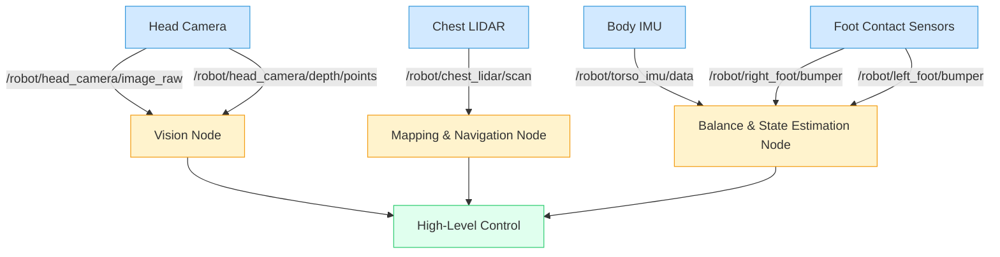

# Physics Simulation and Sensor Integration in Gazebo

## 1. Introduction

Building realistic and intelligent humanoid robots demands a deep understanding of how they interact with the physical world. While URDF and SDF allow us to *describe* a robot, **physics simulation** in tools like Gazebo brings that description to life. It's the engine that calculates how gravity affects a robot's balance, how its joints move under motor commands, and how it collides with its environment. Without accurate physics, our simulated humanoids would float weightlessly, or pass through walls like ghosts.

Equally crucial is **sensor simulation**. Robots perceive their environment through a variety of sensors – cameras for vision, LIDAR for mapping, IMUs for orientation, and contact sensors for touch. Simulating these sensors realistically is paramount for testing perception algorithms before deploying them on expensive physical hardware. It allows us to generate synthetic data, develop robust algorithms, and understand the limitations of our sensing capabilities. This chapter will delve into the intricacies of Gazebo's physics engine and guide you through the process of integrating and configuring a wide array of sensors, all while keeping the **sim-to-real gap** in mind.

## 2. Gazebo Physics Engines

Gazebo can utilize several underlying physics engines, each with its strengths and weaknesses. The choice of engine can significantly impact the realism, stability, and performance of your simulation.

### ODE (Open Dynamics Engine) - Default

*   **Description**: A high-performance, open-source library for simulating articulated rigid body dynamics. It's known for its speed and ability to handle a large number of objects.
*   **Strengths**: Good general-purpose engine, widely adopted, solid for many typical robotics tasks.
*   **Weaknesses**: Can sometimes be less stable with complex contact scenarios or high-speed impacts compared to more advanced engines.

### Bullet Physics

*   **Description**: A free and open-source physics engine commonly used in games, animation, and robotics. It's known for its robust collision detection and rigid body dynamics.
*   **Strengths**: Excellent for collision handling, particularly for complex shapes. Good for stability and accurate contact resolution.
*   **Weaknesses**: Can be slightly slower than ODE for very simple scenarios with many objects.

### DART (Dynamic Animation and Robotics Toolkit)

*   **Description**: An open-source library for robot kinematics and dynamics, specifically designed for research and development in robotics. It focuses on accuracy and stability for complex articulated systems.
*   **Strengths**: Highly accurate for articulated robots, good for inverse kinematics, and particularly well-suited for humanoid robot dynamics due to its focus on control.
*   **Weaknesses**: Can be more computationally intensive than ODE for simple collision-heavy scenes.

### Comparison Table of Physics Engines

| Feature           | ODE                       | Bullet                    | DART                      |
| :---------------- | :------------------------ | :------------------------ | :------------------------ |
| **Primary Use**   | General robotics, speed   | Robust collisions, games  | Articulated robots, control |
| **Stability**     | Good                      | Very good                 | Excellent                 |
| **Performance**   | High for simple scenarios | Good for complex collisions | Good, but can be demanding |
| **Accuracy**      | Good                      | Good                      | Very high                 |
| **Humanoids**     | Adequate                  | Good                      | **Excellent (recommended)** |

### When to Use Which Engine

*   **ODE**: For basic simulations, particularly if you're porting older ROS 1 projects, or for simple mobile robots where raw speed is prioritized over extreme accuracy in contact.
*   **Bullet**: For simulations requiring very robust and accurate collision detection, especially when robots interact heavily with their environment or other robots.
*   **DART**: **Recommended for humanoid robotics.** Its focus on articulated body dynamics and stability makes it ideal for developing and testing complex bipedal locomotion, manipulation, and balance control.

### Switching Physics Engines

You can specify the physics engine in your Gazebo world file. This allows you to experiment and choose the best engine for your specific robot and simulation needs.

```xml
<!-- Example of a Gazebo world file physics configuration -->
<world name="my_robot_world">
  <physics name="default_physics" type="ode"> <!-- Can be "ode", "bullet", "dart" -->
    <real_time_update_rate>1000.0</real_time_update_rate>
    <max_step_size>0.001</max_step_size>
    <ode>
      <solver>
        <type>quick</type>
        <iters>50</iters>
        <friction_model>cone</friction_model>
      </solver>
      <constraints>
        <cfm>0.00001</cfm>
        <erp>0.2</erp>
        <contact_max_correcting_vel>100.0</contact_max_correcting_vel>
        <contact_surface_layer>0.001</contact_surface_layer>
      </constraints>
    </ode>
  </physics>
  <!-- ... rest of world file ... -->
</world>
```

## 3. Physics Properties in Gazebo

To achieve realistic simulations, you need to configure various physics properties. These are typically set within the `<physics>` tag of a Gazebo world file (`.world` file).

### Gravity Configuration

You can set the gravity vector for your simulation. By default, Gazebo uses standard Earth gravity (`0 0 -9.8`).
```xml
<world name="my_world">
  <gravity>0 0 -9.8</gravity> <!-- Standard Earth gravity -->
  <!-- <gravity>0 0 0</gravity> for space simulations -->
  <!-- <gravity>0 0 -1.62</gravity> for Moon simulations -->
</world>
```

### Time Step and Real-Time Factor

*   **`<max_step_size>`**: The maximum time step for the physics engine. Smaller values lead to more accurate, but slower, simulations. A common value is `0.001` seconds (1 kHz).
*   **`<real_time_update_rate>`**: How often Gazebo's physics engine will attempt to update per real second. If set to `1000.0` (1 kHz) and `max_step_size` is `0.001`, Gazebo tries to match real time.
*   **`<real_time_factor>`**: The ratio of simulated time to real time. A value of `1.0` means the simulation runs in real time. Values less than `1.0` mean it runs slower, and values greater than `1.0` mean it runs faster.
```xml
<physics name="default_physics" type="ode">
  <real_time_update_rate>1000.0</real_time_update_rate>
  <max_step_size>0.001</max_step_size>
  <real_time_factor>1.0</real_time_factor> <!-- Simulate at real-time speed -->
</physics>
```

### Contact Properties

Contact properties define how surfaces behave when they touch. These are specified within `<surface>` tags inside a link's `<collision>` element or within the `<physics>` section for global defaults.

*   **Friction Models (`mu1`, `mu2`)**:
    *   `mu1`: Coefficient of friction in the primary friction direction (e.g., sliding).
    *   `mu2`: Coefficient of friction in the secondary friction direction.
    *   `fdir1`: Vector defining the primary friction direction.
*   **Damping and Stiffness**:
    *   `kp`: Spring stiffness coefficient for contact.
    *   `kd`: Damping coefficient for contact.
    *   These control how "bouncy" or "sticky" contacts are.
```xml
<!-- Example of link surface properties -->
<link name="foot_link">
  <collision name="foot_collision">
    <geometry><box size="0.1 0.05 0.02"/></geometry>
    <surface>
      <friction>
        <ode>
          <mu>1.0</mu> <!-- Coefficient of friction -->
          <mu2>1.0</mu2>
          <fdir1>1 0 0</fdir1>
        </ode>
      </friction>
      <contact>
        <ode>
          <kp>1000000.0</kp> <!-- Spring stiffness (very stiff) -->
          <kd>1.0</kd> <!-- Damping coefficient -->
          <max_vel>0.1</max_vel>
          <min_depth>0.0001</min_depth>
        </ode>
      </contact>
    </surface>
  </collision>
</link>
```

### Complete world file example with physics settings

```xml
<?xml version="1.0"?>
<sdf version="1.7">
  <world name="humanoid_test_world">
    <gravity>0 0 -9.81</gravity>
    <magnetic_field>6e-06 2.3e-05 -4.2e-05</magnetic_field> <!-- Example for Earth's magnetic field -->

    <physics name="default_physics" type="dart"> <!-- Using DART for humanoid -->
      <max_step_size>0.001</max_step_size>
      <real_time_update_rate>1000.0</real_time_update_rate>
      <real_time_factor>1.0</real_time_factor>
      <dart>
        <solver>
          <solver_type>pgs</solver_type> <!-- Projected Gauss-Seidel solver -->
          <max_iterations>100</max_iterations>
          <accuracy>0.0001</accuracy>
        </solver>
        <collision_detector>bullet</collision_detector> <!-- Can use Bullet for collision in DART -->
      </dart>
      <ode> <!-- ODE specific solver settings if selected -->
        <solver>
          <type>quick</type>
          <iters>50</iters>
          <friction_model>cone</friction_model>
        </solver>
      </ode>
    </physics>

    <light name="sun" type="directional">
      <pose>0 0 10 0 0 0</pose>
      <diffuse>0.8 0.8 0.8 1</diffuse>
      <specular>0.2 0.2 0.2 1</specular>
      <attenuation>
        <range>1000</range>
        <constant>0.9</constant>
        <linear>0.01</linear>
        <quadratic>0.001</quadratic>
      </attenuation>
      <direction>-0.5 0.1 -0.9</direction>
      <cast_shadows>1</cast_shadows>
    </light>

    <model name="ground_plane">
      <static>true</static>
      <link name="link">
        <collision name="collision">
          <geometry><plane><normal>0 0 1</normal><size>100 100</size></plane></geometry>
          <surface>
            <friction><ode><mu>0.8</mu><mu2>0.8</mu2></ode></friction>
          </surface>
        </collision>
        <visual name="visual">
          <geometry><plane><normal>0 0 1</normal><size>100 100</size></plane></geometry>
          <material><script><uri>file://media/materials/scripts/gazebo.material</uri><name>Gazebo/Grey</name></script></material>
        </visual>
      </link>
    </model>
    
    <!-- Other models (e.g., your humanoid robot) can be included here -->
  </world>
</sdf>
```

## 4. Simulating Rigid Body Dynamics

For a robot to move realistically and maintain stability, its physical properties must be accurately modeled. This involves defining the `mass` and `inertia` of each `link` in its URDF or SDF description.

### Mass and Inertia in Simulation

*   **Mass**: The amount of matter in a link. Crucial for gravity, forces, and overall dynamics. Incorrect mass will lead to unrealistic acceleration and stability issues.
*   **Inertia**: A measure of an object's resistance to changes in its rotational motion. Represented by a 3x3 **moment of inertia tensor**. This tensor describes how mass is distributed around the center of mass.

### Center of Mass Calculation

The center of mass (COM) is the unique point where the weighted relative position of the distributed mass sums to zero. In URDF/SDF, the `<inertial>` tag's `origin` specifies the pose of the inertial frame relative to the link's frame. If the origin is (0,0,0) for the inertial tag, then the COM is at the link's origin.

### Moment of Inertia Tensors

The inertia tensor `I` for a rigid body is:
```
I = | Ixx Ixy Ixz |
    | Ixy Iyy Iyz |
    | Ixz Iyz Izz |
```
For most symmetric shapes, the off-diagonal terms (`Ixy`, `Ixz`, `Iyz`) are zero if the coordinate system's axes align with the principal axes of inertia.
*   `Ixx`: Moment of inertia about the X-axis.
*   `Iyy`: Moment of inertia about the Y-axis.
*   `Izz`: Moment of inertia about the Z-axis.

### How to Calculate for Complex Shapes

*   **CAD Software**: Most CAD tools (SolidWorks, Fusion 360, Blender) can calculate mass, COM, and inertia tensor for a given model with assigned material properties. This is the most accurate method for complex meshes.
*   **Analytic Formulas**: For simple primitives (boxes, cylinders, spheres), analytical formulas exist.
*   **Approximation Tools**: Software like `meshlab` can estimate these properties from mesh files.

### Python Script Example for Inertia Calculation

This script calculates the inertia tensor for a simple box (cuboid) centered at its origin.

```python
import numpy as np

def calculate_box_inertia(mass, x_dim, y_dim, z_dim):
    """
    Calculates the moment of inertia tensor for a box centered at its origin.
    Args:
        mass (float): Mass of the box.
        x_dim (float): Dimension along the x-axis.
        y_dim (float): Dimension along the y-axis.
        z_dim (float): Dimension along the z-axis.
    Returns:
        dict: A dictionary containing Ixx, Iyy, Izz.
    """
    Ixx = (1/12.0) * mass * (y_dim**2 + z_dim**2)
    Iyy = (1/12.0) * mass * (x_dim**2 + z_dim**2)
    Izz = (1/12.0) * mass * (x_dim**2 + y_dim**2)
    
    return {
        'ixx': Ixx, 'iyy': Iyy, 'izz': Izz,
        'ixy': 0.0, 'ixz': 0.0, 'iyz': 0.0 # Off-diagonal terms are zero for axis-aligned box
    }

# Example for a link in a humanoid arm
mass_upper_arm = 0.5 # kg
x_upper_arm = 0.05   # m (thickness)
y_upper_arm = 0.05   # m (thickness)
z_upper_arm = 0.3    # m (length)

inertia_upper_arm = calculate_box_inertia(mass_upper_arm, x_upper_arm, y_upper_arm, z_upper_arm)

print(f"Inertia for upper arm (mass={mass_upper_arm}kg, dims={x_upper_arm}x{y_upper_arm}x{z_upper_arm}):")
for key, value in inertia_upper_arm.items():
    print(f"  {key}: {value:.6f}")

# Example for a foot link (approximate as a box)
mass_foot = 1.0 # kg
x_foot = 0.15   # m (length)
y_foot = 0.08   # m (width)
z_foot = 0.04   # m (height)

inertia_foot = calculate_box_inertia(mass_foot, x_foot, y_foot, z_foot)
print(f"\nInertia for foot (mass={mass_foot}kg, dims={x_foot}x{y_foot}x{z_foot}):")
for key, value in inertia_foot.items():
    print(f"  {key}: {value:.6f}")
```

### Impact on Robot Stability (Critical for Humanoids)

Accurate mass and inertia are absolutely critical for humanoid robots.
*   **Balance**: Incorrect values will lead to unstable walking, falling, and difficulty in maintaining upright posture.
*   **Control**: PID controllers for joints rely on accurate dynamic models. Poor inertia can cause oscillations or slow responses.
*   **Manipulation**: Gripping and lifting objects will be unrealistic if the robot's own mass distribution is wrong.

## 5. Joint Dynamics

Beyond just position and type, configuring joint dynamics accurately is essential for simulating realistic robot motion and control.

### Joint Types (Revolute, Prismatic, Continuous, Fixed)

We briefly touched on these in the URDF chapter.
*   **`revolute`**: A hinge joint that rotates around a single axis, with upper and lower limits. (e.g., elbow, knee)
*   **`prismatic`**: A sliding joint that translates along a single axis, with upper and lower limits. (e.g., linear actuator)
*   **`continuous`**: Similar to revolute but with no upper or lower limits (e.g., wheel joint, some shoulder joints).
*   **`fixed`**: No movement between links (e.g., connecting a sensor to a robot body).

### Joint Limits and Dynamics

The `<limit>` tag within a joint defines its mechanical constraints.
*   `lower` / `upper`: The minimum and maximum joint positions (radians for revolute/continuous, meters for prismatic).
*   `velocity`: Maximum velocity the joint can achieve.
*   `effort`: Maximum force/torque the joint can exert.

The `<dynamics>` tag defines physical properties of the joint itself.
*   `friction`: Frictional force acting on the joint.
*   `damping`: Damping force proportional to joint velocity.

### PID Controllers for Joints

In robotics, **PID (Proportional-Integral-Derivative) controllers** are commonly used to control joint positions, velocities, or efforts. Gazebo provides a way to simulate these controllers through plugins.
*   **P (Proportional)**: Corrects current error.
*   **I (Integral)**: Accounts for past errors, reducing steady-state error.
*   **D (Derivative)**: Predicts future errors, reducing oscillations.

These parameters (`p`, `i`, `d`) are typically configured in a ROS 2 controller configuration file and then loaded by a Gazebo plugin (e.g., `ros_gz_ros2_control` or `gazebo_ros2_control`).

### Example: Humanoid Knee Joint with Realistic Dynamics

```xml
<!-- Example of a humanoid knee joint -->
<joint name="right_knee_joint" type="revolute">
  <parent link="right_thigh_link"/>
  <child link="right_shank_link"/>
  <origin xyz="0 0 -0.4" rpy="0 0 0"/> <!-- Joint at the end of the thigh -->
  <axis xyz="0 1 0"/> <!-- Rotates around the Y-axis (flexion/extension) -->
  <limit lower="-2.0" upper="0.0" velocity="2.0" effort="50.0"/> <!-- Limits in radians and effort -->
  <dynamics damping="0.5" friction="0.1"/> <!-- Damping to reduce bounce, friction for resistance -->
</joint>
```

### Complete Code Example (conceptual ROS 2 control via Gazebo plugin)

This is a conceptual representation as actual implementation involves `ros2_control` configuration and a Gazebo plugin.

```xml
<!-- Example of loading a ROS 2 joint state broadcaser and position controller -->
<!-- This would be part of a .xacro file or separate Gazebo plugin setup -->
<gazebo>
  <plugin filename="libgazebo_ros2_control.so" name="gazebo_ros2_control">
    <parameters_file>$(find your_robot_description)/config/ros2_controllers.yaml</parameters_file>
  </plugin>
</gazebo>
```
**`ros2_controllers.yaml` (example configuration for PID)**
```yaml
controller_manager:
  ros__parameters:
    update_rate: 100 # Hz

joint_state_broadcaster:
  ros__parameters:
    type: joint_state_broadcaster/JointStateBroadcaster

right_knee_position_controller:
  ros__parameters:
    type: joint_trajectory_controller/JointTrajectoryController
    joints:
      - right_knee_joint
    command_interfaces:
      - position
    state_interfaces:
      - position
      - velocity
    state_publish_rate: 50.0
    action_monitor_rate: 20.0
    allow_integration_in_goal_trajectories: true
    allow_partial_joints_goal: true
    constraints:
      stopped_velocity_tolerance: 0.05
      goal_time: 0.0
      right_knee_joint:
        trajectory: 0.05
        goal: 0.02
    gains:
      right_knee_joint:
        p: 100.0
        i: 0.01
        d: 10.0
        ff_velocity_scale: 0.0
        ff_effort: 0.0
```

## 6. Collision Detection

Accurate collision detection is fundamental for safe and realistic robot interaction within a simulated environment. Gazebo uses the `<collision>` element within a link to define its physical boundaries for interaction.

### Collision Geometries (Box, Cylinder, Sphere, Mesh)

*   **Primitives**: For simplicity and computational efficiency, use `<box>`, `<cylinder>`, or `<sphere>` when possible. These are fast and robust.
*   **Mesh**: For complex shapes, you can use a mesh file (`.dae`, `.stl`). However, it's best practice to use a simplified convex hull mesh for collision rather than the high-fidelity visual mesh to improve performance and stability.

### Collision vs Visual Geometry

*   **`<visual>`**: What the robot looks like. Can be high-fidelity.
*   **`<collision>`**: What the robot physically interacts with. Should be simplified, convex, and accurately represent the contact surface.
    *   Example: A complex robotic hand might have a highly detailed visual mesh, but its collision geometry might be a few simple boxes and spheres to represent its contact points.

### Surface Properties

As seen in section 3, `<surface>` properties like `friction` (mu, mu2) and `contact` (`kp`, `kd`) are critical for how collisions resolve. For a humanoid, accurate foot-ground friction is paramount for stable walking.

### Contact Sensors

Gazebo provides **contact sensors** that detect when a collision occurs and report force/torque information. These are essential for robots to "feel" their environment. (Detailed in section 13).

### Debugging Collisions

*   **Gazebo GUI**: You can visualize collision geometries in Gazebo by enabling "View" -> "Collisions" in the GUI. This helps identify if your collision meshes are correctly placed and sized.
*   **`gz contact -t <topic>`**: Command-line tool to inspect contact events.

### Example: Foot-ground contact for humanoid

```xml
<!-- Example of a humanoid foot link with contact properties -->
<link name="right_foot_link">
  <visual>
    <geometry><mesh filename="package://humanoid_description/meshes/foot.dae"/></geometry>
    <material name="grey"/>
  </visual>
  <collision name="foot_collision">
    <geometry><box size="0.15 0.08 0.02"/></geometry> <!-- Simplified box for collision -->
    <surface>
      <friction><ode><mu>1.0</mu><mu2>1.0</mu2></ode></friction>
      <contact><ode><kp>1000000.0</kp><kd>1.0</kd></ode></contact>
    </surface>
  </collision>
  <inertial>
    <mass value="1.0"/>
    <inertia ixx="0.001" ixy="0" ixz="0" iyy="0.001" iyz="0" izz="0.001"/>
  </inertial>
</link>
```

## 7. Simulating Gravity and Forces

Beyond static physics properties, Gazebo allows for dynamic interaction with forces and gravity.

### Custom Gravity Settings

As shown in section 3, you can set the global `<gravity>` vector in the world file. This is useful for simulating robots in different planetary environments or for testing specialized scenarios (e.g., microgravity).

### Applying External Forces

You can apply forces or torques to links dynamically using Gazebo plugins or ROS 2 interfaces. This is useful for:
*   **Testing robustness**: Pushing a robot to see if it maintains balance.
*   **Simulating disturbances**: Wind, impacts.
*   **Generating specific motions**: For testing without full controllers.

### Wind Simulation

Gazebo allows for basic wind simulation by adding a `<wind>` tag to your world file.
```xml
<world name="windy_world">
  <wind>
    <direction>1 0 0</direction> <!-- Wind blowing along X-axis -->
    <speed>5.0</speed> <!-- 5 m/s -->
    <noise>0.1</noise> <!-- Small random fluctuations -->
  </wind>
</world>
```

### Force/Torque Sensors

Gazebo can simulate force/torque sensors, which provide measurements of forces and torques applied at a specific point, typically a joint or a contact surface. These are defined as plugins. (Detailed in section 13).

### Use Case: Testing Humanoid Balance

Applying external forces (e.g., a sudden push) to a humanoid in simulation is a common way to test the robustness of its balance control algorithms. Force/torque sensors in the feet can measure ground reaction forces, crucial feedback for maintaining equilibrium.

## 8. Sensor Simulation Overview

Accurate sensor data is paramount for any robot. Simulating sensors allows us to:
*   **Develop perception algorithms**: Train and test algorithms without physical hardware.
*   **Test sensor fusion**: Combine data from multiple sensor types.
*   **Evaluate sensor placement**: Optimize sensor locations on the robot body.
*   **Generate synthetic data**: Create large datasets for AI training, especially for rare or dangerous scenarios.

### Why Simulate Sensors?

*   **Cost**: Real-world sensors can be expensive.
*   **Accessibility**: Not every developer has access to all sensors.
*   **Repeatability**: Simulations ensure identical sensor readings for repeated experiments.
*   **Controllability**: Easily change environmental conditions (lighting, obstacles) or sensor parameters.

### Sensor Noise Models

Real-world sensors are never perfect. Gazebo allows you to add various noise models to your simulated sensors to make them more realistic:
*   **Gaussian noise**: Random fluctuations around the true value.
*   **Drift**: Slow change in sensor bias over time.
*   **Bias**: Constant offset from the true value.
*   **Quantization**: Discrete steps in sensor readings.

### Update Rates and Latency

Each sensor can be configured with an update rate (how often it publishes data) and latency (delay in data transmission). These factors are crucial for real-time control and perception systems.

### Available Sensors in Gazebo

Gazebo supports a wide array of sensors, including:
*   Cameras (RGB, depth, monocular, stereo)
*   LIDAR / Laser Scanners
*   IMU (Inertial Measurement Unit)
*   Contact Sensors
*   Force/Torque Sensors
*   GPS
*   Altimeters
*   Magnetometers
*   Sonar

## 9. Camera Sensors

Cameras are vital for humanoid robots, providing visual perception for tasks like object recognition, navigation, and human-robot interaction.

### RGB Camera Simulation

Gazebo can simulate standard RGB cameras, generating realistic image streams.

### Camera Plugins

Camera sensors are typically configured via Gazebo plugins, often within a `<sensor>` tag in an SDF file or a `<gazebo>` extension block for URDF.

```xml
<!-- Example: Camera plugin in URDF (using Gazebo extensions) -->
<gazebo reference="camera_link">
  <sensor name="camera" type="camera">
    <pose>0 0 0 0 0 0</pose> <!-- Relative to camera_link -->
    <visualize>true</visualize> <!-- Show camera feed in separate window -->
    <update_rate>30.0</update_rate> <!-- 30 Hz -->
    <camera>
      <horizontal_fov>1.047</horizontal_fov> <!-- 60 degrees -->
      <image>
        <width>640</width>
        <height>480</height>
        <format>R8G8B8</format>
      </image>
      <clip>
        <near>0.1</near>
        <far>100</far>
      </clip>
      <noise>
        <type>gaussian</type>
        <mean>0.0</mean>
        <stddev>0.007</stddev>
      </noise>
    </camera>
    <plugin name="camera_controller" filename="libgazebo_ros2_camera.so">
      <ros>
        <namespace>camera</namespace>
        <argument>--ros-args -r __ns:=/robot/camera</argument>
      </ros>
      <camera_name>rgb_camera</camera_name>
      <frame_name>camera_frame</frame_name>
      <hack_baseline>0.07</hack_baseline> <!-- For stereo cameras -->
    </plugin>
  </sensor>
</gazebo>
```

### Subscribing to Camera Topics in ROS 2

The `libgazebo_ros2_camera.so` plugin publishes image data on ROS 2 topics, typically:
*   `/robot/camera/image_raw` (`sensor_msgs/msg/Image`)
*   `/robot/camera/camera_info` (`sensor_msgs/msg/CameraInfo`)

### Python code to visualize camera feed

```python
# camera_subscriber.py
import rclpy
from rclpy.node import Node
from sensor_msgs.msg import Image
from cv_bridge import CvBridge # ROS 2 package to convert between ROS Image messages and OpenCV images
import cv2 # OpenCV library

class ImageSubscriber(Node):
    def __init__(self):
        super().__init__('image_subscriber')
        self.subscription = self.create_subscription(
            Image,
            '/robot/camera/image_raw', # Topic name
            self.listener_callback,
            10
        )
        self.br = CvBridge()
        self.get_logger().info('Image subscriber node started.')

    def listener_callback(self, data):
        self.get_logger().debug('Receiving video frame')
        current_frame = self.br.imgmsg_to_cv2(data, "bgr8")
        
        # Display image
        cv2.imshow("Camera Feed", current_frame)
        cv2.waitKey(1) # Refresh window

def main(args=None):
    rclpy.init(args=args)
    image_subscriber = ImageSubscriber()
    rclpy.spin(image_subscriber)
    image_subscriber.destroy_node()
    rclpy.shutdown()
    cv2.destroyAllWindows() # Close OpenCV windows

if __name__ == '__main__':
    main()
```
:::info
You will need to install `ros-humble-cv-bridge` and `python3-opencv` for this example to work.
:::

## 10. Depth Cameras and RGBD Sensors

Depth cameras (RGB-D sensors) provide both color (RGB) images and per-pixel depth information. This is invaluable for 3D perception, object manipulation, and navigation tasks.

### Intel RealSense Simulation

Gazebo can simulate popular depth cameras like the Intel RealSense series or Kinect-style sensors.

### Point Cloud Generation

Depth cameras can generate **point clouds** (`sensor_msgs/msg/PointCloud2`), which are collections of 3D points representing the visible surfaces in the scene.

### Complete RGBD Sensor Plugin Example

```xml
<!-- Example: Depth Camera plugin in URDF (using Gazebo extensions) -->
<gazebo reference="depth_camera_link">
  <sensor name="depth_camera" type="depth">
    <pose>0 0 0 0 0 0</pose>
    <visualize>true</visualize>
    <update_rate>20.0</update_rate>
    <camera>
      <horizontal_fov>1.047</horizontal_fov>
      <image>
        <width>640</width>
        <height>480</height>
        <format>R8G8B8</format>
      </image>
      <clip>
        <near>0.1</near>
        <far>10</far>
      </clip>
      <noise>
        <type>gaussian</type>
        <mean>0.0</mean>
        <stddev>0.05</stddev>
      </noise>
      <depth_camera>
        <output>points</output> <!-- Generates PointCloud2 -->
      </depth_camera>
    </camera>
    <plugin name="depth_camera_controller" filename="libgazebo_ros2_depth_camera.so">
      <ros>
        <namespace>depth_camera</namespace>
        <argument>--ros-args -r __ns:=/robot/depth_camera</argument>
      </ros>
      <camera_name>depth_camera</camera_name>
      <frame_name>depth_camera_frame</frame_name>
    </plugin>
  </sensor>
</gazebo>
```

### Visualizing Depth Data

Depth images (often 16-bit monochrome) can be visualized in OpenCV, and point clouds can be viewed in RViz using the `PointCloud2` display type.

### Use Case: Humanoid Vision System

For humanoids, depth cameras are crucial for:
*   **Object pose estimation**: Precisely locating objects in 3D space for manipulation.
*   **Obstacle avoidance**: Building local 3D maps to navigate cluttered environments.
*   **Human body tracking**: Identifying and tracking human users for interaction.

## 11. LIDAR/Laser Scanners

LIDAR (Light Detection and Ranging) sensors measure distances by emitting laser pulses and measuring the time it takes for the light to return. They are essential for accurate mapping, localization, and obstacle avoidance.

### 2D LIDAR Simulation

2D LIDARs typically sweep a single plane, providing a 2D cross-section of the environment.

### 3D LIDAR (Velodyne-style)

3D LIDARs use multiple laser beams (or a rotating single beam) to generate dense 3D point clouds of the surroundings.

### Ray Tracing in Simulation

Gazebo uses ray tracing (or similar techniques) to simulate LIDARs, casting rays into the environment and detecting intersections with obstacles to determine distances.

### LIDAR Plugin Configuration

```xml
<!-- Example: LIDAR sensor plugin in URDF (using Gazebo extensions) -->
<gazebo reference="lidar_link">
  <sensor name="laser_sensor" type="gpu_ray"> <!-- or "ray" for CPU-based -->
    <pose>0 0 0 0 0 0</pose>
    <visualize>true</visualize>
    <update_rate>10.0</update_rate>
    <ray>
      <scan>
        <horizontal>
          <samples>720</samples>
          <resolution>1</resolution>
          <min_angle>-1.5707</min_angle> <!-- -90 degrees -->
          <max_angle>1.5707</max_angle> <!-- +90 degrees -->
        </horizontal>
      </scan>
      <range>
        <min>0.1</min>
        <max>10.0</max>
        <resolution>0.01</resolution>
      </range>
      <noise>
        <type>gaussian</type>
        <mean>0.0</mean>
        <stddev>0.01</stddev>
      </noise>
    </ray>
    <plugin name="lidar_controller" filename="libgazebo_ros2_laser_controller.so">
      <ros>
        <namespace>lidar</namespace>
        <argument>--ros-args -r __ns:=/robot/lidar</argument>
      </ros>
      <topic_name>scan</topic_name>
      <frame_name>lidar_frame</frame_name>
    </plugin>
  </sensor>
</gazebo>
```

### Visualizing Scan Data in RViz

LIDAR data (`sensor_msgs/msg/LaserScan` for 2D, `sensor_msgs/msg/PointCloud2` for 3D) can be visualized in RViz using the `LaserScan` or `PointCloud2` display types.

## 12. IMU (Inertial Measurement Unit)

An IMU is a crucial sensor for any mobile robot, providing measurements of acceleration and angular velocity, which are fundamental for estimating orientation, velocity, and position.

### Accelerometer and Gyroscope Simulation

Gazebo simulates:
*   **Accelerometers**: Measure linear acceleration in three axes.
*   **Gyroscopes**: Measure angular velocity (rate of rotation) in three axes.

### Noise and Bias Parameters

IMUs are susceptible to noise and bias. Gazebo allows configuring these parameters for realistic simulation.
```xml
<!-- Example: IMU sensor plugin in URDF (using Gazebo extensions) -->
<gazebo reference="imu_link">
  <sensor name="imu_sensor" type="imu">
    <always_on>true</always_on>
    <update_rate>100.0</update_rate>
    <imu>
      <angular_velocity>
        <x><noise type="gaussian"><mean>0.0</mean><stddev>2e-4</stddev></noise></x>
        <y><noise type="gaussian"><mean>0.0</mean><stddev>2e-4</stddev></noise></y>
        <z><noise type="gaussian"><mean>0.0</mean><stddev>2e-4</stddev></noise></z>
      </angular_velocity>
      <linear_acceleration>
        <x><noise type="gaussian"><mean>0.0</mean><stddev>1.7e-2</stddev></noise></x>
        <y><noise type="gaussian"><mean>0.0</mean><stddev>1.7e-2</stddev></noise></y>
        <z><noise type="gaussian"><mean>0.0</mean><stddev>1.7e-2</stddev></noise></z>
      </linear_acceleration>
    </imu>
    <plugin name="imu_controller" filename="libgazebo_ros2_imu_sensor.so">
      <ros>
        <namespace>imu</namespace>
        <argument>--ros-args -r __ns:=/robot/imu</argument>
      </ros>
      <output_type>imu</output_type>
      <frame_name>imu_frame</frame_name>
    </plugin>
  </sensor>
</gazebo>
```

### Reading IMU data in ROS 2

The `libgazebo_ros2_imu_sensor.so` plugin publishes data on `/robot/imu/data` (`sensor_msgs/msg/Imu`).

### Use Case: Humanoid balance and orientation

IMUs are fundamental for:
*   **State Estimation**: Combining IMU data with other sensors (e.g., joint encoders, GPS) to estimate the robot's complete pose.
*   **Balance Control**: Providing crucial feedback for bipedal locomotion algorithms to maintain upright stability.
*   **High-Rate Control Loops**: IMU data is often used in fast feedback loops due to its high update rate.

## 13. Contact and Force Sensors

Robots need to "feel" their environment to interact safely and effectively. Contact and force sensors provide this tactile feedback.

### Bumper Sensors

Bumper sensors are simple binary sensors that detect contact. They are useful for basic obstacle detection.

### Force/Torque Sensors at Joints

These sensors measure the forces and torques acting across a joint. They are critical for:
*   **Force control**: Allowing a robot to apply specific forces to objects.
*   **Collision detection**: Detecting unexpected impacts.
*   **Human-robot interaction**: Ensuring safe physical contact.

### Tactile Sensors

More advanced tactile sensors can provide distributed pressure information, allowing a robot to "feel" the shape and texture of an object.

### Example: Humanoid foot contact sensors

For humanoid robots, contact sensors in the feet are vital for:
*   **Ground contact detection**: Knowing when a foot is on the ground or in the air, crucial for gait generation.
*   **Weight distribution**: Measuring forces to adjust balance.
*   **Slip detection**: Identifying when the foot is losing traction.

```xml
<!-- Example: Contact sensor plugin on a humanoid foot -->
<gazebo reference="right_foot_link">
  <sensor name="right_foot_contact_sensor" type="contact">
    <always_on>true</always_on>
    <update_rate>100.0</update_rate>
    <contact>
      <collision>foot_collision</collision> <!-- Reference the collision geometry -->
    </contact>
    <plugin name="right_foot_contact_plugin" filename="libgazebo_ros2_bumper.so">
      <ros>
        <namespace>contact</namespace>
        <argument>--ros-args -r __ns:=/robot/right_foot</argument>
      </ros>
      <frame_name>right_foot_contact_frame</frame_name>
      <bumperTopicName>right_foot_bumper</bumperTopicName>
    </plugin>
  </sensor>
</gazebo>
```

## 14. Multi-Sensor Integration Example

Integrating multiple sensors is essential for building a comprehensive perception system for a humanoid robot. Here, we outline a conceptual full humanoid torso with various sensors.

### Conceptual Full Humanoid Robot with Sensors:
*   **Head Camera (vision)**: RGB and Depth camera in the head for object recognition, human interaction, and local navigation.
*   **Chest LIDAR (navigation)**: A 2D LIDAR mounted on the chest for mapping, localization, and obstacle avoidance in the torso's plane.
*   **Body IMU (balance)**: IMU located in the torso for orientation and balance control.
*   **Foot Force Sensors (contact)**: Contact/force sensors in each foot to detect ground contact and measure ground reaction forces.

### Full URDF/SDF with all sensors (conceptual overview)

The full URDF/SDF would involve defining links and joints for the entire humanoid body, with each sensor defined as a `<link>` with a fixed joint and then associated with a `<gazebo>` extension block or an SDF `<sensor>` tag as shown in the previous sections.

### ROS 2 nodes to read all sensor data

You would typically have separate ROS 2 nodes (Python or C++) for each type of sensor data:
*   `camera_subscriber_node.py`: Subscribes to `/robot/head_camera/image_raw` and `/robot/head_camera/depth/points`.
*   `lidar_subscriber_node.py`: Subscribes to `/robot/chest_lidar/scan`.
*   `imu_subscriber_node.py`: Subscribes to `/robot/torso_imu/data`.
*   `foot_contact_node.py`: Subscribes to `/robot/right_foot/bumper` and `/robot/left_foot/bumper`.
These nodes would then perform perception tasks (e.g., object detection, mapping, localization) and feed into higher-level control nodes.

### Mermaid Diagram Showing Sensor Data Flow:



## 15. Gazebo Plugins

Gazebo's plugin system is key to its extensibility, allowing you to customize simulation behavior, integrate with external software (like ROS 2), and add custom sensors or actuators.

### Model Plugins vs Sensor Plugins vs World Plugins

*   **Model Plugins**: Attached to a specific model in the simulation. They can control its joints, read its sensors, apply forces, or change its properties. (e.g., `libgazebo_ros2_control.so`).
*   **Sensor Plugins**: Attached directly to a `<sensor>` tag. They configure the sensor and bridge its data to ROS 2 topics. (e.g., `libgazebo_ros2_camera.so`).
*   **World Plugins**: Attached to the entire world. They can control global simulation parameters, apply world-wide forces (e.g., wind), or manage events.

### Creating Custom Plugins (C++ basics)

Custom Gazebo plugins are typically written in C++ and compiled as shared libraries (`.so` files). They inherit from base classes like `ModelPlugin`, `SensorPlugin`, or `WorldPlugin`. You implement specific virtual functions (e.g., `Load`, `Update`) to define the plugin's behavior.

### Popular Plugins for Humanoid Robots

*   **`libgazebo_ros2_control.so`**: Integrates Gazebo with ROS 2 Control, allowing you to use ROS 2 controllers to command your simulated robot's joints.
*   **`libgazebo_ros2_force_torque_sensor.so`**: For simulating force/torque sensors at joints or links.
*   **`libgazebo_ros2_bumper.so`**: For simulating contact sensors.

### Plugin Configuration Examples

Plugins are configured with `<plugin>` tags, often containing `<ros>` and other custom parameters.

```xml
<!-- Example of a common ROS 2 Control plugin for a model -->
<gazebo>
  <plugin filename="libgazebo_ros2_control.so" name="gazebo_ros2_control">
    <robot_param>robot_description</robot_param>
    <robot_param_node>robot_state_publisher</robot_param_node>
    <parameters_file>$(find my_humanoid_config)/config/ros2_controllers.yaml</parameters_file>
  </plugin>
</gazebo>
```

## 16. Performance Optimization

Complex humanoid robot simulations with many sensors and detailed physics can be computationally intensive. Optimizing performance is crucial to maintain real-time factors and efficient development.

*   **Real-time Factor Tuning**: Adjust `<real_time_factor>` in the world file. If it consistently drops below 1.0, your simulation is running slower than real-time.
*   **Reducing Computational Load**:
    *   **Simplify Collision Geometries**: Use primitives or convex hulls instead of complex meshes for `<collision>` elements.
    *   **Reduce `max_step_size`**: Increase `max_step_size` if accuracy is not a top priority for certain parts of the simulation.
    *   **Fewer Models/Objects**: Reduce the number of unnecessary models in the world.
    *   **Disable Visuals**: For headless simulations or when debugging physics, disable rendering.
*   **Mesh Optimization**: Use `.stl` files (binary) for meshes if possible, and simplify mesh complexity.
*   **Sensor Update Rate Balancing**: Don't set `update_rate` for all sensors to maximum. High-frequency sensors (IMU) need fast rates, but lower-frequency sensors (e.g., GPS) can update less often.
*   **Culling**: Gazebo supports frustum culling to only render objects within the camera's view.

## 17. Debugging Simulation Issues

:::warning
Simulation is rarely perfect. Expect to encounter issues with physics, sensor data, and control.
:::

*   **Visual Debugging Tools**:
    *   **Gazebo GUI**: Enable "View" -> "Collisions", "View" -> "Inertia", "View" -> "Joints" to inspect your model.
    *   **RViz**: Use `RobotModel` and `TF` displays to visualize your robot's state and coordinate frames.
*   **Topic Inspection (`ros2 topic`)**: Use `ros2 topic echo`, `ros2 topic info`, `ros2 topic hz` to ensure sensor data is being published correctly and at the expected rate.
*   **TF Tree Visualization (`view_frames`)**: Use `ros2 run tf2_tools view_frames` to generate a PDF of your robot's TF tree, ensuring all links are properly connected and named.
*   **Common Sensor Problems**:
    *   **No data**: Check topic name, QoS settings, and if the sensor plugin is loaded.
    *   **Noisy data**: Adjust noise parameters in the sensor configuration.
    *   **Incorrect data**: Check sensor pose, frame ID, and if units are consistent.

## 18. Hands-on Exercises

### Exercise 1: Create Robot with Camera and Visualize Feed

**Goal**: Extend the simple wheeled robot to include a camera sensor and visualize its feed in a ROS 2 node.
**Instructions**:
1.  Take the `simple_wheeled_robot.urdf` from Module 3, Chapter 1.
2.  Add a `camera_link` and `camera_joint` and configure a Gazebo camera sensor plugin (using `libgazebo_ros2_camera.so`) as shown in section 9.
3.  Ensure the camera publishes to a unique ROS 2 topic (e.g., `/my_robot/camera/image_raw`).
4.  Create a Python ROS 2 subscriber node (similar to `camera_subscriber.py` from section 9) to display the camera feed using OpenCV.
5.  Launch Gazebo with your robot, run your camera subscriber node, and verify you see the camera feed.
**Solution Hints**: Remember to add the necessary `<gazebo>` tags for the camera plugin to your URDF (or a separate SDF for the camera). You'll need `ros-humble-cv-bridge` and `python3-opencv`.

### Exercise 2: Add IMU and Plot Orientation Data

**Goal**: Add an IMU sensor to your robot and plot its orientation data.
**Instructions**:
1.  Take the robot model from Exercise 1.
2.  Add an `imu_link` and `imu_joint` and configure a Gazebo IMU sensor plugin (using `libgazebo_ros2_imu_sensor.so`) as shown in section 12.
3.  Ensure the IMU publishes to a unique ROS 2 topic (e.g., `/my_robot/imu/data`).
4.  Create a Python ROS 2 subscriber node that receives `sensor_msgs/msg/Imu` data and extracts the orientation (quaternion). Convert the quaternion to Euler angles (roll, pitch, yaw) and continuously plot these values using a simple plotting library (e.g., `matplotlib`).
5.  Launch Gazebo with your robot, apply some forces to make it tilt, and observe the plotted IMU data.
**Solution Hints**: You'll need `ros-humble-imu-filter-madgwick` or a similar package for robust quaternion to Euler conversion, or implement a basic one yourself. `matplotlib` for plotting.

### Exercise 3: Simulate LIDAR and Detect Obstacles

**Goal**: Integrate a LIDAR sensor into your robot and use it to detect obstacles.
**Instructions**:
1.  Take the robot model from Exercise 2.
2.  Add a `lidar_link` and `lidar_joint` and configure a Gazebo LIDAR sensor plugin (using `libgazebo_ros2_laser_controller.so`) as shown in section 11.
3.  Ensure the LIDAR publishes to a unique ROS 2 topic (e.g., `/my_robot/lidar/scan`).
4.  Create a Gazebo world with some simple obstacles (e.g., a few boxes).
5.  Create a Python ROS 2 subscriber node that receives `sensor_msgs/msg/LaserScan` data. Implement logic to detect if an obstacle is within a certain distance in front of the robot. Print a warning message if an obstacle is detected.
6.  Launch Gazebo with your robot and the obstacle world, run your obstacle detection node, and verify it detects the obstacles as the robot moves (or if you manually place it).
**Solution Hints**: The `LaserScan` message contains an array of ranges. You can check the minimum range within a certain angular sector.

### Exercise 4: Multi-Sensor Humanoid Torso with All Sensors

**Goal**: Combine multiple sensors onto a simplified humanoid torso model.
**Instructions**:
1.  Create a simple URDF/Xacro for a humanoid torso (e.g., a base link with a head link).
2.  Integrate the following sensors:
    *   Head Camera (RGB-D)
    *   Torso IMU
    *   Foot Contact Sensors (on conceptual feet if you add them)
3.  Ensure all sensors are correctly configured with Gazebo plugins and publish to ROS 2 topics.
4.  Launch in Gazebo and use `ros2 topic echo` and `rqt_graph` to verify all sensor data streams are active.
**Solution Hints**: Use Xacro for modularity. Ensure unique frame IDs and topic names for each sensor.

## 19. Simulation Best Practices

*   **Realistic Parameter Values**: Use realistic mass, inertia, friction, and joint limits. This greatly reduces the sim-to-real gap.
*   **Sensor Noise Modeling**: Always add realistic noise to your simulated sensors. Algorithms that work perfectly with clean data will often fail in the real world.
*   **Testing Edge Cases**: Design simulations specifically to test failure conditions, sensor occlusions, and unexpected interactions.
*   **Validation Against Real Hardware**: Whenever possible, validate simulation results against real robot data. Even a small discrepancy can compound into large errors.

## 20. Introduction to Unity for Robotics

While Gazebo is the de-facto standard for ROS-based robotics simulation, other powerful tools are emerging. **Unity** is a popular game development platform that is increasingly being adopted for robotics due to its high-fidelity rendering, advanced physics, and extensive ecosystem.

### Why Unity as Alternative to Gazebo

*   **High-fidelity rendering**: Unity excels in creating visually stunning and realistic environments, crucial for vision-based AI.
*   **Advanced physics**: Unity's physics engine is highly capable, suitable for complex interactions.
*   **Extensive ecosystem**: Large community, asset store, and tools for scene creation.
*   **Integrated development**: Develop robot control logic directly within Unity using C#.

### Unity Robotics Hub

Unity provides a dedicated **Unity Robotics Hub** with resources, tools, and example projects to facilitate robotics development. This includes the **ROS-Unity Bridge** for seamless data exchange between ROS 2 and Unity.

### Unity vs Gazebo Comparison

| Feature               | Gazebo                                          | Unity                                             |
| :-------------------- | :---------------------------------------------- | :------------------------------------------------ |
| **Primary Focus**     | Robotics simulation, ROS integration           | Game development, high-fidelity visualization       |
| **Physics Engine**    | ODE, Bullet, DART                               | PhysX (NVIDIA)                                  |
| **Rendering**         | OGRE (functional)                               | High-fidelity (photorealistic)                    |
| **ROS Integration**   | Native via `ros_gz` bridge, plugins             | Via ROS-Unity Bridge (separate package)           |
| **Programming**       | C++, Python (ROS 2 nodes), XML (URDF/SDF)      | C# (Unity scripts), Python (ROS 2 nodes)          |
| **Ease of Use**       | Command-line centric, steeper learning curve for visuals | GUI-driven, easier for visual scene creation        |
| **Customization**     | C++ plugins, SDF extensions                     | C# scripting, extensive asset store               |

### When to Use Unity

*   When photorealistic rendering is critical for perception (e.g., training vision models in highly varied conditions).
*   For complex human-robot interaction scenarios where visual fidelity and animated environments are important.
*   If your team has existing Unity development expertise.

### Quick Setup Overview

1.  **Install Unity Hub and Unity Editor**.
2.  **Install Unity Robotics Hub packages** via Unity's Package Manager.
3.  **Import ROS-Unity Bridge** and set up communication with your external ROS 2 workspace.
4.  **Create your robot model** within Unity or import existing CAD models.
5.  **Develop control scripts** in C# and integrate with ROS 2.

## 21. Summary and Next Steps

This chapter has provided a deep dive into the heart of realistic robot simulation: **physics engines** and **sensor integration** in Gazebo. We explored how different physics engines (ODE, Bullet, DART) impact simulation fidelity and performance, with a recommendation for DART in humanoid robotics. We delved into configuring critical physics properties like gravity, friction, and joint dynamics, emphasizing the importance of accurate mass and inertia. A significant portion of the chapter focused on integrating and configuring various sensors – cameras, depth sensors, LIDARs, IMUs, and contact sensors – demonstrating how to define them in URDF/SDF and access their data in ROS 2. We also touched upon Gazebo plugins, performance optimization, and debugging techniques, and introduced Unity as a powerful alternative for high-fidelity robotics simulation.

You now have the knowledge to build a sophisticated robot model, embed it with a rich array of sensors, and realistically simulate its interaction with the environment. This forms the cornerstone of developing advanced perception and control algorithms. In **Module 4**, we will transition from the open-source Gazebo ecosystem to the powerful **NVIDIA Isaac platform**, exploring its advanced simulation capabilities, specialized hardware, and cutting-edge AI tools for robotics.

---
[Previous Chapter: Gazebo Simulation Environment and Robot Description Formats](./01-gazebo-setup-urdf.md)
[Next Chapter: Introduction to NVIDIA Isaac Platform and Jetson Hardware](../module-4/01-isaac-sdk-sim-intro.md)

--- 
[Previous Chapter: Gazebo Simulation Environment and Robot Description Formats](./01-gazebo-setup-urdf.md)
[Next Chapter: Introduction to NVIDIA Isaac Platform and Jetson Hardware](../module-4/01-nvidia-isaac-intro.md)
