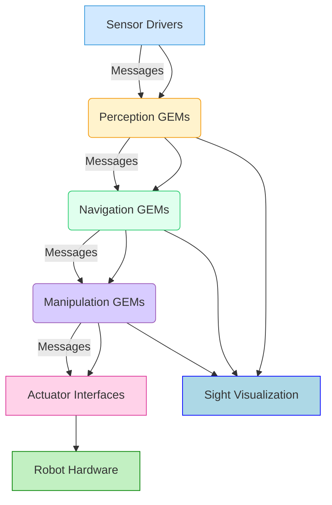

# NVIDIA Isaac SDK and Isaac Sim - AI-Powered Robotics Platform

## 1. Introduction to NVIDIA Isaac Platform

As Artificial Intelligence continues to revolutionize every industry, its impact on robotics is particularly profound. NVIDIA, a company synonymous with graphics processing units (GPUs) and deep learning, has positioned itself at the forefront of this convergence with its comprehensive **NVIDIA Isaac Platform**. Isaac is not just a single product; it's an end-to-end ecosystem designed to accelerate the development, simulation, and deployment of AI-powered robots.

Why NVIDIA for robotics and AI? The demands of modern robotics, especially for humanoids, require immense computational power. Real-time perception (processing high-resolution camera and LIDAR data), complex AI inference (for navigation, manipulation, and decision-making), and sophisticated control algorithms all benefit immensely from parallel processing capabilities that GPUs excel at. NVIDIA's deep expertise in GPU computing and its investment in AI research make it a natural fit for this domain.

The Isaac ecosystem comprises several key components:
*   **Isaac SDK**: A software development kit providing a collection of tools, libraries, and frameworks for developing AI-driven robot applications.
*   **Isaac Sim**: A robotics simulation platform built on NVIDIA Omniverse, offering photorealistic, physics-accurate virtual environments for training and testing robots.
*   **Isaac ROS**: A collection of hardware-accelerated packages for ROS 2, optimizing common robotics workloads for NVIDIA's embedded platforms.
*   **Omniverse**: NVIDIA's platform for 3D design collaboration and simulation, providing the foundation for Isaac Sim.

### Real-world applications in humanoid robots

NVIDIA Isaac is playing a crucial role in advancing humanoid robotics. Companies like **Tesla** and **Figure AI**, which are actively developing advanced humanoid robots, leverage NVIDIA's GPU technology and simulation tools. For instance, Isaac Sim allows these companies to:
*   **Train AI models**: Generate vast amounts of synthetic data with varying conditions (domain randomization) to train robust perception and control models for walking, manipulation, and human interaction.
*   **Test complex behaviors**: Safely test new bipedal locomotion algorithms or dexterous manipulation routines in simulation before deploying to expensive hardware.
*   **Accelerate development**: Rapidly iterate on robot designs and software without the constraints of physical prototypes.

### Industry adoption

Beyond humanoids, the Isaac platform is being adopted across various industries for applications like autonomous mobile robots (AMRs) in logistics, industrial manipulators, and service robots, underscoring its versatility and impact.

## 2. NVIDIA Isaac SDK Overview

The **NVIDIA Isaac SDK** is a powerful toolkit for accelerating the development and deployment of AI-powered robotics applications. It provides a modular and extensible framework that simplifies the integration of perception, navigation, and manipulation capabilities into robot systems.

### What is Isaac SDK?

Isaac SDK is a collection of libraries, frameworks, and tools designed to streamline the process of building intelligent robots. It emphasizes a component-based architecture and leverages NVIDIA's GPU expertise to provide high-performance solutions for common robotics problems.

### Key components and modules

Isaac SDK provides a rich set of pre-built modules for:
*   **Perception**: Stereo depth estimation, object detection, pose estimation, visual odometry.
*   **Navigation**: SLAM (Simultaneous Localization and Mapping), path planning, obstacle avoidance.
*   **Manipulation**: Grasping, inverse kinematics, motion planning.
*   **Human-Robot Interaction**: Gesture recognition, voice command processing.
*   **Utilities**: Logging, debugging, data recording, visualization.

### Isaac GEMs (reusable building blocks)

At the core of Isaac SDK's modularity are **GEMs (GPU-accelerated Embodied Modules)**. These are high-performance, reusable software components for perception, navigation, and manipulation. GEMs encapsulate complex algorithms (often GPU-accelerated) and expose well-defined interfaces, making it easy to snap them together to build sophisticated robot applications.

### Sight visualization tool

**Sight** is a web-based visualization and debugging tool integrated into the Isaac SDK. It allows developers to visualize sensor data, robot states, internal AI representations, and debugging information in real-time within a web browser. This is invaluable for understanding the behavior of complex robotic systems.

### Architecture overview

The Isaac SDK architecture is built around a flexible graph-based execution model. Applications are constructed by connecting various components (codelets, GEMs) that communicate via messages.

Here's a Mermaid diagram showing a simplified Isaac SDK architecture:



## 3. Isaac SDK Core Concepts

The Isaac SDK relies on several core concepts to enable efficient and modular robotics development.

### Codelets (computational building blocks)

**Codelets** are the fundamental computational units in the Isaac SDK. They are self-contained C++ or Python components that perform a specific task (e.g., image processing, path planning). Codelets communicate with each other by sending and receiving **messages** through **channels**. They run in a multithreaded environment, with the SDK managing their execution and scheduling.

### Nodes and applications

An **application** in Isaac SDK is a collection of interconnected **nodes**. A node encapsulates one or more codelets and defines their communication paths. The application's overall logic is defined by this graph of nodes and their message flow.

### Message passing system

Isaac SDK employs a high-performance message passing system for communication between codelets and nodes. Messages are strongly typed, and the system is designed for low-latency, high-throughput data exchange, often leveraging shared memory for efficiency.

### Behavior trees

For complex robot behaviors, Isaac SDK integrates **behavior trees**. These are hierarchical state machines that allow for intuitive and modular representation of robot actions and decision-making logic.

### Configuration files (JSON-based)

Isaac SDK applications are configured using **JSON files**. These files define the application graph, specifying which codelets to use, how they are connected, and their parameters. This allows for flexible and dynamic configuration without recompiling code.

### Simple codelet example with explanation

This is a conceptual Python codelet.

```python
# simple_logger_codelet.py
from isaac_sdk import Codelet
from isaac_sdk.messages import StringProto # Assuming a simple string message type

class SimpleLoggerCodelet(Codelet):
    def start(self):
        # Create an input port to receive string messages
        self.rx_message = self.isaac_proto_rx("StringProto", "message_in")
        
        # Create a timer to log messages periodically
        self.tick_on_message(self.rx_message) # Trigger tick() when a message arrives
        
        self.get_logger().info("SimpleLoggerCodelet started.")

    def tick(self):
        # Read the incoming message
        message = self.rx_message.get_message()
        if message:
            self.get_logger().info(f"Received message: {message.data}")

    def stop(self):
        self.get_logger().info("SimpleLoggerCodelet stopped.")

```
**Explanation**: This codelet `SimpleLoggerCodelet` subscribes to messages of type `StringProto` on a port named "message_in". Whenever a message arrives on this port, its `tick()` method is called, which then logs the received message data.

## 4. Isaac SDK Installation

Installing Isaac SDK is a more involved process than typical software, primarily due to its reliance on NVIDIA-specific hardware and software stacks.

### System requirements (IMPORTANT: RTX GPU needed)

*   **NVIDIA GPU**: An NVIDIA RTX GPU (RTX 4070 Ti or higher with 12GB+ VRAM is recommended) is essential due to the SDK's heavy reliance on CUDA and specialized hardware acceleration. Lower-end GPUs might work but will severely limit performance.
*   **Operating System**: Ubuntu 22.04 LTS (recommended for compatibility with CUDA, Docker, and ROS 2).
*   **RAM**: 32 GB (minimum), 64 GB+ (recommended) for large applications and simulations.
*   **CPU**: Modern multi-core processor (Intel i7/i9 or AMD Ryzen 7/9 equivalent or better).
*   **Storage**: 200 GB+ SSD recommended for the SDK, Docker images, and datasets.

### Detailed hardware requirements:

*   **GPU**: NVIDIA RTX 4070 Ti (12GB VRAM) or higher. For best performance with Isaac Sim and large models, RTX 4080 (16GB VRAM) or RTX 4090 (24GB VRAM) are ideal.
*   **Ubuntu**: 22.04 LTS (Jammy Jellyfish).
*   **RAM**: Crucial for Omniverse and Isaac Sim. 64GB ensures smooth operation.
*   **CUDA and cuDNN installation**: These are NVIDIA's parallel computing platform and deep neural network library, respectively. They form the bedrock of GPU-accelerated AI. You must install versions compatible with your Isaac SDK and GPU driver versions.

### Step-by-step installation process (Conceptual)

1.  **Install NVIDIA GPU Driver**: Ensure you have the latest stable NVIDIA GPU driver.
2.  **Install CUDA Toolkit**: Install the specific CUDA Toolkit version required by your Isaac SDK version.
3.  **Install cuDNN**: Install the cuDNN library for deep learning acceleration.
4.  **Install Docker and NVIDIA Container Toolkit**: Isaac SDK often uses Docker containers for isolated development environments.
5.  **Install Bazel**: The Isaac SDK uses Bazel as its build system.
6.  **Download Isaac SDK**: Obtain the SDK from the NVIDIA Developer website.
7.  **Extract and Configure**: Extract the SDK and run its setup scripts to configure the environment.
8.  **Build Examples**: Build and run provided examples to verify the installation.

### Complete installation commands (Illustrative - refer to NVIDIA docs for exact versions)

```bash
# Example CUDA Toolkit installation (check NVIDIA docs for correct version and repo)
wget https://developer.download.nvidia.com/compute/cuda/repos/ubuntu2204/x86_64/cuda-ubuntu2204.pin
sudo mv cuda-ubuntu2204.pin /etc/apt/preferences.d/cuda-repository-pin-600
wget https://developer.download.nvidia.com/compute/cuda/12.3.0/local_installers/cuda-repo-ubuntu2204-12-3-local_12.3.0-545.23.14-1_amd64.deb
sudo dpkg -i cuda-repo-ubuntu2204-12-3-local_12.3.0-545.23.14-1_amd64.deb
sudo cp /var/cuda-repo-ubuntu2204-12-3-local/cuda-*-keyring.gpg /usr/share/keyrings/
sudo apt-get update
sudo apt-get -y install cuda-toolkit-12-3

# Example cuDNN installation (after CUDA, check NVIDIA docs)
sudo apt-get install libcudnn8 libcudnn8-dev

# Docker and NVIDIA Container Toolkit (for Isaac SDK containers)
distribution=$(. /etc/os-release;echo $ID$VERSION_ID) \
   && curl -fsSL https://nvidia.github.io/libnvidia-container/gpgkey | sudo gpg --dearmor -o /usr/share/keyrings/nvidia-container-toolkit-keyring.gpg \
   && curl -fsSL https://nvidia.github.io/libnvidia-container/$distribution/libnvidia-container.list | \
      sed 's#deb https://#deb [signed-by=/usr/share/keyrings/nvidia-container-toolkit-keyring.gpg] https://#g' | \
      sudo tee /etc/apt/sources.list.d/nvidia-container-toolkit.list
sudo apt-get update
sudo apt-get install -y nvidia-container-toolkit
sudo systemctl restart docker

# Install Bazel (specific version as required by Isaac SDK)
sudo apt install curl gnupg
curl -fsSL https://bazel.build/bazel-release.pub.gpg | gpg --dearmor > bazel.gpg
sudo mv bazel.gpg /etc/apt/trusted.gpg.d/
echo "deb [arch=amd64] https://storage.googleapis.com/bazel-apt stable jdk1.8" | sudo tee /etc/apt/sources.list.d/bazel.list
sudo apt update && sudo apt install bazel-VERSION # Replace VERSION with required Bazel version
```

### Troubleshooting common issues

*   **Driver/CUDA/cuDNN mismatch**: Ensure all versions are compatible. This is the most common issue.
*   **Environment variables**: Make sure CUDA paths and Isaac SDK paths are correctly set in your `.bashrc` or equivalent.
*   **Bazel build failures**: Check dependencies and ensure correct Bazel version.

## 5. Introduction to Isaac Sim

**NVIDIA Isaac Sim** is a powerful, scalable, and physically accurate robotics simulation platform built on **NVIDIA Omniverse**. It offers a high-fidelity virtual environment crucial for developing, testing, and training AI-powered robots, especially humanoids.

### What is Isaac Sim (Omniverse-based)

Isaac Sim is an application running on NVIDIA Omniverse, a platform for real-time 3D design collaboration and simulation. This foundation provides Isaac Sim with its core capabilities:
*   **Universal Scene Description (USD)**: Omniverse uses USD as its universal scene description format, enabling rich scene interoperability and extensibility.
*   **Real-time Ray Tracing**: Leveraging NVIDIA RTX GPUs, Isaac Sim provides photorealistic rendering with real-time ray tracing, crucial for generating realistic sensor data for AI.
*   **PhysX 5**: Utilizes NVIDIA's advanced PhysX 5 physics engine for highly accurate and stable rigid body, soft body, and fluid dynamics simulation.

### Why Isaac Sim vs Gazebo

While Gazebo is a strong open-source simulator (and a fantastic choice for many applications), Isaac Sim targets the high-fidelity, AI-driven simulation needs of advanced robotics.

Here's a comparison table: Isaac Sim vs Gazebo

| Feature             | Gazebo                                            | Isaac Sim (Omniverse)                                 |
| :------------------ | :------------------------------------------------ | :---------------------------------------------------- |
| **Foundation**      | Open-source, dedicated robotics simulator         | NVIDIA Omniverse (platform for 3D simulation/collaboration) |
| **Rendering**       | OGRE (functional)                                 | **Photorealistic** (RTX real-time ray tracing)          |
| **Physics Engine**  | ODE, Bullet, DART (configurable)                  | **NVIDIA PhysX 5** (highly accurate, GPU-accelerated)   |
| **Scene Format**    | SDF (Simulation Description Format)               | **USD (Universal Scene Description)**                 |
| **AI Integration**  | Via ROS 2 bridges, plugins                        | Native via Python API, built-in SDG                   |
| **Synthetic Data Gen**| Basic, often requires custom scripts             | **Built-in, advanced Domain Randomization**           |
| **ROS 2 Integration**| Native, via `ros_gz` bridge                      | **Native, via ROS 2 Bridge extension**                |
| **Platform Support**| Linux, Windows (experimental)                     | Linux (primary), Windows (partial)                      |
| **Hardware Req.**   | Standard CPU/GPU                                  | **NVIDIA RTX GPU (essential)**                        |
| **Cost**            | Free, open-source                                 | Free (for individual developers/researchers), commercial tiers |

## 6. Isaac Sim Features

Isaac Sim provides a rich set of features tailored for advanced robotics development:

*   **Photorealistic Rendering**: Leveraging RTX GPUs, it can generate highly realistic sensor data, including images, depth maps, and LIDAR scans, that closely mimic real-world conditions.
*   **Synthetic Data Generation (SDG)**: Its powerful SDG capabilities allow for automatic generation of large, annotated datasets for training AI models. This includes ground truth labels for objects, segmentation masks, bounding boxes, and depth information.
*   **Domain Randomization**: A key technique for bridging the sim-to-real gap, Isaac Sim allows randomizing various aspects of the simulation (textures, lighting, object positions, physics properties) to expose AI models to a wider range of conditions, making them more robust to real-world variations.
*   **Multi-camera Support**: Easily configure and simulate multiple camera sensors with different types (RGB, depth, fisheye).
*   **Robot Import (URDF support)**: Supports importing robot models from standard formats like URDF, which are then converted to USD.
*   **ROS 2 Integration**: Provides a robust ROS 2 Bridge extension for seamless communication between Isaac Sim and external ROS 2 applications.
*   **Cloud Deployment Capabilities**: Can be deployed on cloud instances with NVIDIA GPUs, enabling scalable simulation for large-scale training.

## 7. Isaac Sim Installation and Setup

Installing Isaac Sim involves first setting up the NVIDIA Omniverse Launcher, which then allows you to install Isaac Sim as an Omniverse application.

### Omniverse Launcher installation

1.  **Download Omniverse Launcher**: Go to the NVIDIA Omniverse website (developer.nvidia.com/omniverse) and download the appropriate Launcher for your Linux system.
2.  **Run Installer**: Make the downloaded `.AppImage` executable and run it.
    ```bash
    chmod +x NVIDIA_Omniverse_Launcher_linux.AppImage
    ./NVIDIA_Omniverse_Launcher_linux.AppImage
    ```
3.  **Login**: Log in with your NVIDIA account.

### Isaac Sim installation through Omniverse

1.  **Open Omniverse Launcher**: Once logged in, navigate to the "Exchange" or "Applications" tab within the Launcher.
2.  **Find Isaac Sim**: Search for "Isaac Sim" and click "Install".
3.  **Select Version**: Choose the desired version to install (always refer to NVIDIA's documentation for the recommended version compatible with your OS and drivers).
4.  **License Activation**: Isaac Sim is free for individual developers and researchers. You will need to activate it within the Launcher.

### First launch and interface tour

After installation, you can launch Isaac Sim directly from the Omniverse Launcher. This will open the Isaac Sim application.

### Workspace setup

For robotics development, you'll typically set up a workspace structure that includes your robot descriptions, ROS 2 packages, and Python scripts for interacting with Isaac Sim.

### Step-by-step with screenshots description (Conceptual)

1.  **Launch Isaac Sim**: From Omniverse Launcher.
2.  **Create New Stage**: Go to "File" -> "New Stage".
3.  **Add Ground Plane**: In the "Create" menu, select "Physics" -> "Ground Plane".
4.  **Add a Camera**: In the "Create" menu, select "Camera" -> "Camera". Adjust its position and orientation.
5.  **Save Stage**: "File" -> "Save Stage As..." (`.usd` format).

### System performance optimization

*   **GPU Driver**: Keep your NVIDIA GPU drivers updated.
*   **Settings**: Adjust graphics settings within Isaac Sim (e.g., enable DLSS if available, reduce resolution if needed).
*   **Headless Mode**: For training, run Isaac Sim in headless mode (without GUI) to maximize performance.

## 8. Isaac Sim Interface Overview

Isaac Sim's interface is built on the Omniverse Kit, offering a powerful and customizable environment for 3D simulation.

*   **Viewport**: The central 3D view where you see your simulated world and robot. Supports various camera controls (orbit, pan, dolly).
*   **Stage Panel**: Located on the left, this panel displays the hierarchy of all objects (primitives, models, lights, cameras, sensors) in your current USD stage. You can select, organize, and hide/show objects here.
*   **Property Panel**: Located on the right, this panel shows the attributes and properties of the currently selected object in the Stage Panel. This is where you configure physics, rendering, and sensor parameters.
*   **Content Browser**: Typically at the bottom, allows you to browse and import assets (models, materials, textures) from local directories, Omniverse Nucleus servers, or the NVIDIA Asset Library.
*   **Console and Script Editor**: Integrated Python console and script editor for direct interaction with the simulation and automation.
*   **Toolbar and Quick Actions**: Top bar with common actions (play/pause, add primitives, save).

:::info
Take time to familiarize yourself with the interface, as it's your primary tool for building and inspecting simulations.
:::

## 9. Creating Your First Scene

Let's walk through creating a basic scene in Isaac Sim, similar to what you might do in Gazebo.

### Starting a new stage

1.  Launch Isaac Sim.
2.  Go to `File -> New Stage`. This clears the current scene and gives you a blank canvas.

### Adding ground plane

1.  In the menu bar, go to `Create -> Physics -> Ground Plane`.
2.  This adds a static ground plane to your scene.

### Adding primitive shapes (cube, sphere, cylinder)

1.  Go to `Create -> Physics -> Cube` (or Sphere, Cylinder).
2.  Select the newly created primitive in the Stage panel.
3.  In the Property panel, adjust its `Transform` properties (Position, Rotation, Scale) to place it in your scene.
4.  To enable physics on the primitive, go to `Add -> Physics -> Rigid Body with Colliders`.

### Applying materials and textures

1.  In the Content Browser, search for `materials`.
2.  Drag and drop a material onto a primitive in your viewport or onto its entry in the Stage panel.

### Setting up lighting

By default, new stages often have a default light (e.g., a dome light). You can add more lights via `Create -> Light`.
*   **Dome Light**: Simulates ambient outdoor lighting.
*   **Sphere Light, Rect Light, Disk Light**: For localized lighting.

### Physics properties

When you add a `Rigid Body with Colliders` to a primitive, you can adjust its physics properties in the Property panel:
*   `Mass`: The mass of the object.
*   `Linear Damping`, `Angular Damping`: Resistance to linear and angular motion.
*   `Physics Material`: Define friction and restitution.

### Complete step-by-step tutorial (conceptual)

1.  Launch Isaac Sim and create a new stage.
2.  Add a ground plane.
3.  Add a cube. Position it at `(0, 0, 1)`.
4.  Add a sphere. Position it at `(0.5, 0, 2)`.
5.  Add `Rigid Body with Colliders` to both the cube and sphere.
6.  Hit the "Play" button in the toolbar. Observe the sphere fall and collide with the cube and ground.
7.  Adjust the mass of the cube and sphere in the Property panel and replay the simulation.

### USD code example (illustrative)

The scene you create in the GUI is saved as a USD file. Here's what a simple USD snippet for a cube might look like:

```usd
#usda 1.0
(
    defaultPrim = "Cube"
    metersPerUnit = 1
    upAxis = "Z"
)

def Xform "Cube"
{
    float3 xformOp:translate = (0, 0, 1)
    float3 xformOp:scale = (1, 1, 1)
    uniform token[] xformOpOrder = ["xformOp:translate", "xformOp:orient", "xformOp:scale"]

    def Capsule "CapsuleShape"
    {
        point3f[] extent = [(-0.5, -0.5, -0.5), (0.5, 0.5, 0.5)]
        float radius = 0.5
        double xformOp:rotateX = 0
        double xformOp:rotateY = 0
        double xformOp:rotateZ = 0
        uniform token[] xformOpOrder = ["xformOp:translate", "xformOp:rotateX", "xformOp:rotateY", "xformOp:rotateZ", "xformOp:scale"]
        
        rel material:binding = </World/Looks/Color_001>
    }

    def PhysicsRigidBodyAPI "PhysicsRigidBody"
    {
        # ... physics properties
    }
}
```

## 10. Importing Robot Models

Isaac Sim supports importing robot models from standard formats, most notably URDF.

### URDF to USD Conversion

When you import a URDF file into Isaac Sim, it's internally converted to the USD format. This process tries to map URDF concepts (links, joints, visuals, collisions, inertials) to their USD equivalents.

### Using Isaac Sim URDF importer

1.  **File -> Import -> URDF**.
2.  Browse to your URDF file and select it.
3.  The importer provides options for:
    *   **Fixing base link**: Make the base of the robot static or floating.
    *   **Joint drive configuration**: Setting up joint controllers.
    *   **Merging links**: Optimize the model.
    *   **Add sensors**: Automatically add basic camera or LIDAR sensors if specified in URDF extensions.

### Fixing common import issues

*   **Missing meshes**: Ensure all mesh files referenced in the URDF are present and correctly located (relative paths work best).
*   **Incorrect joint limits**: Verify joint limits are correctly interpreted.
*   **Physics properties**: Sometimes mass/inertia need manual tweaking in the Property panel after import for optimal simulation.
*   **Redundant joints**: Ensure your URDF doesn't have unnecessary fixed joints or redundant parent/child relationships.

### Adjusting physics properties

After importing, you can select individual links or joints in the Stage panel and adjust their physics properties (mass, inertia, joint limits, damping) in the Property panel.

### Setting up articulation

For a robot to be controllable, it needs to be an "articulation." The URDF importer usually sets this up automatically. An articulation defines how the robot's joints move and are controlled.

### Complete example: Import simple robot arm (conceptual steps)

1.  Create a URDF for a simple 2-DOF robot arm (similar to Module 3, Chapter 1).
2.  In Isaac Sim, go to `File -> Import -> URDF`.
3.  Select your arm's URDF file.
4.  Ensure "Fix base link" is unchecked (if you want the arm to move freely).
5.  Import the arm.
6.  Select a joint in the Stage panel and observe its properties in the Property panel.
7.  Hit "Play" and see if the arm is affected by gravity.

### Python script for import automation

You can automate URDF import using the Isaac Sim Python API.

```python
import omni.isaac.core.utils.nucleus as nucleus_utils
from omni.isaac.core import World
from omni.isaac.urdf import _urdf
import os

# Set up Isaac Sim
_urdf_interface = _urdf.acquire_urdf_interface()
_urdf_interface.set_ignore_ros_extensions(True) # Ignore ROS extensions for cleaner import

async def import_robot_from_urdf(path_to_urdf: str, prim_path: str, position=(0.0, 0.0, 0.0)):
    """Imports a robot from a URDF file into Isaac Sim."""
    print(f"Importing URDF: {path_to_urdf} to {prim_path}")

    # Set the import configuration
    import_config = _urdf.ImportConfig()
    import_config.merge_fixed_joints = False
    import_config.fix_base = False
    import_config.make_default_prim = False
    import_config.create_camera_sensors = False
    import_config.create_pointcloud_sensors = False
    import_config.create_imu_sensors = False
    import_config.set_translate_wear_link_to_joint(False)

    # Perform the import
    success, prim = _urdf_interface.parse_urdf(
        path_to_urdf=path_to_urdf,
        prim_path=prim_path,
        import_config=import_config,
    )

    if success:
        print(f"Successfully imported URDF to {prim_path}")
        # Optionally set the position
        from pxr import UsdGeom
        prim_xform = UsdGeom.Xformable(prim)
        prim_xform.AddTranslateOp().Set((position[0], position[1], position[2]))
        return prim
    else:
        print(f"Failed to import URDF: {path_to_urdf}")
        return None

# Example usage (run within Isaac Sim script editor or extension)
# from omni.isaac.core import SimulationContext
# sim_context = SimulationContext()
# sim_context.initialize()
# world = World(sim_context)
# world.scene.add_default_ground_plane()

# # Assuming your URDF is accessible, e.g., in the Content Browser or local filesystem
# urdf_path = os.path.abspath("path/to/your/robot.urdf") 
# robot_prim_path = "/World/MyRobot"
# await import_robot_from_urdf(urdf_path, robot_prim_path, position=(0.0, 0.0, 0.5))

# sim_context.run()
```

## 11. Basic Robot Control in Isaac Sim

Once a robot is imported as an articulation, you can control its joints programmatically using the Isaac Sim Python API.

### Articulation controller

Isaac Sim provides an **articulation controller** that allows you to set target positions, velocities, or efforts for each joint in your robot model.

### Joint position control

This is the most common way to control a robot's joints – you specify a target angle for each joint, and a PID controller (simulated by PhysX) attempts to reach that position.

### Joint velocity control

You can also command the velocity of joints.

### Action graph basics

For more complex behaviors and state management, Isaac Sim integrates **Action Graphs**. These are visual programming tools that allow you to define complex logic by connecting nodes that represent operations or behaviors.

### Simple Python script to control robot

```python
import omni.isaac.core.utils.nucleus as nucleus_utils
from omni.isaac.core import World
from omni.isaac.core.articulations import Articulation
from omni.isaac.core.utils.types import ArticulationAction
import numpy as np
import asyncio

async def control_imported_robot(robot_prim_path: str, target_joint_angles: dict, duration=2.0):
    """
    Controls an imported robot to move its joints to target angles.
    Args:
        robot_prim_path (str): The prim path of the robot in the USD stage.
        target_joint_angles (dict): A dictionary mapping joint names to target angles (radians).
        duration (float): Time in seconds for the movement.
    """
    world = World.instance()
    robot = world.scene.get_object(robot_prim_path)

    if not isinstance(robot, Articulation):
        print(f"Error: {robot_prim_path} is not an Articulation.")
        return

    # Get joint names and indices
    joint_names = robot.get_joint_names()
    joint_indices = {name: i for i, name in enumerate(joint_names)}

    # Prepare action array
    num_joints = len(joint_names)
    joint_positions = np.array(robot.get_joint_positions())
    
    # Create target position array from current positions
    target_positions_array = joint_positions.copy()

    # Update target positions for specified joints
    for joint_name, target_angle in target_joint_angles.items():
        if joint_name in joint_indices:
            idx = joint_indices[joint_name]
            target_positions_array[idx] = target_angle
        else:
            print(f"Warning: Joint '{joint_name}' not found in robot.")
            
    # Create and apply the action
    action = ArticulationAction(joint_positions=target_positions_array)
    robot.apply_action(action) # Apply action immediately
    
    print(f"Moving robot '{robot.name}' joints to target angles. Duration: {duration}s")
    await asyncio.sleep(duration) # Wait for the movement to complete (conceptual)
    print("Movement complete.")


# Example usage (needs to be run within an Isaac Sim Python environment/script)
# from omni.isaac.core import SimulationContext
# sim_context = SimulationContext()
# sim_context.initialize()
# world = World(sim_context)
# world.scene.add_default_ground_plane()

# # Import a robot first (e.g., the simple arm)
# # await import_robot_from_urdf("path/to/simple_arm.urdf", "/World/SimpleArm")
# # robot_prim_path = "/World/SimpleArm"

# # Assuming a robot is already loaded at this path
# # world.scene.add(Articulation(prim_path="/World/SimpleArm", name="MyArm")) # Need to add the prim as an Articulation object
# # world.reset()

# # Example target angles (radians)
# # target_angles = {
# #    "shoulder_joint": np.pi / 4,
# #    "elbow_joint": np.pi / 2
# # }
# # await control_imported_robot("/World/SimpleArm", target_angles, duration=3.0)

# # sim_context.run()
```

## 12. ROS 2 Bridge in Isaac Sim

Isaac Sim provides a robust **ROS 2 Bridge** extension that enables seamless, high-performance communication between the simulated environment and external ROS 2 applications. This allows you to use your existing ROS 2 nodes to control robots in Isaac Sim and consume sensor data from it.

### Enabling ROS 2 extension

The ROS 2 Bridge is an extension that needs to be enabled within Isaac Sim:
1.  Go to `Window -> Extensions`.
2.  Search for `omni.isaac.ros2_bridge`.
3.  Ensure it is enabled.

### Publishing joint states

The bridge can publish joint states (`sensor_msgs/msg/JointState`) of the simulated robot to ROS 2, allowing external controllers to monitor the robot's current configuration.

### Subscribing to commands

You can subscribe to ROS 2 topics to receive commands (e.g., `geometry_msgs/msg/Twist` for mobile bases, or `std_msgs/msg/Float64MultiArray` for joint commands) and apply them to the simulated robot's articulation controller.

### TF broadcasting

The bridge automatically broadcasts the TF (Transform Frame) tree of the simulated robot, allowing ROS 2 navigation and perception stacks to understand the spatial relationships between different parts of the robot and its sensors.

### Camera image publishing

Simulated camera sensors can publish their image data (RGB, depth, segmentation) to ROS 2 topics as `sensor_msgs/msg/Image` or `sensor_msgs/msg/PointCloud2`.

### Complete ROS 2 integration example (conceptual)

1.  **Launch Isaac Sim** with your robot and the ROS 2 Bridge enabled.
2.  **External ROS 2 Workspace**: Have a ROS 2 workspace with a controller node.
3.  **Controller Node**: 
    *   Subscribes to `/isaac_sim/joint_states` (published by Isaac Sim).
    *   Publishes commands to `/isaac_sim/joint_commands` (subscribed by Isaac Sim).
    *   Subscribes to `/isaac_sim/camera/rgb/image_raw`.
4.  **Launch Controller**: `ros2 launch my_robot_controller controller_launch.py`.

### Python code for ROS 2 control (conceptual)

```python
# external_ros2_controller.py
import rclpy
from rclpy.node import Node
from std_msgs.msg import Float64MultiArray # For sending joint commands

class MyRobotController(Node):
    def __init__(self):
        super().__init__('my_robot_controller')
        self.joint_command_publisher = self.create_publisher(Float64MultiArray, '/isaac_sim/joint_commands', 10)
        self.timer = self.create_timer(0.1, self.timer_callback) # 10 Hz control loop
        self.target_angles = np.array([0.0, 0.0, 0.0]) # Example: target for 3 joints
        self.current_joint_states = None # To be updated by a subscriber

        # Example subscriber to joint states (optional)
        # from sensor_msgs.msg import JointState
        # self.joint_state_subscriber = self.create_subscription(JointState, '/isaac_sim/joint_states', self.joint_state_callback, 10)

    # def joint_state_callback(self, msg):
    #     # Process current joint states
    #     self.current_joint_states = msg.position
    #     # Implement PID or other control logic here to calculate new commands
    
    def timer_callback(self):
        # Example: Simple oscillation for first joint
        self.target_angles[0] = np.sin(self.get_clock().now().nanoseconds / 1e9) * 0.5
        
        msg = Float64MultiArray()
        msg.data = list(self.target_angles)
        self.joint_command_publisher.publish(msg)
        self.get_logger().info(f"Published joint commands: {msg.data}")

def main(args=None):
    rclpy.init(args=args)
    controller = MyRobotController()
    rclpy.spin(controller)
    controller.destroy_node()
    rclpy.shutdown()

if __name__ == '__main__':
    main()
```

## 13. Synthetic Data Generation (SDG)

**Synthetic Data Generation (SDG)** is a critical capability of Isaac Sim for AI training. It allows you to automatically generate large, diverse, and perfectly annotated datasets from simulation, which is far more efficient and safer than collecting real-world data.

### Why synthetic data for AI training

*   **Cost and Time**: Collecting and annotating real-world data is expensive and time-consuming.
*   **Safety**: Generate data for dangerous or rare scenarios (e.g., collisions, extreme weather) that are hard to capture in reality.
*   **Perfect Annotations**: SDG provides pixel-perfect ground truth labels (segmentation masks, bounding boxes, depth maps), which are difficult and costly to obtain manually for real images.
*   **Scale**: Generate millions of data samples quickly.

### Camera sensors and annotations

Isaac Sim can generate various types of annotations from simulated cameras:
*   **Semantic Segmentation**: Labels each pixel with the class of the object it belongs to (e.g., "robot arm", "cup", "table").
*   **Bounding Boxes**: 2D and 3D bounding boxes around objects.
*   **Depth Data**: Per-pixel distance from the camera.
*   **Instance Segmentation**: Labels each pixel with the specific instance of an object (e.g., "cup_01", "cup_02").
*   **Optical Flow**: The apparent motion of objects between consecutive image frames.

### Exporting dataset

SDG tools allow you to export these annotated datasets in various formats compatible with popular deep learning frameworks.

### Use case: Training humanoid vision

For humanoid robots, SDG can be used to:
*   Train object detection models for grasping and manipulation.
*   Develop semantic segmentation models for scene understanding.
*   Generate data for human pose estimation.

## 14. Domain Randomization

**Domain Randomization** is a technique used in conjunction with SDG to bridge the **sim-to-real gap**. By randomizing non-essential parameters in the simulation, the AI model becomes robust to variations in the real world, improving its transferability.

### What is domain randomization

Instead of trying to perfectly model the real world, domain randomization trains AI models on a wide variety of randomly generated simulations. The hope is that the real world then appears as just another variation within the training distribution.

### Randomization parameters in Isaac Sim:
*   **Texture Randomization**: Randomly changes textures of objects and the environment.
*   **Lighting Randomization**: Randomly varies light sources, intensity, color, and shadows.
*   **Object Placement Randomization**: Randomly changes the position, orientation, and sometimes scale of objects in the scene.
*   **Physics Parameter Randomization**: Randomly varies friction, restitution, and mass of objects.
*   **Camera Pose Randomization**: Randomly changes camera positions and orientations.

### Python script example (conceptual)

```python
import omni.isaac.core.utils.prims as prim_utils
import omni.isaac.core.utils.semantics as semantics_utils
from omni.isaac.synthetic_utils import SyntheticDataHelper
import random

async def apply_domain_randomization(scene, objects_to_randomize):
    sd_helper = SyntheticDataHelper()
    
    for obj_prim_path in objects_to_randomize:
        prim = prim_utils.get_prim_at_path(obj_prim_path)
        if not prim:
            continue
            
        # Randomize position slightly
        current_pos = prim_utils.get_prim_at_path(obj_prim_path).GetAttribute("xformOp:translate").Get()
        new_x = current_pos[0] + random.uniform(-0.1, 0.1)
        new_y = current_pos[1] + random.uniform(-0.1, 0.1)
        prim_utils.set_prim_translation(prim, (new_x, new_y, current_pos[2]))

        # Randomize rotation
        random_rot = [random.uniform(0, 360) for _ in range(3)]
        prim_utils.set_prim_rotation(prim, random_rot)

        # Randomize color/texture (requires adding materials)
        semantics_utils.add_update_semantics(prim, "Material", "rand_mat")
        # In a full setup, you'd define a range of materials/textures to swap
        
    # Randomize lighting
    light_prim = prim_utils.get_prim_at_path("/World/defaultLight")
    if light_prim:
        intensity = random.uniform(500, 1500)
        color = (random.uniform(0.5, 1.0), random.uniform(0.5, 1.0), random.uniform(0.5, 1.0))
        light_prim.GetAttribute("intensity").Set(intensity)
        light_prim.GetAttribute("color").Set(color)
        
    print("Domain randomization applied.")

# Example usage (within Isaac Sim script)
# await apply_domain_randomization(world.scene, ["/World/Cube", "/World/Sphere"])
```

### Sim-to-real benefits

By training with domain randomization, AI models become less sensitive to the exact visual and physical properties of the simulation, making them more likely to generalize and perform well when deployed on real robots.

## 15. Isaac Sim Python API

The **Isaac Sim Python API** (`omni.isaac.core`) provides a powerful and flexible way to programmatically control every aspect of your simulation, from scene construction to robot control and data logging.

### `omni.isaac.core` library

This is the main Python library for interacting with Isaac Sim. It provides high-level abstractions for:
*   **World management**: `World` class to manage the simulation context.
*   **Scene manipulation**: Adding, removing, and querying objects (prims) in the stage.
*   **Robot control**: `Articulation` class for controlling robot joints.
*   **Sensor access**: Reading data from simulated sensors.
*   **Physics control**: Applying forces, querying physics properties.

### Scene creation with Python

You can build entire scenes, including ground planes, lights, and objects, directly through Python scripts.

### Robot spawning and control

The API allows you to spawn robot models (e.g., from URDF) and then programmatically control their joints, apply forces, or set velocities.

### Sensor data reading

Access simulated sensor data (camera images, LIDAR scans, IMU data) directly through the Python API for processing or logging.

### Complete Python example script (conceptual - for full example, refer to NVIDIA docs)

```python
import omni.isaac.core.utils.nucleus as nucleus_utils
from omni.isaac.core import World
from omni.isaac.core.objects import DynamicCuboid
from omni.isaac.urdf import _urdf
import numpy as np
import asyncio

async def run_simple_simulation():
    world = World(stage_units_in_meters=1.0)
    
    # Add a ground plane
    world.scene.add_default_ground_plane()

    # Add a dynamic cuboid
    cube = world.scene.add(
        DynamicCuboid(
            prim_path="/World/Cube",
            name="my_cube",
            position=np.array([0.0, 0.0, 1.0]),
            scale=np.array([0.5, 0.5, 0.5]),
            mass=1.0,
            color=np.array([0.5, 0.1, 0.3])
        )
    )
    
    # Import a robot (conceptual)
    # urdf_path = "/path/to/your/robot.urdf"
    # robot_prim_path = "/World/MyRobot"
    # robot = await import_robot_from_urdf(urdf_path, robot_prim_path, position=(0.0, 0.0, 0.5))
    # if robot:
    #    world.scene.add(Articulation(prim_path=robot_prim_path, name="MyRobot"))
    
    # Reset the simulation and play
    await world.reset_async()
    world.play()

    # Simulate for a few steps (conceptual)
    for i in range(1000):
        await world.step_async()
        # if robot:
        #    # Example: get joint positions
        #    joint_positions = robot.get_joint_positions()
        #    # Example: apply some simple joint control
        #    action = ArticulationAction(joint_positions=np.sin(world.current_time * 2.0))
        #    robot.apply_action(action)
        
        if i % 100 == 0:
            print(f"Simulation time: {world.current_time:.2f}")

    world.stop()
    world.clear_instance()

# To run this, you would typically save it as a Python script and execute it
# within the Isaac Sim script editor or as a standalone Python script
# configured to connect to Isaac Sim.
# asyncio.run(run_simple_simulation())
```

## 16. Performance Optimization

Achieving high-performance simulation in Isaac Sim, especially for complex humanoid robots or large scenes, requires careful optimization.

*   **RTX real-time mode vs path tracing**:
    *   **Real-time mode**: Faster, but less photorealistic. Ideal for control loops and faster iteration.
    *   **Path tracing**: Slower, but produces photorealistic renders. Best for synthetic data generation where visual fidelity is paramount.
*   **Resolution settings**: Reduce viewport resolution for faster interactive performance.
*   **Physics sub-steps**: Adjust the number of physics sub-steps per frame. More sub-steps mean higher accuracy but slower simulation. Find a balance suitable for your application.
*   **Multi-GPU support**: Isaac Sim can leverage multiple GPUs for rendering and physics, significantly boosting performance.
*   **Headless mode for training**: When running large-scale training (e.g., reinforcement learning), run Isaac Sim in headless mode (without the GUI) to maximize simulation throughput.
*   **Cloud deployment options**: For very large-scale simulations, consider deploying Isaac Sim on cloud-based GPU instances.

## 17. First Complete Project

**Project: Humanoid robot in warehouse environment**

This project demonstrates how to set up a basic warehouse scene with a humanoid robot, integrate ROS 2 for control, and generate synthetic data.

### Step-by-step implementation:

1.  **Create warehouse scene**:
    *   Start a new stage in Isaac Sim.
    *   Add a ground plane.
    *   Import warehouse assets (shelves, boxes) from the Content Browser (or create simple primitives).
    *   Set up lighting.
2.  **Import humanoid robot**:
    *   Import a humanoid robot URDF (e.g., from NVIDIA's asset library or a custom one).
    *   Adjust its initial pose and physics properties.
3.  **Add cameras and sensors**:
    *   Add RGB-D cameras to the robot's head.
    *   Add a LIDAR sensor to the robot's chest.
    *   Add an IMU to the torso.
    *   Configure these sensors using the Property panel or Python API.
4.  **Setup ROS 2 bridge**:
    *   Enable the `omni.isaac.ros2_bridge` extension.
    *   Verify joint state publishing and command subscriptions.
5.  **Control robot with Python**:
    *   Write a Python script (either in the Isaac Sim script editor or an external ROS 2 node) to:
        *   Subscribe to camera/LIDAR/IMU data.
        *   Implement a simple behavior (e.g., walk forward, pick up an object).
        *   Publish joint commands to control the robot.
6.  **Generate synthetic data**:
    *   Configure the camera to output semantic segmentation, bounding boxes, and depth.
    *   Use domain randomization to vary textures, lighting, and object positions.
    *   Record a dataset of annotated images and sensor readings.

### Mermaid diagram of system architecture

```mermaid
graph TD
    A[Isaac Sim (Omniverse)] --> B[USD Scene]
    B --> C[Humanoid Robot Model]
    B --> D[Warehouse Environment]
    C --> E[Simulated Sensors]
    C --> F[Simulated Actuators]
    E --> G[ROS 2 Bridge]
    F --> G
    G --> H[External ROS 2 Nodes]
    H --> I[AI Models (Perception, Control)]
    I --> H
    J[Python API / Scripting] --> A
    J --> C
    K[Synthetic Data Generation] --> E
    K --> I
    style A fill:#D2E9FF,stroke:#3498DB
    style H fill:#FFF3CD,stroke:#F39C12
    style I fill:#E0FFEE,stroke:#2ECC71
```

## 18. Isaac Sim vs Other Simulators

Choosing the right simulator is critical. Here's a brief comparison to help you decide.

### Comparison table:

| Feature               | Isaac Sim                                         | Gazebo                                            | Unity (Robotics)                                  | PyBullet                                       |
| :-------------------- | :------------------------------------------------ | :------------------------------------------------ | :------------------------------------------------ | :--------------------------------------------- |
| **Rendering**         | **Photorealistic (RTX)**                          | Functional (OGRE)                                 | **Photorealistic** (Unity's renderer)             | Basic (OpenGL)                                  |
| **Physics**           | **PhysX 5**                                       | ODE, Bullet, DART                                 | PhysX (NVIDIA)                                  | Bullet Physics                                  |
| **Scene Format**      | USD                                               | SDF                                               | Unity Scene Format                                | URDF/SDF (via parser)                           |
| **AI Focus**          | **SDG, Domain Randomization, RL**                 | General simulation, ROS integration               | Visuals, scene creation, RL                       | Fast RL, simple physics                         |
| **ROS 2 Integration** | Native Bridge                                     | Native Bridge (`ros_gz`)                          | ROS-Unity Bridge                                  | Python API                                      |
| **Programming**       | Python API                                        | C++, Python (ROS 2), XML                          | C#, Python API (via ROS-Unity)                    | Python API                                      |
| **Hardware**          | **RTX GPU Required**                              | Standard CPU/GPU                                  | Standard CPU/GPU                                  | Standard CPU/GPU                               |
| **Complexity**        | High (initial setup, large feature set)           | Medium (good for ROS dev)                         | Medium (game dev principles)                      | Low (scripting focus)                           |

### Strengths and weaknesses

*   **Isaac Sim**: Best for high-fidelity, AI-driven simulation, especially synthetic data generation and domain randomization for deep learning. Requires NVIDIA RTX.
*   **Gazebo**: Excellent open-source option for general-purpose robotics, strong ROS integration, and a large community. Less visually realistic than Isaac Sim/Unity.
*   **Unity**: Strong for visually rich environments and custom behaviors, especially where game development skills are available. Good ROS integration via Robotics Hub.
*   **PyBullet**: Very lightweight Pythonic physics simulator, great for rapid prototyping and reinforcement learning with simple robot models.

## 19. Hands-on Exercises (4 exercises)

### Exercise 1: Setup Isaac Sim and Create Basic Scene

**Goal**: Get familiar with Isaac Sim by setting up a basic scene.
**Instructions**:
1.  Install Omniverse Launcher and Isaac Sim.
2.  Launch Isaac Sim and create a new stage.
3.  Add a ground plane.
4.  Add a few primitive shapes (cubes, spheres) and enable physics for them.
5.  Add a light source and adjust its properties.
6.  Save your scene as `my_first_scene.usd`.
**Solution Hints**: Refer to sections 7 and 9.

### Exercise 2: Import Custom URDF Robot

**Goal**: Import a custom robot model into Isaac Sim.
**Instructions**:
1.  Take the `simple_wheeled_robot.urdf` or the 3-link arm URDF you created in Module 3.
2.  Use the `File -> Import -> URDF` option in Isaac Sim to import your robot.
3.  Verify the robot loads correctly, and its joints are articulated.
4.  Observe its physics behavior (e.g., if it falls to the ground).
**Solution Hints**: Check for any errors during import in the console. Ensure your URDF meshes are correctly referenced.

### Exercise 3: Control Robot via ROS 2

**Goal**: Control a robot in Isaac Sim using an external ROS 2 node.
**Instructions**:
1.  Import your robot into Isaac Sim (from Exercise 2).
2.  Enable the `omni.isaac.ros2_bridge` extension.
3.  Create an external ROS 2 Python package with a node (similar to `external_ros2_controller.py` from section 12) that publishes joint commands.
4.  Launch your ROS 2 node and observe the robot moving in Isaac Sim.
**Solution Hints**: Ensure topic names match between Isaac Sim and your ROS 2 node. Use `ros2 topic echo` to inspect commands.

### Exercise 4: Generate 1000 Synthetic Images with Randomization

**Goal**: Generate a dataset of synthetic images with annotations using Isaac Sim's SDG and domain randomization.
**Instructions**:
1.  Create a scene with a few objects (e.g., a cuboid, a sphere) and a camera.
2.  Add semantic annotations to the objects.
3.  Implement a Python script (in Isaac Sim's script editor or as an extension) that:
    *   Randomizes object positions, rotations, and textures.
    *   Randomizes lighting conditions.
    *   Captures RGB images, depth images, and semantic segmentation masks.
    *   Saves 1000 annotated images.
**Solution Hints**: Explore the `omni.isaac.synthetic_utils` library and `omni.isaac.core.prims` for randomization.

## 21. Summary and Next Steps

This chapter has introduced you to the powerful **NVIDIA Isaac Platform**, a comprehensive ecosystem for AI-powered robotics development. We explored the **Isaac SDK** for building robot applications and delved deep into **Isaac Sim**, NVIDIA's cutting-edge, photorealistic simulation environment built on Omniverse. You now understand Isaac Sim's advantages over traditional simulators like Gazebo, its core features like USD, PhysX 5, synthetic data generation (SDG), and domain randomization, all critical for bridging the sim-to-real gap. We covered the installation, interface, and how to create scenes, import and control robots, and integrate with ROS 2. The hands-on exercises will solidify your understanding of this high-fidelity simulation platform.

Having mastered the fundamentals of Isaac Sim, you are now equipped to leverage its advanced capabilities for developing, training, and testing your humanoid robots. In **Module 5**, we will shift our focus to the specifics of **Humanoid Development**, applying these simulation tools to the unique challenges of bipedal locomotion, balance, and manipulation.

---
[Previous Chapter: Physics Simulation and Sensor Integration in Gazebo](../module-3/02-physics-sensor-simulation.md)
[Next Chapter: AI-Powered Perception and Manipulation with NVIDIA Isaac](./02-perception-manipulation.md)
---
[Previous Chapter: Physics Simulation and Sensor Integration in Gazebo](./02-physics-sensor-simulation.md)
[Next Chapter: Humanoid Kinematics and Dynamics](../module-5/01-humanoid-kinematics-dynamics.md)
