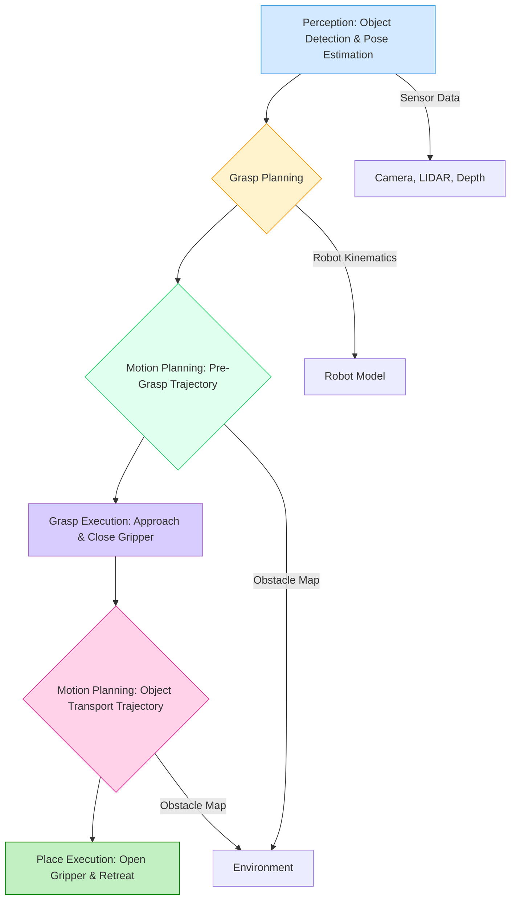

# AI-Powered Perception and Manipulation with NVIDIA Isaac

## 1. Introduction

For a humanoid robot to truly interact intelligently with its environment, it needs two critical capabilities: **perception** to understand the world around it, and **manipulation** to act upon that understanding. In this chapter, we delve into how NVIDIA Isaac, with its powerful Isaac Sim and Isaac ROS components, empowers the development of advanced, AI-driven perception and manipulation systems, particularly relevant for the complexities of humanoid robotics.

**Perception** in robotics involves interpreting sensor data (from cameras, LIDAR, IMUs, etc.) to build a meaningful representation of the environment. This includes identifying objects, understanding their properties, localizing the robot within a map, and tracking dynamic elements. **Manipulation** is the robot's ability to physically interact with objects – grasping, lifting, moving, or assembling them. For humanoid robots, these tasks are especially challenging due to the high degrees of freedom, the need for precise force control, and operating in unstructured, human-centric environments. The fusion of AI, especially deep learning, with high-fidelity simulation and hardware-accelerated libraries allows Isaac to tackle these complex problems, bringing humanoids closer to robust, autonomous interaction.

### Humanoid robot perception challenges

Humanoid robots face unique perception challenges:
*   **Self-occlusion**: The robot's own body can block its sensors.
*   **Dynamic balance**: Perception must be integrated with balance control, as head or body movements affect sensor views.
*   **Human-centric scenes**: Must understand objects and spaces designed for humans, often requiring human-like vision and reasoning.
*   **Dexterous manipulation**: Requires highly accurate 6DOF pose estimation for objects and fine-grained contact perception.

## 2. Computer Vision in Isaac Sim

NVIDIA Isaac Sim's photorealistic rendering capabilities make it an excellent platform for simulating various camera sensors and generating synthetic vision data.

### Camera sensors in simulation

Isaac Sim allows you to configure a wide range of camera sensors, each with customizable properties.

*   **RGB cameras**: Simulate standard color cameras, crucial for object detection and recognition.
*   **Depth cameras**: Generate per-pixel depth information, vital for 3D reconstruction and grasping.
*   **Stereo cameras**: Two RGB cameras with a known baseline, used for passive depth estimation and visual odometry.
*   **Fisheye and 360° cameras**: For wide-angle or omnidirectional views, useful for navigation in complex environments.

### Setting up multiple cameras

You can easily add multiple cameras to your robot model in Isaac Sim, each positioned at different locations (e.g., head, chest, hands) and configured independently.

### Complete camera configuration example (Python API)

This Python script demonstrates how to add an RGB-D camera to a scene and configure its properties.

```python
import omni.isaac.core.utils.nucleus as nucleus_utils
from omni.isaac.core import World
from omni.isaac.core.objects import DynamicCuboid
from omni.isaac.synthetic_utils import SyntheticDataHelper
from omni.isaac.core.articulations import Articulation
from omni.isaac.sensor import Camera
import numpy as np
import asyncio

async def setup_camera_scene():
    world = World(stage_units_in_meters=1.0)
    world.scene.add_default_ground_plane()

    # Add a cuboid to view
    cube = world.scene.add(
        DynamicCuboid(
            prim_path="/World/Cube",
            name="my_cube",
            position=np.array([1.0, 0.0, 0.5]),
            scale=np.array([0.5, 0.5, 0.5]),
            mass=1.0,
            color=np.array([0.5, 0.1, 0.3])
        )
    )

    # Add an RGBD Camera
    camera_prim_path = "/World/Camera"
    camera = Camera(
        prim_path=camera_prim_path,
        name="my_rgbd_camera",
        translation=np.array([0.0, 0.0, 1.5]), # Position it above the ground
        orientation=np.array([0.5, 0.5, -0.5, -0.5]), # Look down somewhat
        resolution=(640, 480),
        fov=90.0,
        high_frequency_update=True # Enable high frequency updates
    )
    world.scene.add(camera)
    
    # Configure camera to get RGB and Depth data
    camera.set_enabled_linereader(True)
    camera.set_targets(
        [
            ("rgb", None),
            ("depth", None),
        ]
    )

    await world.reset_async()
    world.play()

    print("Camera setup complete. Running simulation for 100 steps.")
    for i in range(100):
        await world.step_async()
        if i % 10 == 0:
            print(f"Simulation step {i}")
            # Example: Accessing camera data (conceptual)
            # rgb_data = camera.get_data("rgb").data
            # depth_data = camera.get_data("depth").data
            # print(f"Captured RGB frame shape: {rgb_data.shape}, Depth frame shape: {depth_data.shape}")

    world.stop()
    world.clear_instance()

# Example usage (run within Isaac Sim script editor or extension)
# asyncio.run(setup_camera_scene())
```

## 3. Image Processing Pipeline

After capturing raw image data from simulated cameras, it needs to be processed. Isaac Sim's **Replicator** and **Synthetic Data Generation (SDG)** framework provide powerful tools for this, especially for creating annotated datasets.

### Raw image capture

The `omni.isaac.sensor.Camera` class allows direct access to raw RGB, depth, and other camera data within your Python scripts.

### Image preprocessing

Standard image preprocessing techniques (e.g., resizing, normalization, color space conversion) can be applied using libraries like OpenCV (`cv2`) or NumPy.

### Replicator for synthetic data

NVIDIA Omniverse Replicator is a framework for generating synthetic datasets. It orchestrates the rendering of scenes and the collection of various types of ground truth data (segmentation, bounding boxes, pose).

### Annotators and writers

Replicator uses **annotators** (e.g., `LdrTexture`, `Depth`, `SemanticSegmentation`) to generate specific types of ground truth data. **Writers** then save this data to disk in desired formats (e.g., COCO, KITTI).

### Python example: Capture and process images (conceptual with Replicator)

```python
import omni.replicator.core as rep
import omni.isaac.core.utils.nucleus as nucleus_utils
from omni.isaac.core import World
from omni.isaac.core.objects import DynamicCuboid
import asyncio
import numpy as np
import os

# --- Setup Replicator graph ---
rep.orchestrator.set_stage_settings(
    frames_per_sample=1, # Capture one frame per step
    # live_mode=True # For real-time visualization
)

async def capture_images_with_annotations():
    world = World(stage_units_in_meters=1.0)
    world.scene.add_default_ground_plane()

    # Add a cuboid
    cube = world.scene.add(
        DynamicCuboid(
            prim_path="/World/Cube",
            name="my_cube",
            position=np.array([1.0, 0.0, 0.5]),
            scale=np.array([0.5, 0.5, 0.5]),
            mass=1.0,
            color=np.array([0.5, 0.1, 0.3])
        )
    )
    # Add semantic label for the cube
    rep.semantics.add_semantics(cube.prim_path, "Cube")

    # Add a camera
    camera = rep.create.camera(
        position=(0, 0, 1.5), look_at=(1.0, 0.0, 0.5), focal_length=24, f_stop=1.8, field_of_view=60
    )
    
    # Attach annotators to the camera
    rep.create.render_product(camera, (640, 480))
    rgb_annotator = rep.AnnotatorRegistry.get_annotator("rgb")
    depth_annotator = rep.AnnotatorRegistry.get_annotator("distance_to_image_plane")
    sem_seg_annotator = rep.AnnotatorRegistry.get_annotator("semantic_segmentation")
    bounding_box_annotator = rep.AnnotatorRegistry.get_annotator("bounding_box_3d")

    # Hook annotators to render product
    rgb_annotator.attach([camera])
    depth_annotator.attach([camera])
    sem_seg_annotator.attach([camera])
    bounding_box_annotator.attach([camera])

    # --- Domain Randomization (conceptual) ---
    # Create randomizer for cube position
    rep.randomizer.spawn([cube.prim_path], size=1)
    rep.modify.pose(
        position=rep.distribution.uniform((-0.5, -0.5, 0.25), (0.5, 0.5, 0.75)),
        rotation=rep.distribution.uniform((0, 0, 0), (360, 360, 360)),
    )

    # --- Setup writer to save data ---
    output_dir = "omniverse_data/output_data"
    rep.WriterRegistry.get("BasicWriter").initialize(
        output_dir=output_dir, 
        rgb=True, 
        bounding_box_3d=True, 
        semantic_segmentation=True, 
        distance_to_image_plane=True
    )
    rep.WriterRegistry.get("BasicWriter").attach([camera])

    await world.reset_async()
    world.play()
    
    print(f"Starting data generation. Data will be saved to: {os.path.abspath(output_dir)}")
    await rep.orchestrator.run_async(num_frames=100) # Generate 100 frames
    print("Data generation complete.")

    world.stop()
    world.clear_instance()

# Example usage
# asyncio.run(capture_images_with_annotations())
```

## 4. Object Detection

Object detection is a core perception task for humanoid robots, enabling them to identify and locate objects in their environment for tasks like grasping, navigation, and interaction.

### Setting up object detection

Isaac Sim, in conjunction with Replicator, can generate perfectly annotated data (bounding boxes) for training object detectors.

### Using pre-trained models (YOLO, DetectNet)

NVIDIA provides optimized versions of popular object detection models like **YOLO (You Only Look Once)** and **DetectNet** within the Isaac SDK or as pre-trained models on NGC (NVIDIA GPU Cloud) that can be deployed on Jetson platforms.

### Custom object training with synthetic data

The typical workflow involves:
1.  **Generate synthetic data**: Use Isaac Sim's Replicator to create a diverse dataset of your target objects with 2D/3D bounding box annotations.
2.  **Train model**: Use a deep learning framework (PyTorch, TensorFlow) to train an object detection model (e.g., a YOLO variant) on this synthetic data.
3.  **Deploy model**: Convert the trained model to an optimized format (e.g., ONNX, TensorRT) and deploy it to your robot (e.g., on a Jetson).

### Real-time detection in simulation

You can deploy your trained models back into Isaac Sim, feeding simulated camera images through the model and visualizing the detected bounding boxes in real-time.

### Use case: Humanoid detecting objects to manipulate

A humanoid needs to detect objects in its field of view to:
*   Identify graspable items.
*   Determine obstacles.
*   Locate tools.

## 5. Semantic Segmentation

**Semantic segmentation** is a pixel-wise classification task where every pixel in an image is assigned a class label (e.g., "table," "chair," "robot body"). This provides a detailed understanding of the scene's composition.

### Semantic sensor setup

Isaac Sim's Replicator can generate semantic segmentation masks directly from the simulation. You assign semantic labels to objects in your USD stage.

### Class labels and colors

Each class is assigned a unique ID and color, which is then used to generate the segmentation mask.

### Generating segmentation masks

The `semantic_segmentation` annotator in Replicator captures these masks.

### Training segmentation models

Similar to object detection, synthetic data with semantic segmentation masks can be used to train deep learning models (e.g., U-Net, DeepLab) for real-world semantic segmentation.

### Python code example (conceptual - part of Replicator setup)

```python
# In Replicator setup:
# Add semantic label to an object
rep.semantics.add_semantics(cube.prim_path, "Cube")

# Attach semantic segmentation annotator to camera
sem_seg_annotator = rep.AnnotatorRegistry.get_annotator("semantic_segmentation")
sem_seg_annotator.attach([camera])
```

### Application: Scene understanding for humanoids

*   **Navigation**: Identify traversable surfaces vs. obstacles.
*   **Safe interaction**: Differentiate between humans and other objects.
*   **Manipulation**: Understand the context of an object within the scene.

## 6. Instance Segmentation

**Instance segmentation** goes a step further than semantic segmentation. It not only classifies each pixel by class but also distinguishes between individual instances of the same class (e.g., "cup_A," "cup_B").

### Object instance identification

Isaac Sim's Replicator can provide instance ID masks, where each unique object instance receives a distinct ID.

### Panoptic segmentation

This combines semantic and instance segmentation, providing a rich, pixel-level understanding of every object and region in the scene.

### Use cases in manipulation

For humanoids, instance segmentation is critical for:
*   **Singulating objects**: Picking a specific item from a cluttered pile.
*   **Tracking multiple objects**: Following the movement of several identical items.
*   **Fine-grained interaction**: Distinguishing individual components for assembly tasks.

## 7. Pose Estimation

**Pose estimation** involves determining the 6 Degrees of Freedom (6DOF) pose (position and orientation) of an object or a robot's end-effector relative to a camera or world frame. This is a fundamental capability for precise manipulation.

### 6DOF object pose estimation

Isaac Sim and its related tools (like Isaac SDK's DOPE) can generate 6DOF pose ground truth for training.

### DOPE (Deep Object Pose Estimation)

NVIDIA developed DOPE, a neural network for estimating the 6DOF pose of known objects from a single RGB image. It's highly optimized for NVIDIA GPUs.

### Training with synthetic data

Generating synthetic data with perfect 6DOF pose annotations in Isaac Sim is crucial for training robust pose estimation models.

### Real-time pose tracking

Deploy trained pose estimation models on Jetson platforms to track objects in real-time.

### Python implementation (conceptual with Isaac SDK/ROS)

```python
# Example of using a pose estimation model (conceptual)
import rclpy
from rclpy.node import Node
from sensor_msgs.msg import Image
from geometry_msgs.msg import PoseStamped # To publish estimated pose
# from isaac_ros_dope.msg import DopeDetection # Example custom message

class ObjectPoseEstimator(Node):
    def __init__(self):
        super().__init__('object_pose_estimator')
        self.image_sub = self.create_subscription(
            Image, '/robot/camera/image_raw', self.image_callback, 10
        )
        self.pose_pub = self.create_publisher(PoseStamped, '/object/estimated_pose', 10)
        self.get_logger().info('Object Pose Estimator node started.')

        # Load pre-trained DOPE model or a custom model
        # self.pose_model = load_dope_model() 

    def image_callback(self, msg):
        # Convert ROS Image to OpenCV image
        # Run inference with the pose estimation model
        # estimated_poses = self.pose_model.infer(cv_image)

        # For each detected object, publish its pose
        # for pose in estimated_poses:
        #     pose_msg = PoseStamped()
        #     pose_msg.header.stamp = self.get_clock().now().to_msg()
        #     pose_msg.header.frame_id = 'camera_frame'
        #     pose_msg.pose = pose # Assuming pose is a geometry_msgs/Pose object
        #     self.pose_pub.publish(pose_msg)
        self.get_logger().debug('Processing image for pose estimation...')

def main(args=None):
    rclpy.init(args=args)
    node = ObjectPoseEstimator()
    rclpy.spin(node)
    node.destroy_node()
    rclpy.shutdown()

if __name__ == '__main__':
    main()
```

### Critical for humanoid grasping

Accurate 6DOF pose estimation is absolutely vital for humanoid robots to successfully grasp objects. They need to know not just where an object is, but its precise orientation in 3D space.

## 8. 3D Perception

Beyond 2D images, robots need a 3D understanding of their environment. This is achieved through processing point clouds, typically generated by LIDARs or depth cameras.

### Point cloud generation

Isaac Sim's depth cameras and LIDAR sensors can directly output `sensor_msgs/msg/PointCloud2` data.

### 3D object detection

Just as with 2D images, deep learning models can be trained to detect objects directly in 3D point clouds.

### Voxel-based methods

Point clouds can be converted into voxel grids (3D pixels) for efficient processing by convolutional neural networks.

### PointNet and PointNet++

These are pioneering deep learning architectures designed specifically to process unordered point clouds directly, without requiring conversion to grids.

### LIDAR simulation and processing

Isaac Sim can simulate various LIDAR configurations, and the ROS 2 Bridge can publish this data.

### Complete 3D perception pipeline (conceptual)

1.  **Sensor data**: Raw point cloud from LIDAR/depth camera.
2.  **Preprocessing**: Downsampling, noise filtering, outlier removal.
3.  **Segmentation**: Identifying ground plane, clusters of objects.
4.  **Object detection/classification**: Using 3D deep learning models.
5.  **Tracking**: Following detected objects over time.

## 9. VSLAM (Visual SLAM)

**VSLAM (Visual Simultaneous Localization and Mapping)** enables a robot to build a map of an unknown environment while simultaneously localizing itself within that map, using only camera data. This is crucial for autonomous navigation.

### Visual odometry basics

Visual odometry (VO) estimates the robot's motion by tracking features across successive camera frames.

### Isaac ROS Visual SLAM

NVIDIA provides hardware-accelerated VSLAM solutions within Isaac ROS, optimized for Jetson platforms. These packages often include features like:
*   **Feature tracking**: Identifying and tracking key points in images.
*   **Bundle adjustment**: Optimizing camera poses and 3D points.
*   **Loop closure**: Recognizing previously visited locations to correct drift in the map.

### Integration with Isaac Sim

You can simulate a robot with cameras in Isaac Sim, and then feed the simulated camera data to an external Isaac ROS VSLAM node to build a map of the simulated environment and track the robot's pose.

### Use case: Humanoid navigation

VSLAM allows humanoids to:
*   Navigate in unknown indoor environments.
*   Avoid obstacles dynamically.
*   Relocalize themselves if they get lost.

## 10. Isaac ROS Packages

**Isaac ROS** is a collection of hardware-accelerated ROS 2 packages that leverage NVIDIA GPUs for high-performance robotics perception and AI. These GEMs (GPU-accelerated Embodied Modules) are optimized for NVIDIA Jetson platforms and Isaac Sim.

### Overview of Isaac ROS GEMs

Isaac ROS offers GEMs for various tasks:
*   **`isaac_ros_apriltag`**: Fast AprilTag detection.
*   **`isaac_ros_image_segmentation`**: Accelerated semantic and instance segmentation.
*   **`isaac_ros_depth_estimation`**: High-performance depth estimation from stereo images.
*   **`isaac_ros_vslam`**: Visual SLAM for localization and mapping.
*   **`isaac_ros_unet`**: Pre-trained U-Net models for various segmentation tasks.

### Hardware acceleration with CUDA

All Isaac ROS GEMs are deeply integrated with NVIDIA's CUDA platform, ensuring maximum performance on Jetson GPUs.

### Installation and setup (Conceptual)

Isaac ROS packages are typically installed through Docker containers or by building them from source within your ROS 2 workspace, ensuring CUDA compatibility.

### Example: Using Isaac ROS with Isaac Sim

1.  **Launch Isaac Sim** with a robot with cameras and the ROS 2 Bridge.
2.  **Launch `isaac_ros_apriltag` node**: In your external ROS 2 workspace, run the AprilTag detector, subscribing to the camera topic published by Isaac Sim.
3.  **Place AprilTags in Isaac Sim**: Add virtual AprilTags to your scene.
4.  **Observe detection**: The `isaac_ros_apriltag` node will publish detected AprilTag poses to a ROS 2 topic, which you can visualize.

## 11. Introduction to Manipulation

**Robot manipulation** is the field concerned with a robot's ability to physically interact with objects in its environment. For humanoid robots, this means tasks like picking up a cup, opening a door, or assembling components.

### Robot manipulation fundamentals

*   **End-effector**: The part of the robot that interacts with objects (e.g., gripper, hand, tool).
*   **Workspace**: The volume of space a robot's end-effector can reach.
*   **Degrees of Freedom (DOF)**: The number of independent parameters that define the configuration of a mechanical system. Humanoids typically have many DOFs.

### Kinematics vs dynamics

*   **Kinematics**: Describes the motion of a robot without considering the forces and torques causing that motion. Focuses on position, velocity, and acceleration.
*   **Dynamics**: Deals with the relationship between forces/torques and the resulting motion of the robot, considering mass, inertia, and external forces.

### Forward and inverse kinematics

*   **Forward Kinematics (FK)**: Given the joint angles of a robot, calculate the position and orientation (pose) of its end-effector. This is a straightforward calculation.
*   **Inverse Kinematics (IK)**: Given a desired pose for the end-effector, calculate the required joint angles. This is a more complex problem, often having multiple solutions or no solution.

### Motion planning overview

Motion planning involves generating a path or trajectory for a robot to move from a start configuration to a goal configuration while avoiding obstacles and respecting joint limits.

### Humanoid manipulation challenges

*   **Balance**: Manipulation often requires shifting the robot's center of mass, challenging its balance.
*   **Redundancy**: Humanoids have many DOFs, leading to multiple IK solutions, requiring intelligent selection.
*   **Force control**: Precise force application is needed for delicate tasks.
*   **Human-like dexterity**: Replicating the fine motor skills of human hands is extremely difficult.

## 12. Robot Arms in Isaac Sim

Isaac Sim provides robust tools for simulating and controlling robotic arms, essential components of humanoid robots.

### Importing robotic arms (UR5, Franka, etc.)

You can import standard robotic arm URDFs (e.g., Universal Robots UR5, Franka Emika Panda) into Isaac Sim using the URDF importer. These can then be integrated into a larger humanoid body.

### Joint control

You can control individual joints of the imported arms using position, velocity, or effort commands through the Python API or ROS 2 Bridge.

### End-effector control

Often, you want to control the end-effector's pose (position and orientation) directly, rather than individual joint angles. This requires an IK solver.

### Articulation API

The `omni.isaac.core.articulations.Articulation` class in the Python API provides methods for controlling and querying the state of articulated robots.

### Complete arm control example (Python API)

```python
import omni.isaac.core.utils.nucleus as nucleus_utils
from omni.isaac.core import World
from omni.isaac.core.articulations import Articulation
from omni.isaac.core.utils.types import ArticulationAction
import numpy as np
import asyncio
import time

async def simple_arm_control(robot_prim_path: str, joint_name: str, target_angle: float, duration: float = 2.0):
    world = World.instance()
    robot = world.scene.get_object(robot_prim_path)

    if not isinstance(robot, Articulation):
        print(f"Error: {robot_prim_path} is not an Articulation.")
        return

    joint_indices = robot.get_dof_indices()
    joint_names = robot.get_joint_names()

    if joint_name not in joint_names:
        print(f"Joint '{joint_name}' not found in robot '{robot.name}'.")
        return

    target_positions = np.array(robot.get_joint_positions())
    joint_idx = joint_names.index(joint_name)
    target_positions[joint_idx] = target_angle

    # Apply control over time
    start_time = world.current_time
    while world.current_time - start_time < duration:
        action = ArticulationAction(joint_positions=target_positions)
        robot.apply_action(action)
        await world.step_async()
        await asyncio.sleep(0.01) # Small delay for real-time feel if not in simulation loop

    print(f"Joint '{joint_name}' of '{robot.name}' moved to {target_angle:.2f} radians.")

# Example Usage (within Isaac Sim script)
# async def run_arm_scene():
#     world = World(stage_units_in_meters=1.0)
#     world.scene.add_default_ground_plane()
#     # Assuming 'franka.usd' is available or imported from URDF
#     # robot_path = "/World/Franka"
#     # franka = world.scene.add(
#     #     Articulation(prim_path=robot_path, name="Franka_robot")
#     # )
#     # await world.reset_async()
#     # await simple_arm_control(robot_path, "franka_joint1", np.pi/4) # Move shoulder joint
#     # await simple_arm_control(robot_path, "franka_joint2", -np.pi/6) # Move elbow joint
#     # world.stop()
#     # world.clear_instance()
# # asyncio.run(run_arm_scene())
```

### Humanoid arm simulation

Simulating humanoid arms is more complex due to the high DOFs and the need for whole-body control (integrating with balance). Isaac Sim's articulation and physics capabilities are well-suited for this.

## 13. Inverse Kinematics (IK)

**Inverse Kinematics (IK)** is the process of calculating the joint angles required for a robot's end-effector to reach a desired 6DOF pose in space.

### IK solvers in Isaac Sim

Isaac Sim provides integrated IK solvers that can be accessed through its Python API.

### Lula IK solver

NVIDIA's **Lula IK solver** is a highly efficient and robust analytical IK solver optimized for complex robotic systems.

### Analytical vs numerical IK

*   **Analytical IK**: Provides a closed-form mathematical solution for joint angles. Faster but only exists for specific robot geometries (e.g., 6-DOF manipulators with spherical wrists).
*   **Numerical IK**: Iteratively searches for a solution. More general but slower and can get stuck in local minima.

### IK constraints

IK solvers can incorporate various constraints, such as joint limits, collision avoidance, and orientation targets.

### Python implementation (conceptual)

```python
import omni.isaac.core.utils.nucleus as nucleus_utils
from omni.isaac.core import World
from omni.isaac.core.articulations import Articulation
from omni.isaac.motion_generation import RmpFlow, ArticulationKinematicsSolver
import numpy as np
import asyncio

async def solve_ik_for_robot(robot_prim_path: str, end_effector_name: str, target_position: np.ndarray, target_orientation: np.ndarray = None):
    world = World.instance()
    robot = world.scene.get_object(robot_prim_path)

    if not isinstance(robot, Articulation):
        print(f"Error: {robot_prim_path} is not an Articulation.")
        return

    # Initialize IK solver
    # Using RmpFlow as a high-level motion generation and IK solver
    rmp_flow = RmpFlow(robot=robot)
    
    # Define a goal
    if target_orientation is None:
        target_orientation = np.array([0.0, 0.0, 0.0, 1.0]) # No specific orientation constraint

    # Set the RMPFlow goal
    rmp_flow.set_end_effector_target(
        target_position=target_position,
        target_orientation=target_orientation,
        end_effector_prim_path=robot.prim_path + "/" + end_effector_name # Path to end effector link
    )

    # Perform IK (RmpFlow will continuously update joint commands)
    print(f"Attempting to move end effector '{end_effector_name}' to position {target_position}.")
    start_time = world.current_time
    while world.current_time - start_time < 5.0: # Run for 5 seconds
        action = rmp_flow.get_next_articulation_action()
        robot.apply_action(action)
        await world.step_async()
        
        current_ee_pose = robot.get_link_world_pose(end_effector_name)
        current_ee_pos = current_ee_pose[0]
        distance = np.linalg.norm(current_ee_pos - target_position)
        if distance < 0.01:
            print(f"End effector reached target position! Distance: {distance:.4f}")
            break
        
        if world.current_time - start_time > 4.9:
            print(f"IK did not converge to target. Current distance: {distance:.4f}")

# Example usage (within Isaac Sim script)
# async def run_ik_scene():
#     world = World(stage_units_in_meters=1.0)
#     world.scene.add_default_ground_plane()
#     # Assuming 'franka.usd' is available or imported from URDF
#     # robot_path = "/World/Franka"
#     # franka = world.scene.add(
#     #     Articulation(prim_path=robot_path, name="Franka_robot")
#     # )
#     # await world.reset_async()
#     # target_pos = np.array([0.5, 0.5, 0.8])
#     # await solve_ik_for_robot(robot_path, "franka_hand", target_pos) # "franka_hand" is often the end effector link
#     # world.stop()
#     # world.clear_instance()
# # asyncio.run(run_ik_scene())
```

## 14. Motion Planning

**Motion planning** is the process of computing a continuous trajectory for a robot's joints (or end-effector) to move from a start configuration to a goal configuration while avoiding collisions with itself and the environment.

### RMPflow (Riemannian Motion Policies)

**RMPflow** is NVIDIA's reactive motion generation framework for Isaac Sim. It provides a real-time, collision-aware motion planner that can handle high-DOF robots and complex environments. RMPflow generates smooth, kinematically feasible, and collision-free trajectories.

### Collision avoidance

RMPflow inherently incorporates collision avoidance by defining "potential fields" around obstacles. The robot's motion is then guided to avoid these high-potential regions.

### Smooth trajectory generation

RMPflow generates smooth, continuous joint trajectories, which are essential for realistic and energy-efficient robot movements.

### Integration with perception

Motion planning can be integrated with perception systems (object detection, scene understanding) to dynamically update the map of obstacles and generate reactive paths.

### Use case: Humanoid navigation in cluttered space

For humanoids, motion planning is critical for:
*   **Walking in crowded areas**: Generating footstep plans that avoid people and obstacles.
*   **Arm manipulation in confined spaces**: Planning collision-free paths for arms to reach objects on shelves.

## 15. Grasping Simulation

**Grasping** is a fundamental manipulation skill. Simulating grasping accurately requires careful modeling of contact, friction, and gripper dynamics.

### Gripper types (parallel jaw, multi-finger)

Isaac Sim supports various gripper types:
*   **Parallel-jaw grippers**: Simple and common for industrial tasks.
*   **Multi-finger hands**: More dexterous, like humanoid hands, for complex object manipulation.

### Contact simulation

Accurate contact modeling (friction, restitution) is essential for realistic grasping. Isaac Sim's PhysX 5 engine provides this.

### Force/torque sensors

Force/torque sensors on the gripper fingers or at the wrist provide critical feedback for precise grasping, allowing the robot to apply appropriate pressure.

### Setting up gripper in Isaac Sim

Grippers are typically part of the robot's URDF/USD model, with joints and links. You can then control them via articulation APIs.

### Complete grasping pipeline (conceptual)

1.  **Perception**: Detect the object and estimate its 6DOF pose.
2.  **Grasp Planning**: Determine a stable grasp pose (where and how to grip the object). This can involve deep learning models trained on synthetic data.
3.  **Motion Planning**: Generate a collision-free trajectory for the arm and gripper to approach the object.
4.  **Grasp Execution**: Execute the motion, close the gripper, and apply appropriate force.
5.  **Lift/Place**: Lift the object and move it to the target location.

### Humanoid hand simulation

Simulating realistic humanoid hands, with their many DOFs and complex contact dynamics, is a significant challenge but feasible within Isaac Sim.

## 16. Pick and Place Pipeline

The **pick-and-place pipeline** is a quintessential robotics task that integrates perception, motion planning, and manipulation.

### Complete pick-and-place system:

1.  **Object detection**: Identify target objects in the scene (e.g., a "red cup").
2.  **Pose estimation**: Determine the 6DOF pose of the target object.
3.  **Motion planning (Pre-grasp)**: Plan a collision-free path for the robot arm to approach the object from a safe distance.
4.  **Grasp execution**: Move the gripper to the pre-grasp pose, open it, move to the grasp pose, close it with appropriate force, and lift the object.
5.  **Motion planning (Post-grasp)**: Plan a collision-free path to the target placement location while holding the object.
6.  **Place action**: Lower the object, open the gripper, and retreat.

### Full Python implementation (conceptual)

```python
import omni.isaac.core.utils.nucleus as nucleus_utils
from omni.isaac.core import World
from omni.isaac.core.articulations import Articulation
from omni.isaac.motion_generation import RmpFlow
import numpy as np
import asyncio
from scipy.spatial.transform import Rotation as R

async def execute_pick_and_place(robot_prim_path: str, end_effector_name: str, object_prim_path: str, target_location: np.ndarray):
    world = World.instance()
    robot = world.scene.get_object(robot_prim_path)
    
    if not isinstance(robot, Articulation):
        print(f"Error: {robot_prim_path} is not an Articulation.")
        return

    # --- 1. Perception: Get object pose (simulated for now) ---
    object_prim = world.scene.get_object(object_prim_path)
    object_pos, object_rot = object_prim.get_world_pose()
    
    print(f"Object '{object_prim.name}' detected at position: {object_pos}")

    # --- 2. Grasp Planning (simplified): Define a grasp pose relative to the object ---
    # For simplicity, assume grasping from top
    pre_grasp_offset = np.array([0.0, 0.0, 0.2]) # 20cm above object
    grasp_offset = np.array([0.0, 0.0, 0.05]) # 5cm above object center (or deeper for actual grasp)

    pre_grasp_pos = object_pos + pre_grasp_offset
    grasp_pos = object_pos + grasp_offset
    
    # Assume default downward orientation for gripper
    grasp_orientation = R.from_euler('xyz', [0, np.pi, 0], degrees=False).as_quat() # gripper pointing down
    
    rmp_flow = RmpFlow(robot=robot) # Motion planner for the robot arm
    
    # --- 3. Motion Planning (Pre-grasp) & Execution ---
    print(f"Moving to pre-grasp position: {pre_grasp_pos}")
    rmp_flow.set_end_effector_target(pre_grasp_pos, grasp_orientation, end_effector_prim_path=robot.prim_path + "/" + end_effector_name)
    await world.reset_async() # Ensure sim is reset to a known state if needed
    for _ in range(200): # Simulate movement to pre-grasp
        action = rmp_flow.get_next_articulation_action()
        robot.apply_action(action)
        await world.step_async()
    
    # --- 4. Grasp Execution (simplified) ---
    print(f"Moving to grasp position: {grasp_pos}")
    rmp_flow.set_end_effector_target(grasp_pos, grasp_orientation, end_effector_prim_path=robot.prim_path + "/" + end_effector_name)
    for _ in range(100): # Simulate movement to grasp
        action = rmp_flow.get_next_articulation_action()
        robot.apply_action(action)
        await world.step_async()
    
    # Assuming the robot has a gripper, close it (conceptual)
    # gripper.close()
    # await world.step_async(50) # Simulate gripper closing time
    
    # --- 5. Lift Object ---
    print("Lifting object...")
    lift_pos = grasp_pos + np.array([0.0, 0.0, 0.2]) # Lift 20cm up
    rmp_flow.set_end_effector_target(lift_pos, grasp_orientation, end_effector_prim_path=robot.prim_path + "/" + end_effector_name)
    for _ in range(100):
        action = rmp_flow.get_next_articulation_action()
        robot.apply_action(action)
        await world.step_async()

    # --- 6. Motion Planning (Post-grasp) & Execution ---
    print(f"Moving to target location: {target_location}")
    rmp_flow.set_end_effector_target(target_location + np.array([0.0, 0.0, 0.2]), grasp_orientation, end_effector_prim_path=robot.prim_path + "/" + end_effector_name)
    for _ in range(200): # Simulate movement to target
        action = rmp_flow.get_next_articulation_action()
        robot.apply_action(action)
        await world.step_async()
    
    # --- 7. Place Action ---
    print("Placing object...")
    place_pos = target_location + np.array([0.0, 0.0, grasp_offset[2]]) # Place at target height
    rmp_flow.set_end_effector_target(place_pos, grasp_orientation, end_effector_prim_path=robot.prim_path + "/" + end_effector_name)
    for _ in range(100):
        action = rmp_flow.get_next_articulation_action()
        robot.apply_action(action)
        await world.step_async()
        
    # Open gripper (conceptual)
    # gripper.open()
    # await world.step_async(50) # Simulate gripper opening time

    print("Pick and Place complete!")

# Example usage (within Isaac Sim script)
# async def run_pick_place_scene():
#     world = World(stage_units_in_meters=1.0)
#     world.scene.add_default_ground_plane()
#     # Assuming robot and object are loaded
#     # robot_path = "/World/Franka"
#     # franka = world.scene.add(Articulation(prim_path=robot_path, name="Franka_robot"))
#     # cube = world.scene.add(DynamicCuboid(prim_path="/World/Cube", name="my_cube", position=np.array([0.5, 0.5, 0.025]), scale=np.array([0.05, 0.05, 0.05]), mass=0.1))
#     # await world.reset_async()
#     # target_place_pos = np.array([-0.5, 0.5, 0.0])
#     # await execute_pick_and_place(robot_path, "franka_hand", "/World/Cube", target_place_pos)
# # asyncio.run(run_pick_place_scene())
```

### Mermaid Diagram of Pick and Place Pipeline:



## 17. Deep Learning for Manipulation

Deep learning techniques are increasingly being applied to solve complex manipulation problems, particularly for learning policies directly from data.

### Imitation learning

Robots can learn manipulation skills by observing human demonstrations. Isaac Sim allows for recording human demonstrations (e.g., via VR controllers) and using this data to train deep learning models that can then imitate these actions.

### Reinforcement learning basics

**Reinforcement Learning (RL)** is a powerful paradigm where an agent learns optimal behaviors through trial and error, by interacting with an environment and receiving rewards or penalties. This is particularly suited for complex motor control and decision-making in manipulation.

### Training manipulation policies

Isaac Sim (and particularly **Isaac Gym**) provides efficient environments for training RL policies for manipulation tasks.

### Using Isaac Gym (preview)

**Isaac Gym** is a high-performance GPU-accelerated simulation platform specifically designed for RL training. It can simulate thousands of robots in parallel, drastically speeding up the data collection phase for RL.

### Sim-to-real transfer

The goal of deep learning for manipulation is often to transfer policies learned in simulation to real hardware. Techniques like domain randomization (covered in Module 4, Chapter 1) are crucial for successful sim-to-real transfer.

### Example: Learning to grasp (conceptual with RL)

1.  **Define environment**: In Isaac Sim, define a scene with a robot arm, a gripper, and various objects.
2.  **Define reward function**: Design a reward function that encourages the robot to grasp objects successfully (e.g., positive reward for successful grasp, negative for dropping or collision).
3.  **Train RL agent**: Use an RL algorithm (e.g., PPO, SAC) to train a deep neural network (the policy) that maps sensor observations to joint commands.
4.  **Deploy policy**: Deploy the trained policy on the simulated robot, and later, on a real robot.

## 18. Multi-Modal Perception

Combining data from different sensor modalities can lead to a more robust and comprehensive understanding of the environment, especially for humanoids interacting in complex scenes.

### Combining vision and force sensing

*   **Vision**: Provides global context and object identification.
*   **Force sensing**: Provides local, contact-rich information about physical interaction.
    *   Example: A humanoid might use vision to locate an object and then use force sensors in its fingertips to adjust its grip once contact is made.

### Tactile simulation

Isaac Sim can simulate tactile sensors, providing realistic pressure distribution data crucial for dexterous manipulation.

### Sensor fusion

Techniques like Kalman filters or deep learning models can be used to fuse data from multiple sensors (e.g., IMU + vision for robust pose estimation) to get a more accurate and reliable estimate of the robot's state or the environment.

## 20. Vision-Language Models for Robotics

A new frontier in robotics is the integration of **Vision-Language Models (VLMs)**, allowing robots to understand and respond to natural language commands based on visual perception.

### Integrating GPT/Claude with perception

Modern VLMs like GPT-4V or Google's Gemini can process both image and text inputs, enabling them to understand commands like "pick up the red cup" by visually identifying the object.

### Natural language commands to actions

The workflow typically involves:
1.  **Perception**: Robot captures images of the scene.
2.  **VLM Input**: Image and natural language command are fed to the VLM.
3.  **VLM Output**: VLM identifies the target object and potentially suggests a high-level action.
4.  **Robotics Pipeline**: The VLM's output is translated into specific object poses, grasp plans, and motion trajectories for the robot to execute.

### Use case: "Pick up the red cup"

A humanoid robot can take an image of a table with several cups, receive the command "pick up the red cup," and then:
1.  Use the VLM to identify and localize the red cup in the image.
2.  Translate this into a 6DOF pose for the red cup.
3.  Execute a pick-and-place pipeline to grasp and move it.

## 21. Complete Humanoid Perception System

### Full project: Humanoid robot with:
*   Head cameras (stereo RGB-D)
*   Chest LIDAR
*   Body IMU
*   Hand force sensors
*   Object detection
*   Pose estimation
*   Motion planning
*   Grasping

### Complete system architecture

This would involve a complex interplay of ROS 2 nodes, Isaac Sim plugins, and external AI models.

### Full Python implementation (conceptual)

An actual full implementation would be a multi-file project. Here's a high-level conceptual flow:

```python
# Conceptual main_humanoid_app.py
import rclpy
from rclpy.node import Node
from sensor_msgs.msg import Image, PointCloud2, Imu
from geometry_msgs.msg import PoseStamped, Twist
from std_msgs.msg import String # For VLM commands
import numpy as np
import asyncio

class HumanoidController(Node):
    def __init__(self):
        super().__init__('humanoid_controller')
        # Subscribers for sensor data
        self.rgb_sub = self.create_subscription(Image, '/robot/head_camera/rgb', self.rgb_callback, 10)
        self.depth_sub = self.create_subscription(Image, '/robot/head_camera/depth', self.depth_callback, 10)
        self.lidar_sub = self.create_subscription(PointCloud2, '/robot/chest_lidar/points', self.lidar_callback, 10)
        self.imu_sub = self.create_subscription(Imu, '/robot/body_imu/data', self.imu_callback, 10)
        
        # Publishers for commands
        self.cmd_vel_pub = self.create_publisher(Twist, '/robot/cmd_vel', 10)
        self.joint_command_pub = self.create_publisher(Float64MultiArray, '/robot/joint_commands', 10) # Assuming a multi-joint command
        
        # VLM integration
        self.vlm_command_sub = self.create_subscription(String, '/human/command', self.vlm_command_callback, 10)
        
        self.latest_rgb = None
        self.latest_depth = None
        self.latest_lidar = None
        self.latest_imu = None
        self.current_goal = None # For high-level tasks

    def rgb_callback(self, msg):
        self.latest_rgb = msg
        # Trigger object detection/segmentation here
    
    def depth_callback(self, msg):
        self.latest_depth = msg
    
    def lidar_callback(self, msg):
        self.latest_lidar = msg
        # Trigger 3D perception/mapping here
    
    def imu_callback(self, msg):
        self.latest_imu = msg
        # Trigger balance control/state estimation here
    
    async def vlm_command_callback(self, msg):
        human_command = msg.data
        self.get_logger().info(f"Received human command: '{human_command}'")
        
        if self.latest_rgb:
            # Send image and text to VLM (e.g., OpenAI API call)
            # vlm_response = await call_vlm_api(self.latest_rgb, human_command)
            # self.current_goal = parse_vlm_response(vlm_response)
            
            self.get_logger().info(f"VLM processed command, identified goal: {self.current_goal}")
            # Trigger pick and place or navigation based on goal
            # await self.execute_robot_behavior(self.current_goal)
        else:
            self.get_logger().warn("No RGB image available for VLM processing.")
            
    async def execute_robot_behavior(self, goal):
        # This would be a high-level orchestration of perception, planning, manipulation
        self.get_logger().info(f"Executing robot behavior for goal: {goal}")
        # Example: if goal is to pick a "red cup"
        # object_pos, object_rot = await self.detect_and_pose_estimate("red cup", self.latest_rgb, self.latest_depth)
        # await execute_pick_and_place(self.robot_prim_path, "robot_hand", object_pos, target_place_pos)
        pass # Placeholder for actual logic

def main(args=None):
    rclpy.init(args=args)
    controller = HumanoidController()
    rclpy.spin(controller)
    controller.destroy_node()
    rclpy.shutdown()

if __name__ == '__main__':
    main()
```

### Comprehensive Mermaid diagrams (example for overall system)

```mermaid
graph TD
    subgraph Humanoid Robot
        A[Head Cameras (RGB-D)] --> P1(Perception: Object Detection, Pose Est.)
        B[Chest LIDAR] --> P2(Perception: Mapping, 3D Detection)
        C[Body IMU] --> P3(Perception: State Est., Balance)
        D[Hand Force Sensors] --> P4(Perception: Contact Feedback)
    end
    
    subgraph Control & AI
        P1 --> G1(Manipulation: Grasp Planning)
        P2 --> G2(Navigation: Motion Planning)
        P3 --> G3(Balance Control)
        P4 --> G1
        G1 --> ACT(Actuators: Joints, Grippers)
        G2 --> ACT
        G3 --> ACT
    end

    subgraph Human Interface
        H[Human Command (Text/Speech)] --> VLM(Vision-Language Model)
        VLM --> G1
        VLM --> G2
    end
    
    ACT --> R[Robot Body]
    R --> A
    R --> B
    R --> C
    R --> D

    style Humanoid_Robot fill:#D2E9FF,stroke:#3498DB
    style Control_&_AI fill:#FFF3CD,stroke:#F39C12
    style Human_Interface fill:#E0FFEE,stroke:#2ECC71
```

## 22. Synthetic Data for Training

The backbone of AI-powered perception is high-quality training data. Isaac Sim's SDG capabilities make it a leader in generating synthetic data.

### Building diverse datasets

Use domain randomization to vary simulation parameters, creating diverse datasets that improve model generalization to the real world.

### Data augmentation

Apply additional augmentations (e.g., blur, color jitter, cropping) to synthetic images to further increase dataset diversity.

### Label generation

Isaac Sim automatically generates pixel-perfect annotations:
*   **Semantic segmentation masks**
*   **Instance segmentation masks**
*   **2D/3D bounding boxes**
*   **6DOF object poses**
*   **Depth maps**

### Exporting formats (COCO, YOLO, etc.)

Export datasets in formats compatible with popular deep learning frameworks and tools (e.g., COCO JSON for object detection).

### Training pipeline

1.  **Generate data**: Use Isaac Sim (with Python scripting or Replicator) to create large synthetic datasets.
2.  **Train model**: Use frameworks like PyTorch or TensorFlow to train a deep learning model on the generated data.
3.  **Validate**: Test the model on real-world data to assess sim-to-real transfer.

### Sim-to-real validation

Critical step to ensure that models trained on synthetic data perform well on physical robots.

## 23. Debugging Perception Systems

Debugging complex perception systems in robotics can be challenging.

*   **Visualization tools**: Use Isaac Sim's built-in viewers, RViz (for ROS 2 data), and Sight (for Isaac SDK) to visualize raw sensor data, processed outputs, and annotations.
*   **Debug overlays**: Isaac Sim can render debug overlays (e.g., bounding boxes, segmentation masks) directly in the viewport.
*   **Recording and playback**: Record simulation runs (ROS bags, Isaac Sim recordings) for offline analysis and debugging.
*   **Performance profiling**: Use NVIDIA Nsight tools to profile GPU performance of your perception pipelines.
*   **Common issues**:
    *   **Sensor calibration**: Ensure simulated sensors are correctly calibrated (intrinsic/extrinsic parameters).
    *   **Frame IDs**: Mismatched `frame_id`s in ROS 2 can break TF transforms.
    *   **Noise modeling**: Insufficient noise in simulation can lead to models that overfit to perfect data.

## 24. Hands-on Exercises

### Exercise 1: Setup Multi-Camera Perception System

**Goal**: Configure multiple cameras on a robot and visualize their feeds.
**Instructions**:
1.  Import a humanoid robot (e.g., a simple human-like model) into Isaac Sim.
2.  Add an RGB camera to the head and a depth camera to the chest.
3.  Configure both cameras to publish their data via the ROS 2 Bridge.
4.  Write external ROS 2 Python nodes to subscribe to and display the RGB and depth camera feeds.
**Solution Hints**: Use `libgazebo_ros2_camera.so` and `libgazebo_ros2_depth_camera.so` equivalent plugins in Isaac Sim via its extensions.

### Exercise 2: Implement Object Detection with YOLO

**Goal**: Detect objects in simulated camera feeds using a pre-trained YOLO model.
**Instructions**:
1.  Set up a scene with a few common objects (e.g., a cuboid, a sphere) in Isaac Sim.
2.  Configure an RGB camera to publish to ROS 2.
3.  Use an existing YOLOv5/v8 ROS 2 package (e.g., `yolov5_ros` or similar) or an Isaac ROS GEM to subscribe to the camera feed.
4.  Visualize the detected bounding boxes either in Isaac Sim (if using its visualizers) or in RViz.
**Solution Hints**: This requires setting up an external ROS 2 environment with a YOLO package.

### Exercise 3: Create Pick-and-Place Pipeline

**Goal**: Implement a basic pick-and-place operation using a simulated robot arm.
**Instructions**:
1.  Import a robot arm (e.g., Franka Panda or a simple 7-DOF arm) and a target object (e.g., a cube) into Isaac Sim.
2.  Use the Isaac Sim Python API to:
    *   Get the object's initial pose.
    *   Plan a pre-grasp trajectory using RMPflow.
    *   Execute the grasp (move to object, close gripper).
    *   Plan a trajectory to a target location.
    *   Execute the place action (open gripper, retreat).
3.  Observe the robot performing the pick-and-place.
**Solution Hints**: Refer to the conceptual `execute_pick_and_place` function. Focus on sequential calls to `rmp_flow.set_end_effector_target`.

### Exercise 4: Train Custom Object Detector with Synthetic Data

**Goal**: Generate synthetic data from Isaac Sim and use it to train a simple custom object detector.
**Instructions**:
1.  Create a scene in Isaac Sim with a custom object.
2.  Use Isaac Sim's Replicator to generate 1000 annotated images (RGB, 2D bounding boxes) of this object with domain randomization.
3.  Export the dataset.
4.  Use a simple object detection framework (e.g., `detectron2`, `YOLOv5` custom training script) to train a detector on this synthetic data.
5.  Test your trained model on new simulated images.
**Solution Hints**: This is a multi-step process involving data generation, dataset preparation, and model training.

## 25. Best Practices

*   **Sensor placement for humanoids**: Optimize sensor locations (e.g., cameras in head for human-like POV, LIDAR in chest for broad environmental scan).
*   **Calibration procedures**: Implement virtual calibration for simulated sensors to mimic real-world processes.
*   **Error handling**: Design perception and manipulation pipelines to be robust to sensor noise, missing data, and planning failures.
*   **Performance optimization**: Leverage GPU acceleration with Isaac ROS, optimize model sizes, and use efficient data structures.
*   **Sim-to-real considerations**: Integrate domain randomization, transfer learning, and real-world validation throughout the development cycle.

## 26. Advanced Topics (Overview)

*   **Reinforcement Learning (Preview)**: Using Isaac Gym for high-performance RL training of manipulation and locomotion policies. (Covered in detail in Module 4, Chapter 3).
*   **Multi-agent systems**: Simulating and coordinating multiple robots in a shared environment.
*   **Cloud deployment**: Running large-scale simulations on cloud infrastructure.
*   **Edge deployment on Jetson**: Deploying optimized AI models to NVIDIA Jetson embedded platforms for real-world robots.

## 27. Industry Applications

*   **Warehouse automation**: Humanoids picking and placing diverse objects, navigating complex aisles.
*   **Manufacturing**: Dexterous manipulation for assembly, quality inspection.
*   **Healthcare robots**: Assisting in surgery, patient care, rehabilitation.
*   **Service robots**: Interacting with customers, performing tasks in retail or hospitality.
*   **Real-world humanoid deployments**: Tesla Optimus, Figure 01, Boston Dynamics Atlas (research).

## 28. Summary and Next Steps

This chapter has taken you on an immersive journey into **AI-powered perception and manipulation** within the NVIDIA Isaac ecosystem. We explored how Isaac Sim enables the simulation of various camera sensors and the generation of annotated synthetic data crucial for training advanced computer vision models, including object detection, semantic/instance segmentation, and 6DOF pose estimation. We delved into 3D perception with point clouds and saw how **Isaac ROS** hardware-accelerated packages boost performance. In manipulation, we covered kinematics, inverse kinematics (IK), RMPflow for motion planning, and critical grasping techniques, culminating in the integrated pick-and-place pipeline. The integration of Vision-Language Models (VLMs) and the use of deep learning for manipulation highlight the cutting edge of robotics.

You are now equipped with a powerful toolkit to design and implement sophisticated perception and manipulation capabilities for your humanoid robots. In the next chapter, we will expand on the deep learning aspect, delving into **Reinforcement Learning (RL) for Complex Robotic Behaviors** and how Isaac Gym facilitates large-scale RL training.

---
[Previous Chapter: NVIDIA Isaac SDK and Isaac Sim - AI-Powered Robotics Platform](./01-isaac-sdk-sim-intro.md)
[Next Chapter: Reinforcement Learning for Complex Robotic Behaviors](./03-reinforcement-learning-isaac-gym.md)

---
[Previous Chapter: NVIDIA Isaac SDK and Isaac Sim - AI-Powered Robotics Platform](./01-isaac-sdk-sim-intro.md)
[Next Chapter: Reinforcement Learning for Complex Robotic Behaviors](./03-reinforcement-learning-isaac-gym.md)
